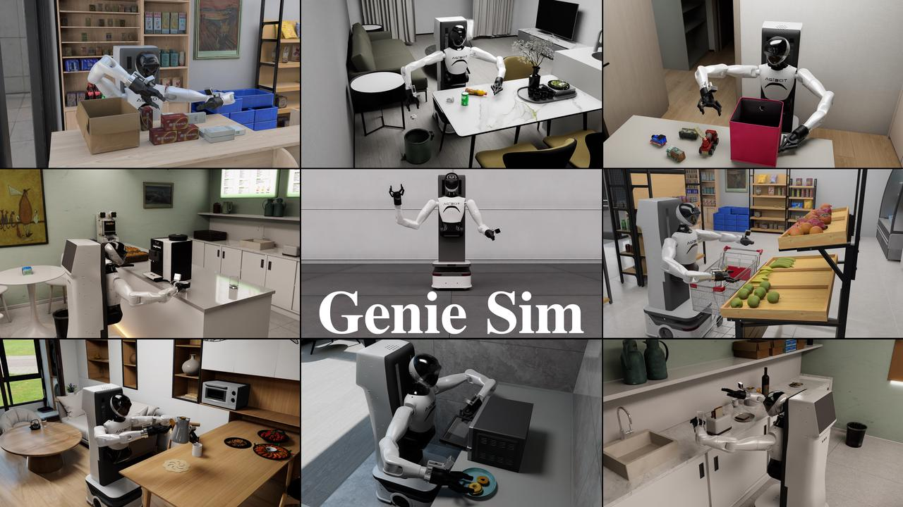

# Genie Sim

Genie Sim is the simulation framework from AgiBot, which provides developers efficient data generation capabilities and evaluation benchmarks to accelerate embodied intelligence development.
Genie Sim has established a comprehensive closed loop pipeline, encompassing trajectory generation, model training, benchmarking, and deployment validation. Users can quickly validate algorithm performance and optimize models through this efficient simulation toolchain. Whether for simple grasping tasks or complex long-range operations, Genie Sim can provide a highly realistic simulation environment and precise evaluation metrics, empowering developers to efficiently complete the development and iteration of robotic technologies.

# Features
- Flexible and user-friendly simulation configuration and interface
- Simulation benchmarks and evaluation tasks for 10+ manipulation tasks
- Teleoperation capability based on PICO and keyboard
- All Joints and end effector pose record and replay
- High fidelity and physically accurate 3D simulation environment and assets
- Standardized evaluation metrics to quantify performance of embodied AI models
- Evaluation results achieve less than 5% sim to real evaluation error on GO-1 model

# Contents
## Introduction
Embodied interlligence simulation benchmarks in Genie Sim are designed to evaluate and advance the development of embodied AI models. These benchmarks provide realistic environments, diverse tasks and standardized metrics to measure the performance of robotic AI systems, which reduce the requirement of expensive physical hardware and real-world testing, avoid risky and dangerous testing scenarios and accelerate training and evaluaiton process of AI agents.

## Getting Started
Please refer to this documentation.

## Tutorials
Tutorials are provided here.

## API Documentation
Detailed APIs can be found here.

# Support

# TODO List
[] Release more benchmark mainuplation tasks
[] More scenes and assets for each benchmark task
[] Teleoperation with Apple VisionPro
[] Scenario layout generalization toolkit

# FAQ

# License and Citation
All the data and code within this repo are under Mozilla Public License 2.0
1. Please consider citing our work either way below if it helps your research.
2. For the full authorship and detailed contributions, please refer to contributions.
3. In alphabetical order by surname
@misc{2025geniesim,
  title={GenieSim},
  author={GenieSim Team},
  month={April},
  year={2025},
  url={xxx}
}

# Refercences
[1] M. Ghallab, A. Howe, C. Knoblock, D. McDermott, A. Ram, M. Veloso, D. Weld, & D. Wilkins. PDDL - The Planning Domain Definition Language. Yale Center for Computational Vision and Control, TR-98-003/DCS TR-1165 (1998). [Online].
[2] PDDL Parser (2020). Version 1.1. [Source code]. https://github.com/pucrs-automated-planning/pddl-parser.
[3] C. Li*, F. Xia*, R. Martín-Martín*, M. Lingelbach, S. Srivastava, B. Shen, K. Vainio, C. Gokmen, G. Dharan, T. Jain, A. Kurenkov, C. K. Liu, H. Gweon, J. Wu, L. Fei-Fei, S. Savarese. iGibson 2.0: Object-Centric Simulation for Robot Learning of Everyday Household Tasks. CoRL 2021.
[4] C. Li*, R. Zhang*, J. Wong*, C. Gokmen*, S. Srivastava*, R. Martín-Martín*, C. Wang*, G. Levine*, M. Lingelbach, J. Sun, M. Anvari, M. Hwang, M. Sharma, A. Aydin, D. Bansal, S. Hunter, K.-Y. Kim, A. Lou, C. R. Matthews, I. Villa-Renteria, J. H. Tang, C. Tang, F. Xia, S. Savarese, H. Gweon, C. K. Liu, J. Wu, L. Fei-Fei. BEHAVIOR-1K: A Benchmark for Embodied AI with 1,000 Everyday Activities and Realistic Simulation. CoRL 2022.
[5] BDDL. Version 1.x.x [Source code]. https://github.com/StanfordVL/bddl
[6] CUROBO [Source code]. https://github.com/NVlabs/curobo
[7] Isaac Lab [Source code]. https://github.com/isaac-sim/IsaacLab
