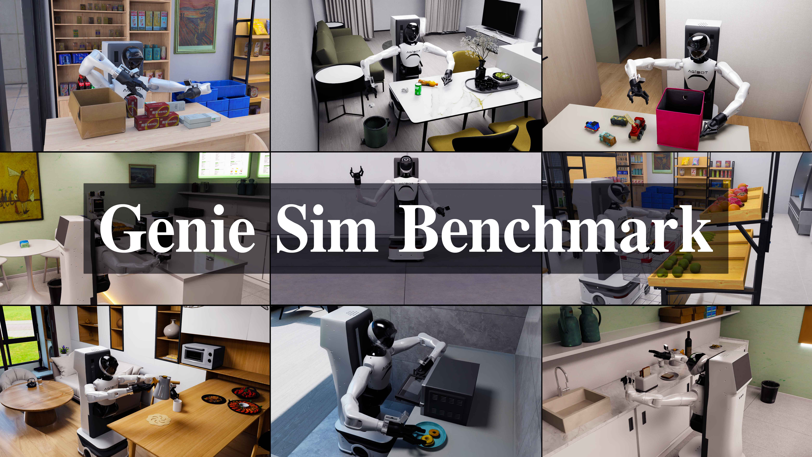

<div align="center">
  <a href="https://github.com/AgibotTech/genie_sim">
    
  </a>
  <a href="https://huggingface.co/datasets/agibot-world/GenieSimAssets">
    
  </a>
  <a href="https://agibot-world.com/sim-evaluation">
    
  </a>
  <a href="https://genie.agibot.com/en/geniestudio">
    
  </a>
</div>

# 1. Genie Sim Benchmark
Genie Sim is the simulation framework from AgiBot, which provides developers efficient data generation capabilities and evaluation benchmarks to accelerate embodied intelligence development. Genie Sim has established a comprehensive closed loop pipeline, encompassing trajectory generation, model training, benchmarking, and deployment validation. Users can quickly validate algorithm performance and optimize models through this efficient simulation toolchain. Whether for simple grasping tasks or complex long-range operations, Genie Sim can provide a highly realistic simulation environment and precise evaluation metrics, empowering developers to efficiently complete the development and iteration of robotic technologies.

Genie Sim Benchmark, as the open-source evaluation version of Genie Sim, is dedicated to providing precise performance testing and optimization support for embodied AI models.

# 2. Features
- Flexible and user-friendly simulation configuration and interface
- Simulation benchmarks and evaluation tasks for 10+ manipulation tasks
- Teleoperation capability based on VR and keyboard
- All Joints and end effector pose record and replay
- 550+ High fidelity and physically accurate 3D simulation environment and assets
- Standardized evaluation metrics to quantify performance of embodied AI models
- Evaluation results achieve less than 5% sim to real evaluation error on GO-1 model
- Support UniVLA baseline model in simulation evaluation

# 3. Updates
- [7/14/2025] v2.2
  - Provide detailed evaluation metrics for all Agibot World Challenge tasks
  - Add automatic evaluation script to run each task multiple times and record score of all steps
- [6/25/2025] v2.1
  - Add 10 more manipulation tasks for Agibot World Challenge 2025 including all simulation assets
  - Open-source synthetic datasets for 10 manipulation tasks on Huggingface
  https://huggingface.co/datasets/agibot-world/AgiBotWorldChallenge-2025/tree/main/Manipulation-SimData
  - Integrate UniVLA policy and support model inference simulation evaluation
  - Update IK solver sdk which supports cross-embodiment IK solving for other robots
  - Optimize communication framework and improve simulation running speed by 2x
  - Update automatic evaluation framework for more complicated long-range tasks

# 4. Contents

## 4.1 Introduction
Embodied intelligence simulation benchmarks in Genie Sim are designed to evaluate and advance the development of embodied AI models. These benchmarks provide realistic environments, diverse tasks and standardized metrics to measure the performance of robotic AI systems, which reduce the requirement of expensive physical hardware and real-world testing, avoid risky and dangerous testing scenarios and accelerate training and evaluaiton process of AI agents.

## 4.2 Getting Started
Please refer to [this page](https://agibot-world.com/sim-evaluation/docs/#/v2) for installation, user guide and API reference

## 4.3 Support


## 4.4 TODO List
- [x] Release more long-horizon benchmark mainuplation tasks
- [x] More scenes and assets for each benchmark task
- [x] Support Agibot World Challenge baseline model
- [ ] Scenario layout and manipulation trajectory generalization toolkit

## 4.5 FAQ
- How to shut down the isaac sim server when errors occur, causing the process not responding?
  Kill the process in terminal using `pkill -9 -f raise_standalone_sim`
- How to choose different render modes?
  The default render mode is `RaytracedLighting(RealTime)`. For tasks that contain transparent objects, use `RealTimePathTracing(RealTime-2.0)` for perspective relationship of objects

## 4.6 License and Citation
All the data and code within this repo are under Mozilla Public License 2.0
Please consider citing our work either way below if it helps your research.
```
@misc{2025geniesim,
  title={GenieSim},
  author={GenieSim Team},
  year={2025},
  url={https://github.com/AgibotTech/genie_sim}
}
```

## 4.7 References
1. PDDL Parser (2020). Version 1.1. [Source code]. https://github.com/pucrs-automated-planning/pddl-parser.
2. BDDL. Version 1.x.x [Source code]. https://github.com/StanfordVL/bddl
3. CUROBO [Source code]. https://github.com/NVlabs/curobo
4. Isaac Lab [Source code]. https://github.com/isaac-sim/IsaacLab
5. Omni Gibson [Source code]. https://github.com/StanfordVL/OmniGibson
