# geniesim_engine -- ABI Design for Common Engine Interface

> **Status**: Design Document  
> **Scope**: Stable interface contracts shared by all three physics backends
> (`isaac_physx`, `isaac_newton`, `newton`).  Every contract here is consumed
> by the run loop, RL training, and unit tests.  
> **Replaces**: ad-hoc call conventions in `EngineRunLoop`, `EngineSession`,
> and the entry-point scripts with documented pre/post conditions.

---

## Table of Contents

1. [Module Architecture Overview](#1-module-architecture-overview)
2. [Purpose](#2-purpose)
3. [Parameter Input Contract](#3-parameter-input-contract)
4. [Engine Lifecycle Contract](#4-engine-lifecycle-contract)
5. [State Readback Contract](#5-state-readback-contract)
6. [Command Application Contract](#6-command-application-contract)
7. [ROS Topic Contract](#7-ros-topic-contract)
8. [C++ Bridge Contract (`genie_sim_engine_py`)](#8-c-bridge-contract-genie_sim_engine_py)
9. [Scene YAML & Manifest Contract](#9-scene-yaml--manifest-contract)
10. [Physics Params YAML Contract](#10-physics-params-yaml-contract)
11. [Threading & Synchronization Contract](#11-threading--synchronization-contract)
12. [Error Handling Contract](#12-error-handling-contract)
13. [Unit-Test Mock Strategy](#13-unit-test-mock-strategy)
14. [RL Reuse Path](#14-rl-reuse-path)

---

## 1. Module Architecture Overview

```mermaid
flowchart TB
    subgraph Entry["📥 Entry Points"]
        direction LR
        EP1["genie_sim_engine<br/>_isaacsim.py"]
        EP2["genie_sim_engine<br/>_newton.py"]
    end

    subgraph AssetPipe["🏗️ Asset Pipeline"]
        direction LR
        AR["assemble_robot.py<br/>URDF→USD 9-stage"]
        AS["assemble_scene.py<br/>manifest + render"]
        AN["assemble_newton.py<br/>cloth sidecar"]
    end

    subgraph Session["🔗 Session & Run Loop"]
        SESSION["common/session.py<br/>EngineSession"]
        LOOP["common/loop.py<br/>EngineRunLoop"]
        PUB["_publish_tick()"]
    end

    subgraph Config["⚙️ Config Pipeline"]
        PARAMS["common/params.py<br/>EngineNodeParams<br/>PhysicsParams"]
        SCENE["common/scene_config.py<br/>pin_base, convert_joints"]
        MANIFEST["manifest.json<br/>asset paths + topology"]
    end

    subgraph Shared["📦 Shared Utilities"]
        JC["common/joint_<br/>classification.py"]
        OC["common/object_<br/>classification.py"]
        MJ["common/mjcf_<br/>postprocess.py"]
        UP["common/usd_path_<br/>helpers.py"]
    end

    subgraph ABC["🧬 Engine ABC"]
        BASE["engine/base.py<br/>PhysicsEngine ABC<br/>+ factory"]
    end

    subgraph Cpp["⚡ C++ pybind Bridge (src/)"]
        PB["pybinding.cpp<br/>genie_sim_engine_py"]
        RBN["realtime_ros_node<br/>RosBridge pub/sub"]
        CBUF["realtime_buffer<br/>RealtimeCommandBuffer"]
        RSCH["realtime_scheduler<br/>RenderScheduler"]
        SR["stats<br/>StatsRing"]
    end

    subgraph Backends["🎯 Three Backends"]
        PHYSX["kit/isaac_physx.py<br/>IsaacPhysXEngine<br/>PhysX 5"]
        ISAAC_N["kit/isaac_newton.py<br/>IsaacNewtonEngine<br/>MuJoCo-Warp wrapper"]
        NEWTON["engine/newton/engine.py<br/>NewtonHeadlessEngine<br/>Kit-free"]
    end

    subgraph NewtonInternal["🔧 Newton-Standalone (engine/newton/)"]
        MIXIN["engine_base.py<br/>_NewtonStandaloneBase<br/>13-mixin composition"]
        SETUP["setup/<br/>7 build-phase mixins<br/>stage→model→normalize<br/>→solver→debug→init→runtime"]
        STATE["state.py +<br/>async_mirror.py<br/>GPU→CPU state readback"]
        CTRL["control.py<br/>command buffer dispatch"]
        ADP["adapters/<br/>MuJoCo-Warp<br/>Featherstone<br/>AVBD (VBD)"]
        VIZ["visualizers/<br/>Markers + OVRtx render"]
        CLOTH["cloth.py<br/>cloth/FEM injection"]
        PLUGIN["plugin.py<br/>scene-plugin hooks"]
    end

    EP1 --> SESSION
    EP2 --> SESSION
    AR --> SESSION
    AS --> SESSION
    AN --> SESSION

    SESSION --> BASE
    SESSION --> LOOP
    SESSION --> PARAMS
    SESSION --> SCENE
    SESSION --> MANIFEST

    LOOP --> PUB
    PUB --> PB

    BASE --> PHYSX
    BASE --> ISAAC_N
    BASE --> NEWTON

    PARAMS -.-> PHYSX
    PARAMS -.-> ISAAC_N
    PARAMS -.-> NEWTON

    NEWTON --> MIXIN
    MIXIN --> SETUP
    MIXIN --> STATE
    MIXIN --> CTRL
    MIXIN --> ADP
    MIXIN --> VIZ
    MIXIN --> CLOTH
    MIXIN --> PLUGIN

    SESSION -.-> JC
    SESSION -.-> OC
    SESSION -.-> MJ
    SESSION -.-> UP
```



---

## 2. Purpose

> This document was preceded by an exploration phase that mapped all 73 source
> files, ~42,000 lines of code + docs + config across the entire
> `genie_sim_engine` package. The module diagram in §1 summarises the result.
> Each ABI contract below derives from evidence in the actual code — not from
> aspirational design.

### 2.1 Problem

Three engine backends (`isaac_physx`, `isaac_newton`, `newton`) share a
common `PhysicsEngine` ABC, a common ROS publish/subscribe pattern, and a
common YAML-driven config pipeline.  But the contracts are implicit --
documented only in docstrings, spread across `engine/base.py`,
`common/loop.py`, `common/session.py`, and two entry-point scripts.
Nothing says "this is the ABI, mock here, test here, extend here."

### 2.2 What this document defines

1. **The parameter input contract** -- how configs flow from YAML to CLI to
   typed dataclasses to engine constructor.
2. **The engine lifecycle contract** -- `PhysicsEngine` ABC methods with
   pre/post conditions, valid call order, and threading requirements.
3. **The ROS I/O contract** -- topic names, message shapes, publish cadence,
   subscription format.
4. **Threading & error contracts** -- CUDA stream ownership, GIL semantics,
   shutdown guarantees.
5. **Mock boundaries** -- what an RL training loop or unit test can replace
   without touching the engine internals.

### 2.3 Not in scope

- Solver-specific adapter internals (covered by `SolverAdapter` ABC in
  `adapters/base.py` -- that is a separate sub-ABI).
- Newton-direct CUDA graph capture mechanics (covered by `DESIGN.RL.md`).
- AL-IPC contact augmentation (covered by `DESIGN.ALIPC.md`).
- Visualizer construction (viewer, OVRtx -- entry-point-specific).

---

## 3. Parameter Input Contract

### 3.1 Data flow

```
Scene YAML (.yaml)  ---> manifest.json ---> CLI argv ---> EngineNodeParams
Physics YAML (.yaml) ---> PhysicsParams
```

Four input sources merge at engine construction:

| Source | Format | Parsing | Consumed by |
|---|---|---|---|
| CLI args | `-p key:=value` | `_parse_args` to `{str: str}` | `EngineNodeParams.from_dict()` |
| `--params-file` | YAML with `ros__parameters` | `_merge_params_file` | same flat dict |
| `stage_manifest` | JSON file path from CLI | JSON to dict to asset paths | `EngineSession.__init__` |
| `physics_params_file` | YAML path from manifest | `load_physics_params` to `PhysicsParams` | engine constructor |

CLI `-p` overrides take precedence over `--params-file` (same as rclcpp).

### 3.2 EngineNodeParams (CLI-sourced)

Typed representation of the flat ROS-parameter dict.  Defined in
`common/params.py`:

| Field | Type | Default | Sentinels |
|---|---|---|---|
| `physics_hz` | float | 100.0 | -- |
| `render_hz` | float | 0.0 | 0.0 -> use `PhysicsParams.render_target_hz` |
| `realtime_factor` | float | 1.0 | -- |
| `fake_slam` | bool | False | -- |
| `physics_params_file` | str | "" | -- |
| `physics_solver` | str | "" | "" -> engine default |
| `render_mode` | str | "raster" | -- |
| `physics_solver_substep` | int | 0 | 0 -> engine default |
| `physics_solver_iterations` | int | 0 | 0 -> engine default |
| `physics_solver_mass_matrix_interval` | int | 0 | 0 -> engine default |
| `stage_manifest` | str | "" | required at runtime |
| `init_joint_pos_json` | str | "" | JSON-encoded dict |
| `mujoco_pd_ke` | float | 0.0 | 0 -> engine default (50000) |
| `mujoco_pd_kd` | float | 0.0 | 0 -> engine default (500) |

**Invariant**: `stage_manifest` must be non-empty and point at an existing
JSON file before `EngineSession.__init__` completes.

### 3.3 Manifest JSON

Written by `assemble_scene`, consumed by `EngineSession`.  Keys:

| Key | Type | Meaning |
|---|---|---|
| `base_path` | str | Working directory for relative path resolution |
| `robot_prefix` | str | USD prim prefix (e.g. `"ur5"`, `"g2"`) |
| `scene_usda` | str | Path to scene USD |
| `robot_usda` | str | Path to robot USD |
| `render_layer_usda` | str | Path to render-layer USD |
| `robot_from_urdf` | bool | Whether robot was converted from URDF |
| `scene_yaml` | str | Path to scene YAML for runtime flags |

**Invariant**: All USD paths are absolute after resolution against
`base_path`.  Resolved files must exist before `PhysicsEngine.create()`.

### 3.4 Scene YAML Runtime Flags (re-read at engine startup)

Read live from `scene_yaml` (NOT baked into manifest) so operators can
tweak behavior without invalidating the asset cache:

| YAML path | Key | Type | Default |
|---|---|---|---|
| `robot.robot_source.pin_base_to_world` | -- | bool | False |
| `robot.robot_source.convert_joints_to_fixed` | -- | list[str] | [] |
| `robot.init_joint_pos` | -- | dict `{name: float}` | {} |

`init_joint_pos` values: degrees for revolute joints, metres for
prismatic joints.

### 3.5 PhysicsParams (YAML-sourced)

Loaded from `physics_params_file` (YAML).  Missing file -> built-in
defaults (no error).  Full schema in `common/params.py:PhysicsParams`.

Three named sections in the YAML:

```
usd_drive_api:
  default_revolute:   {stiffness, damping, max_force, dof_damping, dof_frictionloss, armature}
  chassis_drive_joint: ...
  chassis_steer_joint: ...
  body:               {dof_damping, dof_frictionloss, ...}
  head:               {dof_damping, dof_frictionloss, ...}
  arm_shoulder:       {dof_damping, dof_frictionloss, ...}
  arm_mid:            ...
  arm_wrist:          ...
  gripper:            {master_stiffness, master_damping, ...}

articulation_view_runtime:
  default:            {kp, kd, max_effort}
  chassis_drive:      ...
  chassis_steer:      ...
  body:               ...
  head:               ...
  arm_shoulder:       ...
  arm_mid:            ...
  arm_wrist:          ...

command:
  cmd_4ws_timeout_s

stepping:
  render_target_hz
  render_safety_ms
```

---

## 4. Engine Lifecycle Contract

### 4.1 PhysicsEngine ABC (`engine/base.py`)

All three backends implement this interface.  Valid call order:

```
create() -> startup() -> [step() -> tick_extras() -> publish]* -> shutdown()
```

### 4.2 Factory: `PhysicsEngine.create()`

```python
@staticmethod
def create(
    physics_engine: str,        # "isaac_physx" | "isaac_newton" | "newton"
    *,
    robot_prefix: str,
    scene_usda: str,
    robot_usda: str,
    render_layer_usda: str,
    physics_hz: float,
    render_hz: float,
    simulation_app: Any,        # None for newton-standalone
    logger: Any,
    params: PhysicsParams,      # from load_physics_params()
    robot_from_urdf: bool,
    init_joint_pos: dict,
    runtime_usd_dump_path: str,
    pin_base_to_world: bool = False,
    convert_joints_to_fixed: list | None = None,
    newton_solvers_path: str = "",
    scene_cfg: dict | None = None,
    scene_yaml_path: str = "",
    physics_solver: str = "fsvbd",
    physics_solver_substep: int = 0,
    physics_solver_iterations: int = 0,
    physics_solver_mass_matrix_interval: int = 0,
    render_mode: str = "raster",
    mujoco_pd_ke: float = 0.0,
    mujoco_pd_kd: float = 0.0,
) -> PhysicsEngine:
```

**Preconditions**:
- All USD paths resolve to existing files
- `physics_engine` must be one of the three canonical values
- `simulation_app` is `None` for `newton`, a live `SimulationApp` for
  `isaac_*` engines

**Postconditions**:
- Engine is fully constructed (stage open, model built, solver initialized,
  CUDA graph captured for `newton`)
- Engine is NOT yet stepped (call `startup()` first)

**Backend dispatch**:

| `physics_engine` | Concrete class | ROS deps |
|---|---|---|
| `isaac_physx` | `IsaacPhysXEngine` (kit/isaac_physx.py) | Isaac Sim SimulationApp |
| `isaac_newton` | `IsaacNewtonEngine` (kit/isaac_newton.py) | Isaac Sim SimulationApp |
| `newton` | `NewtonHeadlessEngine` (engine/newton/engine.py) | Kit-free (pure pxr) |

### 4.3 `startup(headless: bool) -> None`

**Pre**: Engine constructed. **Post**: Engine ready for stepping.

Logs engine configuration (physics_hz, substeps, sim_dt).  No GPU work.

| Backend | headless=True | headless=False |
|---|---|---|
| `newton` | No-op | No-op (viewer created later by entry point) |
| `isaac_*` | Configures render | Configures decoupled render |

### 4.4 `step(dt: float, step_start: float) -> float`

**Pre**: `startup()` called. **Post**: Physics advanced by `dt`.

- `dt` = sim seconds to advance (typically `1/physics_hz`)
- Returns wall-clock milliseconds spent in the physics solve
- Must NOT call `simulation_app.update()` -- render is the caller's
  responsibility

| Backend | Implementation |
|---|---|
| `newton` | Launch captured CUDA graph + BVH rebuild + async mirror refresh |
| `isaac_physx` | PhysX `step(step_size)` via timestepping callback |
| `isaac_newton` | Newton-in-Kit `step(step_size)` via wrapper |

**Threading**: Called from the main (Python) thread.  GPU kernels launch
asynchronously on the default CUDA stream.

### 4.5 `tick_extras() -> None`

**Pre**: `step()` just completed. **Post**: Side-effects published.

Always fires every physics tick.  For `newton`: publishes OVRtx CUDA event
+ periodic stats log + debug marker publishers.  For `isaac_*`: no-op.

### 4.6 `shutdown() -> None`

**Pre**: Engine running. **Post**: GPU resources released, CUDA graph
freed, model/stage set to None.  Idempotent (called from `EngineRunLoop`
`finally` block).

### 4.7 Additional lifecycle hooks

```python
def sync_visual_state(self) -> None: ...       # no-op by default
def note_render(self, render_ms, did_render): ...
def note_render_target(self, render_hz): ...
def note_phase_timing(self, step_ms, extras_ms, render_ms, render_sync_ms, did_render): ...
def note_publish_phase(self, clock_ms, joints_ms, bodies_ms, odom_ms): ...
```

These are called by the run loop for stats collection.  All have no-op
defaults.  The `newton` backend overrides `note_render_target` and
`note_phase_timing` for stats accumulation.

---

## 5. State Readback Contract

### 5.1 `get_joint_states() -> tuple[np.ndarray, np.ndarray]`

Returns `(positions, velocities)` arrays, ordered by `self.joint_names`.
Length = number of DOFs (not joints -- free joints contribute 7q + 6qd).

| Backend | Source |
|---|---|
| `newton` | AsyncMirror host buffer (1-tick lag) |
| `isaac_physx` | USD stage snapshot via `snapshot_joint_states` |
| `isaac_newton` | USD stage snapshot via `snapshot_joint_states` |

**Pre**: `step()` completed (state is valid).

### 5.2 `get_body_transforms() -> tuple[np.ndarray, list[str]]`

Returns `(Nx7 array, frame_paths)` where the array is
`[x, y, z, qw, qx, qy, qz]` and each row corresponds to a frame path
in the second element.

**Pre**: `step()` completed.

### 5.3 `get_odom(sim_time: float) -> tuple | None`

Returns `(pose7, twist6)` for the base link, or `None` if the robot has
no mobile base (no odom frame found).

### 5.4 Properties

| Property | Returns | Notes |
|---|---|---|
| `stage` | `Usd.Stage` or None | Live USD stage (newton: pure pxr; isaac: omni) |
| `robot_prefix` | str | e.g. `"ur5"` |
| `joint_names` | `list[str]` | Ordered DOF names |
| `joint_prim_map` | `dict[str, str]` | Name to USD prim path |
| `body_paths` | `list[str]` | USD prim paths for all rigid bodies |

---

## 6. Command Application Contract

### 6.1 `apply_commands(cmd_positions, cmd_4ws_steer_pos, cmd_4ws_drive_vel, cmd_4ws_stamp)`

```python
def apply_commands(
    self,
    cmd_positions: Dict[str, float],         # joint_name -> target position
    cmd_4ws_steer_pos: Any,                  # 4WS steering target (dict or None)
    cmd_4ws_drive_vel: Any,                  # 4WS drive velocity (dict or None)
    cmd_4ws_stamp: Any,                      # 4WS command timestamp
) -> None:
```

**Pre**: `startup()` called. **Post**: Commands written to the engine's
control buffer (applied on next `step()`).

Called by `EngineRunLoop` after `core.pop_commands()` every tick.

| Backend | Mechanism |
|---|---|
| `newton` | Scatter into `self._adapter.target_buffer()` (a `wp.array`) |
| `isaac_physx` | USD stage SetAttribute on each joint's DriveAPI target |
| `isaac_newton` | USD stage SetAttribute via Newton wrapper |

---

## 7. ROS Topic Contract

### 7.1 Published topics

All published by `_publish_tick()` in `common/loop.py` via the C++ pybind
module `genie_sim_engine_py`:

| Topic | Type | Cadence | Called from |
|---|---|---|---|
| `/clock` | `rosgraph_msgs/Clock` | every tick | `core.publish_clock(sim_time)` |
| `/joint_states` | `sensor_msgs/JointState` | every tick | `_publish_tick` |
| `/tf_render` | `tf2_msgs/TFMessage` | every tick | `core.publish_body_tf_render(...)` |
| `/odom` | `nav_msgs/Odometry` | every tick (when base exists) | `core.publish_odom(...)` |
| `/rtf` | `std_msgs/Float32` | every tick | `core.publish_rtf(float)` |

**Joint state ordering**: `sim.get_joint_states()` returns arrays ordered
by `sim.joint_names`, which matches the order returned by
`core.set_topology(list(sim.joint_names), body_frames)` at init.

**Body transform encoding**: `body_xyzwxyz` is `[x, y, z, qw, qx, qy, qz]`
per body (Nx7).  `child_frame_id` is the absolute USD prim path.
Transform is **local** relative to immediate USD parent (not world).

**Base frame convention**: `get_odom()` splits the base link pose into
`odom -> base_footprint` (ground-projected: z=0, level orientation, yaw
kept) plus `base_footprint -> base_link` (dynamic residual).  The base
frame name is set in `EngineSession.__init__` (default `"base_footprint"`).

### 7.2 Subscribed topics

Consumed by the C++ pybind bridge, read via `core.pop_commands()`:

| Topic | Type | Mapped to |
|---|---|---|
| `/joint_command` | custom `JointCommand` msg | `pos_dict: Dict[str, float]` |
| `/cmd_4ws` (optional) | custom 4WS msg | `steer_dict, drive_dict, stamp` |

`pop_commands()` returns `(pos_dict, eff_dict, steer_dict, drive_dict,
cmd_4ws_stamp)` every tick.  Empty dict when no command received.

---

## 8. C++ Bridge Contract (`genie_sim_engine_py`)

The pybind `.so` owns all ROS I/O.  Methods:

| Method | Purpose |
|---|---|
| `init_ros(node_name, namespace, fake_slam, executor_threads, base_frame)` | Create ROS node + executors |
| `init_scheduler(render_target_hz, render_safety_ms, physics_hz, rtf)` | Configure timing |
| `set_topology(joint_names, body_frames)` | Fix DOF + body order |
| `ok()` | rclcpp `ok()` check |
| `pop_commands()` | Read latest joint commands |
| `publish_clock(sim_time)` | Publish `/clock` |
| `publish_joint_states(sim_time, jpos, jvel)` | Publish `/joint_states` |
| `publish_body_tf_render(sim_time, body_xyzwxyz)` | Publish `/tf_render` |
| `publish_odom(sim_time, pose, twist)` | Publish `/odom` |
| `publish_rtf(rtf_value)` | Publish `/rtf` |
| `note_step_timing(...)` | Stats |
| `log_stats_if_due(now)` | Stats string or "" |
| `mark_rendered_decoupled(now)` | Render sync |
| `should_render_decoupled(now, budget_s)` | Render gating |
| `shutdown()` | Clean up |

**Threading**: The C++ bridge runs its own executor threads
(`executor_threads=2`).  `pop_commands()` is thread-safe (mutex-guarded
latest-command buffer).

---

## 9. Scene YAML & Manifest Contract

### 9.1 Manifest JSON schema

Minimal required set (actual files on disk):

```json
{
  "base_path": "/path/to/scene/dir",
  "robot_prefix": "myrobot",
  "scene_usda": "scene.usda",
  "robot_usda": "robot.usda",
  "render_layer_usda": "render.usda",
  "robot_from_urdf": true,
  "scene_yaml": "scene.yaml"
}
```

### 9.2 Scene YAML schema (engine-consumed keys)

```yaml
robot:
  robot_source:
    pin_base_to_world: false
    convert_joints_to_fixed: [base, head, body]
  init_joint_pos:
    arm_joint1: -90.0
    gripper: 0.0
```

Runtime-behavior flags consumed by `EngineSession` every launch (NOT
baked into manifest).  See `common/scene_config.py` for parsers.

---

## 10. Physics Params YAML Contract

### 10.1 Top-level sections

| YAML key | Maps to | Defaults |
|---|---|---|
| `usd_drive_api` | `PhysicsParams.drive_*` | Built-in `_DEFAULTS` in `common/params.py` |
| `articulation_view_runtime` | `PhysicsParams.art_*` | Built-in `_DEFAULTS` |
| `command` | `cmd_4ws_timeout_s` | 0.1 s |
| `stepping` | `render_target_hz`, `render_safety_ms` | 30 Hz, 2.0 ms |

### 10.2 Schema

```yaml
usd_drive_api:
  default_revolute:  {stiffness: 50000, damping: 5000, max_force: 5000}
  default_prismatic: {stiffness: 50000, damping: 5000, max_force: 50000}
  chassis_drive_joint: {stiffness: 0, damping: 1e6, max_force: 1e7, free_limits: true}
  chassis_steer_joint: {stiffness: 1e5, damping: 5000, max_force: 5000}
  gripper: {master_stiffness: 10000, master_damping: 10, armature: 0.001}
  arm_shoulder: {dof_damping: 3.0, dof_frictionloss: 1.0}
  arm_mid:      {dof_damping: 1.5, dof_frictionloss: 0.5}
  arm_wrist:    {dof_damping: 0.8, dof_frictionloss: 0.3}
  body:         {dof_damping: 0.0, dof_frictionloss: 0.0, armature: 0.1}
  head:         {dof_damping: 0.0, dof_frictionloss: 0.0, armature: 0.05}

articulation_view_runtime:
  default:      {kp: 50000, kd: 5000, max_effort: 5000}
  chassis_drive: {kp: 0, kd: 10000, max_effort: 1e7}
  chassis_steer: {kp: 1e5, kd: 5000, max_effort: 5000}
  arm_shoulder: {kp: 40000, kd: 600, max_effort: 108}
  arm_mid:      {kp: 15000, kd: 220, max_effort: 35}
  arm_wrist:    {kp: 8000, kd: 100, max_effort: 18}
  body:         {kp: 1e5, kd: 1000, max_effort: 1200}
  head:         {kp: 1000, kd: 20, max_effort: 1200}

command:
  cmd_4ws_timeout_s: 0.1

stepping:
  render_target_hz: 30.0
  render_safety_ms: 2.0
```

Missing file or empty YAML -> built-in defaults (safe fallback).

---

## 11. Threading & Synchronization Contract

### 11.1 Thread model

```
+----------------------------------------------------+
| Main (Python) thread                                |
|   EngineRunLoop.spin() loop                         |
|     +-- core.pop_commands()      mutex-guarded     |
|     +-- sim.step()               GPU launches      |
|     +-- sim.tick_extras()        Python ops        |
|     +-- render_hook()            viewport update   |
|     +-- _publish_tick()          ROS publish       |
+----------------------------------------------------+
| C++ bridge executor threads  (2 threads)            |
|     +-- rclcpp spin (subscriptions, services)       |
|     +-- command buffer (mutex-guarded latest copy)  |
+----------------------------------------------------+
| OVRtx render thread (optional)                      |
|     +-- CUDA event wait -> render -> loop          |
+----------------------------------------------------+
```

### 11.2 CUDA stream ownership

| Resource | Stream | Notes |
|---|---|---|
| Physics solve | Default stream (`cuda:0` implicit) | Captured graph launches here |
| AsyncMirror copy | Default stream | `wp.copy` enqueued FIFO after graph |
| OVRtx render | Dedicated stream | Waits on `wp.Event` recorded in `tick_extras()` |

No explicit stream synchronization between physics and render -- the
`wp.Event` handshake (record in `tick_extras`, wait on render thread)
is the only cross-stream sync point.

### 11.3 GIL behavior

- `sim.step()` holds the GIL (Python caller)
- GPU kernels run asynchronously; Python returns while kernels execute
- `get_joint_states()` on `newton` backend reads pre-copied host buffers
  (AsyncMirror) -- no GPU sync
- ROS publish calls release the GIL inside rclcpp

---

## 12. Error Handling Contract

### 12.1 Constructor failures

| Failure | Behaviour |
|---|---|
| Missing `stage_manifest` | `RuntimeError` raised by `EngineSession.__init__` |
| Missing USD file | Engine-specific error (USD open failure, model build failure) |
| Unknown `physics_engine` | `ValueError` from `_validate_engine_id` |
| Invalid physics YAML | Warning logged, built-in defaults used (no crash) |

### 12.2 Runtime failures

| Failure | Behaviour |
|---|---|
| `step()` raises | Warning logged, tick skipped, loop continues |
| `pop_commands()` timeout | Empty command dict (engines stay at last position) |
| ROS publish failure | Warning logged once, publish disarmed |
| OVRtx failure | Warning logged, runs headless |

### 12.3 Shutdown

`EngineRunLoop.spin()` has a `finally` block that calls both
`sim.shutdown()` and `core.shutdown()`.  Both are idempotent.

---

## 13. Unit-Test Mock Strategy

### 13.1 Mock boundaries

```
+-----------------------------------------------+
|  Test (pytest)                                |
|                                               |
|  +----------------------------------+         |
|  |  MockPhysicsEngine               |         |
|  |    implements PhysicsEngine ABC  |         |
|  |    step: record call + advance   |         |
|  |    get_joint_states: return stub |         |
|  |    apply_commands: record args   |         |
|  +----------+-----------------------+         |
|             |                                  |
|  +----------v-----------------------+         |
|  |  EngineRunLoop (common/loop.py)  |         |
|  |  _publish_tick (common/loop.py)  |         |
|  |  EngineSession (common/session)  |         |
|  +----------------------------------+         |
|                                               |
|  +----------------------------------+         |
|  |  C++ bridge mock                |         |
|  |    (mock genie_sim_engine_py)   |         |
|  |    pop_commands -> test dict    |         |
|  |    publish_* -> record calls    |         |
|  +----------------------------------+         |
+-----------------------------------------------+
```

### 13.2 What to test at each boundary

| Test target | Mock | What it validates |
|---|---|---|
| `EngineRunLoop.spin()` | `MockPhysicsEngine` + `MockCore` | Timing, command flow, publish cadence, error recovery |
| `_publish_tick()` | `MockPhysicsEngine` + `MockCore` | Topic data format, ordering, odom dispatch |
| `EngineSession.__init__()` | YAML/manifest files | Param parsing, asset resolution, engine construction |
| `PhysicsEngine.create()` | Factory dispatch | Correct class per `physics_engine` value |
| Engine `step()` timing | Real engine (benchmark) | Frame time budget |

### 13.3 MockPhysicsEngine skeleton

```python
class MockPhysicsEngine(PhysicsEngine):
    """Fake engine for testing the run loop and publish pipeline.

    Records every call so tests assert on call count, arguments, and order.
    Advances a configurable simulation time on each step().
    """

    def __init__(self, n_dofs: int = 7, n_bodies: int = 10):
        self.call_log: list[tuple[str, tuple, dict]] = []
        self._joint_q = np.zeros(n_dofs)
        self._joint_qd = np.zeros(n_dofs)
        self._body_poses = np.zeros((n_bodies, 7))
        self._body_poses[:, 3] = 1.0  # identity quaternion w=1
        self._sim_time = 0.0

    def step(self, dt, step_start):
        self.call_log.append(("step", (dt, step_start), {}))
        self._sim_time += dt
        self._joint_q[:] = np.sin(self._sim_time)
        return 0.5

    def get_joint_states(self):
        self.call_log.append(("get_joint_states", (), {}))
        return self._joint_q.copy(), self._joint_qd.copy()

    def apply_commands(self, cmd_positions, cmd_4ws_steer_pos=None,
                       cmd_4ws_drive_vel=None, cmd_4ws_stamp=None):
        self.call_log.append(("apply_commands", (), dict(...)))
```

---

## 14. RL Reuse Path

### 14.1 What RL consumes from this ABI

| ABI component | How RL uses it |
|---|---|
| `PhysicsEngine` lifecycle pattern | RL env constructor: `create()` -> `startup()` -> `step()` -> `shutdown()` |
| `PhysicsEngine.step()` contract | `NewtonSimContext.step()` follows same pre/post pattern |
| State readback (`get_joint_states`) | RL reads `joint_pos` / `joint_vel` as observation tensors |
| Command application pattern | RL writes `actions [N, A]` tensor instead of ROS `joint_command` |
| `PhysicsParams` defaults | RL uses same tuning defaults (gains, solver config) |
| `EngineNodeParams` schema | RL uses same `physics_hz`, `physics_solver`, `physics_solver_substep` |

### 14.2 What RL replaces vs reuses

| Component | RL replaces | RL reuses |
|---|---|---|
| ROS I/O (`core.pop_commands`) | Tensor-based action injection | `apply_commands()` control buffer dispatch |
| ROS publish (`_publish_tick`) | Skipped (headless training) | `get_joint_states()` / `get_body_transforms()` tensor paths |
| Real-time loop (`EngineRunLoop`) | step-on-demand (no wall-clock timing) | `step(dt)` method contract |
| USD stage readback | GPU tensor state buffers | `NewtonSimContext` state buffer layout |
| Config pipeline | Programmatic `@configclass` | `PhysicsParams` defaults for gains |

### 14.3 ABI evolution path

```
Phase A (now):   PhysicsEngine ABC + common/ params + loop  [this document]
Phase B:         NewtonPhysicsCore extraction (DESIGN.RL.md Section 15)
                 Core inherits step/state contract from this ABI
Phase C:         ActionSource / StateSink ABCs
                 Engine, RL, and unit tests all use same I/O plugins
```

---

## Revision History

| Date | Change |
|---|---|
| 2026-07-12 | Initial version.  Engine lifecycle, param input, ROS topics, mock strategy. |
| 2026-07-12 | Added §1 Module Architecture Overview (Mermaid diagram).  Full module map of all 73 source files across entry points, session layer, engine ABC, three backends, Newton-standalone internals, C++ pybind bridge, and shared utilities.  Renumbered sections 2–14. |
