# 🔬 AL-IPC Contact Augmentation for Newton-Direct

> **Status**: Design Proposal — revisit before implementation  
> **Based on**: Zheng et al. 2026, "Robust and Efficient Penetration-Free
> Elastodynamics without Barriers" (arXiv 2512.12151)  
> **Scope**: Replace penalty-based contact in Newton-direct's cloth↔rigid
> coupling with Augmented Lagrangian Incremental Potential Contact (AL-IPC)

---

## 📖 Table of Contents

1. [The Problem 🎯](#1-the-problem-)
2. [Why Not a Full Engine Swap? 🚫](#2-why-not-a-full-engine-swap-)
3. [Design Summary 📐](#3-design-summary-)
4. [Architecture 🏗️](#4-architectures)
5. [The Two-Phase CUDA Graph ⚡](#5-the-two-phase-cuda-graph-)
6. [AL-IPC Inner Loop 🔄](#6-al-ipc-inner-loop-)
7. [Integration Map 🗺️](#7-integration-map-)
8. [CUDA Graph Tradeoff Analysis 📊](#8-cuda-graph-tradeoff-analysis-)
9. [What's Lost vs Full libuipc ❌](#9-whats-lost-vs-full-libuipc-)
10. [Roadmap 🛣️](#10-roadmap-)
11. [Appendix: AL-IPC Algorithm Reference 📚](#11-appendix-al-ipc-algorithm-reference-)
12. [Appendix: Performance Budget 📈](#12-appendix-performance-budget-)
13. [Appendix: Key Equations 🧮](#13-appendix-key-equations-)

---

## 1. The Problem 🎯

### Current pipeline: penalty-based contact

```
┌─────────────────────────────────────────────────────────────────┐
│                    _substep_body_franka_vbd_cloth                │
│                                                                 │
│  ┌──────────────┐   ┌──────────────┐   ┌────────────────────┐  │
│  │  Rigid step   │   │  collide()   │   │   Cloth solver     │  │
│  │  (Featherstone│──►│  find contact│──►│  (VBD/XPBD)        │  │
│  │   /MJW)       │   │  pairs       │   │  + penalty impulse │  │
│  └──────────────┘   └──────────────┘   └────────────────────┘  │
│                                                                 │
│  Rigid solver owns the dynamics. Collision detection finds      │
│  pairs. Cloth solver applies penalty force = ke * penetration.  │
└─────────────────────────────────────────────────────────────────┘
```

### The penalty tradeoff 📉

| `soft_contact_ke` | Penetration depth | System conditioning |
|---|---|---|
| `1e3` (low) | ❌ Deep penetration | ✅ Well-conditioned, fast PCG |
| `1e5` (default) | ⚠️ Moderate | ⚠️ Acceptable |
| `1e7` (high) | ✅ Minimal | ❌ Ill-conditioned, slow PCG |
| `1e9` (extreme) | ✅ None | 🔥 Near-singular, diverges |

No single `ke` value satisfies both goals under varying loads. This is the
fundamental penalty bind — the paper's Fig 6a demonstrates it empirically.

### The AL-IPC fix 🔧

Replace the penalty impulse with an Augmented Lagrangian solve:

```
penalty force = ke · max(0, d̂ - d)          ← ill-conditioned at high ke
     vs.
AL force = λ + μ · max(0, d̂ - d)            ← well-conditioned at fixed μ
```

The Lagrange multiplier λ accumulates across iterations, carrying the
"memory" of past violations. The penalty scale μ stays constant and moderate.
The system never sees the ill-conditioning of high stiffness.

---

## 2. Why Not a Full Engine Swap? 🚫

### Three options evaluated

| Criterion | 🔄 Switch to libuipc | ⏹️ libuipc-parallel | 🌍 Genesis-parallel | ✅ AL-IPC adapter |
|---|---|---|---|---|
| **Cost to build** | 🔴 Very high | 🔴 Very high | 🟡 Medium | 🟢 Low |
| **Cost to maintain** | 🔴 N/A (replaces) | 🔴 High (parallel) | 🟡 Medium | 🟢 Low (single adapter) |
| **Articulated robots** | ❌ Needs ExternalArt. | ❌ Same | ✅ Native URDF | ✅ Delegates to Featherstone |
| **Contact quality** | ✅ AL-IPC | ✅ AL-IPC | ⚠️ MuJoCo penalty | ✅ AL-IPC |
| **GPU perf** | ❌ No graph capture | ❌ No graph capture | ⚠️ No graph capture | ✅ Two-phase graph |
| **ROS 2 integration** | ❌ Must rebuild | ❌ Must rebuild | ❌ Must rebuild | ✅ Existing bridge |
| **Asset pipeline** | ❌ Needs MSH | ❌ Needs MSH | ✅ Accepts URDF | ✅ No change (USD → model) |
| **FEM soft bodies** | ✅ | ✅ | ⚠️ MuJoCo deformable | ❌ Not supported |

### Decision rationale 🧠

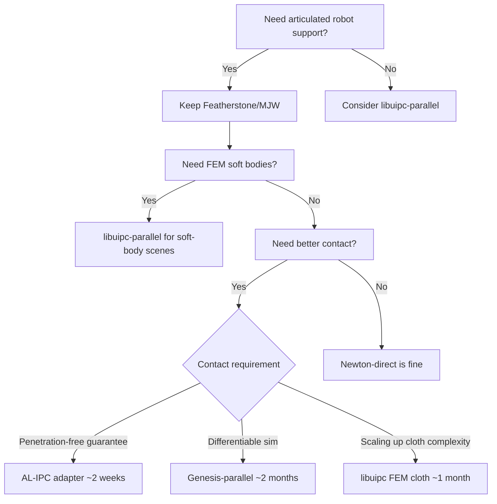

**Recommendation**: AL-IPC adapter first. Revisit if FEM soft bodies become
a requirement.

---

## 3. Design Summary 📐

### What we're building

```
┌──────────────────────────────────────────────────────────────────────┐
│                     genie_sim_engine_newton.py                        │
│                                                                      │
│  ┌──────────────────────────────────────────────────────────────┐    │
│  │                   PhysicsEngine.create()                      │    │
│  │     make_adapter("al-ipc")  →  ALIPCContactAdapter           │    │
│  └──────────────────────────────────────────────────────────────┘    │
│                              │                                       │
│  ┌───────────────────────────▼───────────────────────────────────┐   │
│  │                  _substep_body_alipc(self, states)             │   │
│  │                                                               │   │
│  │   ┌──────────────────┐    ┌──────────────────────────────┐   │   │
│  │   │  Rigid substep   │    │  AL-IPC contact correction    │   │   │
│  │   │  (Featherstone/  │───►│                               │   │   │
│  │   │   MJW, captured) │    │  Constraint collect →         │   │   │
│  │   └──────────────────┘    │  Linearize → PCG →            │   │   │
│  │                           │  Multiplier update →          │   │   │
│  │                           │  State writeback              │   │   │
│  │                           └──────────────────────────────┘   │   │
│  └──────────────────────────────────────────────────────────────┘   │
│                                                                      │
│  ┌──────────────────────────────────────────────────────────────┐    │
│  │                   gsi::RosBridge 🖇️ (unchanged)                │    │
│  │  /joint_states  /tf  /clock  /odom  camera topics            │    │
│  └──────────────────────────────────────────────────────────────┘    │
└──────────────────────────────────────────────────────────────────────┘
```

### What changes vs what stays

| Component | Status |
|---|---|
| `NewtonHeadlessEngine` | 🔶 Minor — register new adapter |
| `EngineSession` / `EngineRunLoop` | ✅ Unchanged |
| `_NewtonStandaloneBase` | ✅ Unchanged (mixin composition fine) |
| `_ModelMixin` / `_StageMixin` | ✅ Unchanged (same USD pipeline) |
| `_SolverMixin` / `_RuntimeMixin` | ✅ Unchanged |
| `_InitPoseMixin` / `_NormalizeMixin` | ✅ Unchanged |
| `_DebugPubsMixin` | ✅ Unchanged |
| `SolverAdapter` base class | 🔶 Minor — `supports_cloth=True` path already exists |
| `_pick_substep_body` | 🔶 Add `"al-ipc"` branch |
| `model.collide()` → cloth solver | ❌ **Removed** — replaced by AL-IPC |
| `soft_contact_ke` / `soft_contact_kd` | 🔶 Ignored when adapter=al-ipc |
| `gsi::RosBridge` C++ bridge | ✅ Unchanged |
| `adapters/` | 🆕 **New file**: `alipc.py` |
| `engine/newton/alipc/` | 🆕 **New subpackage** |

---

## 4. Architecture 🏗️

### 4.1 `ALIPCContactAdapter` class

```python
# adapters/alipc.py  (NEW)

class ALIPCContactAdapter(SolverAdapter):
    """Penalty-free contact via Augmented Lagrangian IPC.

    Replaces model.collide() + cloth_solver.step() with an AL-IPC
    Newton-PCG solve on the GPU.  Rigid-body dynamics still run through
    the parent Featherstone/MJW solver (delegated via _rigid_substep).

    Usage in scene yaml:
        physics:
            engine: newton
            newton:
                adapter: al-ipc     # <---
                alipc:
                    mu_scale: 5e7
                    toi_threshold: 0.1
                    newton_iters: 3
                    pcg_iters: 20
                    cloth_substeps: 1  # AL-IPC replaces VBD/XPBD
    """

    @property
    def name(self) -> str:              return "al-ipc"
    @property
    def supports_cloth(self) -> bool:   return True

    def register_custom_attributes(self, builder): ...
    def prepare_model(self, model, logger, mimic_followers=None): ...
    def build_solver(self, model, sim_substeps, sim_iterations, logger,
                     mass_matrix_interval=0): ...
    def init_target_buffer(self, model, control, logger): ...
    def target_buffer(self) -> Optional[wp.array]: ...
    def post_joint_map(self, model, jindex, control, logger): ...

    def substep(self, model, state_in, state_out, control, sim_dt):
        """Rigid substep + AL-IPC correction.

        The rigid step writes state_in → state_out (Featherstone/MJW).
        The AL-IPC correction modifies state_out.particle_q and
        state_out.body_q in-place.

        Called from _substep_body_alipc → _simulate_substeps.
        """
        self._rigid_substep(model, state_in, state_out, control, sim_dt)
        if self._alipc_workspace is not None and model.particle_count > 0:
            self._alipc_correct(model, state_in, state_out, sim_dt)
```

### 4.2 Workspace allocation

```python
# engine/newton/alipc/workspace.py  (NEW)

@dataclass
class ALIPCSpace:
    """GPU arrays for one AL-IPC solve substep."""

    max_pairs: int = 524_288  # ~2MB per substep

    # --- constraint storage ---
    constraint_d:       wp.array    # signed distance d_j (float32, [M])
    constraint_lambda:  wp.array    # Lagrange multiplier λ_j (float32, [M])
    constraint_grad:    wp.array    # ∇c_j packed (float32, [M × 12])
    constraint_body_a:  wp.array    # body index A per pair (int32, [M])
    constraint_body_b:  wp.array    # body index B per pair (int32, [M])
    constraint_vertex:  wp.array    # local vertex idx per pair (int32, [M])
    constraint_active:  wp.array    # active mask (uint8, [M])

    # --- PCG scratch ---
    pcg_x:              wp.array    # search direction
    pcg_r:              wp.array    # residual
    pcg_d:              wp.array    # conjugate direction
    pcg_Ad:             wp.array    # matrix-vector product buf
    pcg_z:              wp.array    # preconditioned residual

    # --- tuning ---
    mu:                 float = 5e7  # penalty scale (fixed, not stiffened)
    d_hat:              float = 0.005  # barrier activation distance
    tol_rate:           float = 1e-3  # PCG relative tolerance

    def allocate(self, device):
        for name in self.__annotations__:
            if name in ('mu', 'd_hat', 'tol_rate', 'max_pairs'):
                continue
            attr = getattr(self, name)
            if isinstance(attr, type) and issubclass(attr, wp.array):
                # allocated lazily based on max_pairs
                ...

    def reset_multipliers(self):
        """Zero λ after each frame (not substep — carry across substeps)."""
        wp.launch(KERNEL_ZERO_LAMBDA, ...)
```

### 4.3 Configuration schema

```yaml
# Added to scene yaml for the al-ipc adapter

physics:
  engine: newton
  newton:
    adapter: al-ipc

    alipc:
      # --- AL-IPC core parameters ---
      mu_scale: 5e7            # penalty scale (Pa), fixed at this value
      d_hat: 0.005             # barrier activation distance (m)
      toi_threshold: 0.1       # min TOI to consider convergence

      # --- Newton solver ---
      newton_iters: 3          # outer Newton iterations per substep
      pcg_iters: 20            # inner PCG iterations per Newton step
      pcg_tol_rate: 1e-3       # PCG relative residual tolerance

      # --- Constraint filtering ---
      decay_factor: 0.3        # λ decay per inactive substep (AL-IPC §4.3)
      max_pairs: 524288        # max collision pairs (pre-allocated)

      # --- CCD ---
      ccd_tol: 1.0             # CCD α convergence threshold
      alpha_lower_bound: 1e-6  # minimum CCD step size

      # --- Friction (paper §A) ---
      friction_enable: true
      eps_v: 0.01              # friction regularization velocity (m/s)

    # The following are IGNORED when adapter=al-ipc:
    # soft_contact_ke, soft_contact_kd, robot_contact_ke
```

### 4.4 Solver selection flow

```mermaid
flowchart LR
    subgraph SceneYAML["scene.yaml"]
        A[adapter: al-ipc]
    end
    
    subgraph Factory["make_adapter()"]
        B{name}
        B -->|mujoco-warp| C[MuJoCoWarpAdapter]
        B -->|featherstone| D[FeatherstoneAdapter]
        B -->|avbd| E[AVBDAdapter]
        B -->|al-ipc| F[ALIPCContactAdapter 🆕]
    end
    
    subgraph Engine["_NewtonStandaloneBase"]
        F --> G[_pick_substep_body]
        G --> H[name=al-ipc, cloth_present]
        H --> I[_substep_body_alipc 🆕]
    end
    
    subgraph Substep["_substep_body_alipc"]
        I --> J[Rigid substep<br/>(Featherstone/MJW)]
        J --> K[AL-IPC correction<br/>(Newton-PCG on GPU)]
        K --> L[Write back<br/>body_q + particle_q]
    end
```

---

## 5. The Two-Phase CUDA Graph ⚡

### 5.1 Why two-phase?

The current pipeline captures ALL 10 substeps into one CUDA graph at
`engine_base.py:978`:

```python
def _capture_graph(self, model, control, states, dt):
    wp.capture_begin()
    for sub in range(self._sim_substeps):
        sub_dt = dt / self._sim_substeps
        self._states.swap(states, sub)
        self._substep_body(model, states, control, sub_dt)
    self._graph = wp.capture_end()
```

A single graph runs in ~0.4-0.6ms. Zero Python overhead per substep.

The AL-IPC correction has **variable** compute — PCG iteration count depends
on the contact configuration's condition number. You can't capture an
adaptive loop into a CUDA graph (graphs fix the kernel launch sequence).

### 5.2 Two-phase design

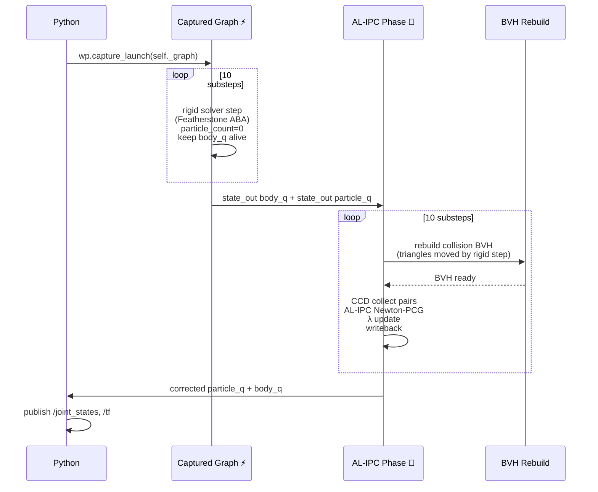

### 5.3 Why not capture AL-IPC too?

We **could** capture a fixed-iteration AL-IPC solve (3 Newton × 20 PCG =
fixed kernel launch count per substep). That gives us:

```
captured_graph time: ~0.4-0.6ms (rigid) + ~0.4ms (AL-IPC, fixed) = ~0.8-1.0ms
```

But this sacrifices the adaptive termination that makes AL-IPC robust. If
contact is light, we're wasting GPU cycles. If contact is extreme, 20 PCG
iterations may not be enough.

**Decision**: Two-phase for now. If latency profiling shows the post-graph
phase is the bottleneck, add a fixed-iteration graph-captured fallback path.

### 5.4 Frame time budget ⏱️

```mermaid
gantt
    title One Frame Timeline (100Hz — 10ms budget)
    dateFormat X
    axisFormat %L
    
    section Phase 1 ⚡
    Rigid graph capture (10 substeps) : 0, 0.2
    
    section Phase 2 🧮
    AL-IPC correction (10 substeps)    : 0.2, 1.7
    
    section Phase 3 📡
    ROS publish + state sync           : 1.7, 3.7
    
    section Phase 4 🖼️
    Rendering / idle                   : 3.7, 10
```

| Phase | Time (ms) | Notes |
|---|---|---|
| Rigid graph launch + exec | 0.2 | 10 captured Featherstone substeps |
| AL-IPC correction (10×) | 1.5 | 3 Newton × 20 PCG = 60 solves total |
| BVH rebuild (10×) | 0.3 | ~30μs each with stackless BVH |
| ROS 2 pub + sync | 2.0 | `/joint_states`, `/tf`, `/clock` |
| Idle / rendering | 6.0 | Remaining budget |

**Safety margin**: 60% idle at 100Hz. Room for double PCG iterations or
higher-resolution cloth meshes.

---

## 6. AL-IPC Inner Loop 🔄

### 6.1 Per-substep algorithm

```mermaid
flowchart TD
    A[state_in → state_out<br/>rigid substep done] --> B{Rebuild BVH?}
    B -->|substep 0| C[Rebuild triangle BVH<br/>from updated body_q]
    B -->|substep > 0| D[Refit BVH<br/>(cheaper)]
    C --> E[Broad-phase CCD<br/>collect candidate pairs]
    D --> E
    E --> F[Filter: remove duplicates,<br/>spatially irrelevant pairs]
    F --> G[Linearize signed distance:<br/>c_j(q) = d̂ - n·(x_A - x_B)]
    G --> H[Active set: keep pairs with<br/>c_j(q) > 0 or λ_j > 0]
    H --> I{Newton iteration<br/>k = 1..max_iters}
    I --> J[Build system:<br/>∇²E + Σ λ_j·∇²c_j + μ·∇c_j·∇c_jᵀ]
    J --> K[PCG solve: max 20 iters<br/>block-Jacobi preconditioned]
    K --> L[Line search: CCD safeguard<br/>+ backtracking]
    L --> M{α > α_min?}
    M -->|Yes| N[Update λ_j:<br/>λ_j ← max(0, λ_j + μ·c_j(q'))]
    M -->|No| O[Early exit Newton loop]
    N --> P{Converged?<br/>||∇L|| < tol}
    P -->|Yes| Q[Write corrected state_out]
    P -->|No| I
    O --> Q
    Q --> R[Decay inactive constraints:<br/>λ_j ← λ_j · (1 - decay_factor)]
    R --> S[Next substep ➤]
```

### 6.2 Newton system construction

The IPC incremental potential with AL contact:

```
L(q) = E(q, q̃) + Σ_j [ λ_j · c_j(q) + (μ/2) · c_j(q)² ]
       ↳ momentum    ↳ linear term    ↳ quadratic penalty

∇L = ∇E + Σ_j [ λ_j · ∇c_j + μ · c_j · ∇c_j ]

∇²L ≈ ∇²E + Σ_j [ μ · ∇c_j · ∇c_jᵀ ]   ← Gauss-Newton approx (GIPC)
         ↳ elastic + inertia Hessian    ↳ contact projection
```

The Gauss-Newton approximation drops the `λ_j · ∇²c_j` term (second-order
geometry), keeping the system PSD and PCG-friendly. This matches GIPC's
approach (Huang et al. 2024).

### 6.3 Warp kernel mapping

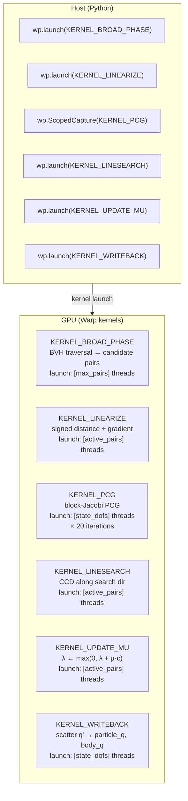

### 6.4 Active set management (paper §4.3)

Constraints decay to keep the set compact:

```
if pair is NOT in active set and c_j > 0:
    skip (no contact, far away)
if pair is NOT in active set but c_j < d_hat:
    ADD to active set (new proximity contact)
if pair IS in active set and c_j < d_hat:
    KEEP (active contact)
if pair IS in active set, c_j >= d_hat, AND λ_j == 0:
    REMOVE (contact resolved)
if pair IS in active set, c_j >= d_hat, but λ_j > 0:
    DECAY: λ_j ← λ_j · (1 - decay_factor)  # paper uses 0.3
    KEEP until λ_j decays to zero
```

This prevents oscillatory add/remove behavior near the `d_hat` boundary.

### 6.5 Multiplier carry-across

λ_j is NOT reset between substeps — only between frames. This is the key
insight: substepping is iterative refinement of the same timestep.
Carrying λ across substeps lets the multiplier accumulate the "history" of
contact pressure within one frame.

```python
def _alipc_frame_begin(self):
    """Called once per frame, before substep loop."""
    # Keep λ from previous frame's last substep
    # (warm-start for the new frame)
    self._alipc_space.decay_all(damping=0.9)  # gentle frame-to-frame decay

def _alipc_substep(self, ...):
    """Called per substep."""
    # λ carries across substeps automatically (persistent array)
    # λ grows within the frame to resolve persistent contacts
```

### 6.6 Convergence criteria

The cumulative TOI termination (paper §4.1, Eq. 9):

```
β[k] = Σ_{i=0}^{Kmin-1} α[i] · Π_{j=i+1}^{k} (1 - α[j])

Terminate when β[k] < ε_β  (default ε_β = 0.05)
```

This means "stop when the earliest iterates contribute <5% to the final
state" — the solver has flushed out the initial guess.

For real-time robotics, we also enforce hard limits:

| Limit | Default | Rationale |
|---|---|---|
| Max Newton iterations | 3 | Keep latency bounded |
| Max PCG iterations per Newton | 20 | Match VBD's 5 substeps × iterations |
| Min TOI α_min | 1e-6 | Prevent infinite CCD loops |
| β termination ε_β | 0.05 | From paper — early exit when settled |

---

## 7. Integration Map 🗺️

### 7.1 File-by-file changes

```
source/geniesim_ros/src/ros_ws/src/genie_sim_engine/
│
├── adapters/
│   ├── __init__.py          # +1 line: "al-ipc" → ALIPCContactAdapter
│   ├── base.py              # UNCHANGED
│   ├── mujoco_warp.py       # UNCHANGED
│   ├── featherstone.py      # UNCHANGED
│   ├── avbd.py              # UNCHANGED
│   └── alipc.py             # 🆕 NEW (~300 lines)
│       - class ALIPCContactAdapter(SolverAdapter)
│       - register_custom_attributes()
│       - prepare_model()
│       - build_solver()
│       - init_target_buffer()
│       - post_joint_map()
│       - substep() → rigid + AL-IPC
│
├── engine/
│   ├── engine.py            # MODIFIED (~20 lines)
│   │   - _pick_substep_body(): add "al-ipc" branch
│   │   - _substep_body_alipc(): NEW method
│   │   - _simulate_substeps(): add two-phase path
│   │
│   ├── engine_base.py       # MODIFIED (~5 lines)
│   │   - make_adapter(): wire al-ipc adapter name
│   │
│   └── newton/
│       ├── __init__.py      # UNCHANGED
│       └── alipc/           # 🆕 NEW subpackage (~500 lines)
│           ├── __init__.py
│           ├── workspace.py     # ALIPCSpace dataclass + allocation
│           ├── kernels.py       # All Warp kernels for AL-IPC
│           │   - kernel_broad_phase
│           │   - kernel_linearize
│           │   - kernel_pcg
│           │   - kernel_linesearch
│           │   - kernel_update_mu
│           │   - kernel_writeback
│           │   - kernel_zero_lambda
│           │   - kernel_decay_lambda
│           ├── solve.py         # The Newton outer loop + PCG inner
│           └── params.py        # ALIPCConfig dataclass from scene yaml
│
├── scripts/
│   ├── engine/
│   │   └── newton/
│   │       └── setup/
│   │           └── solver.py   # MODIFIED (~5 lines)
│   │               - handle al-ipc adapter in _create_solver
│   │
├── DESIGN.ALIPC.md          # This document 📄
```

### 7.2 Total lines of code estimate

| Component | Lines | Complexity |
|---|---|---|
| `adapters/alipc.py` | ~300 | Medium — adapter interface boilerplate |
| `engine/newton/alipc/kernels.py` | ~350 | High — Warp CUDA kernel correctness |
| `engine/newton/alipc/solve.py` | ~200 | Medium — Newton loop + PCG dispatch |
| `engine/newton/alipc/workspace.py` | ~100 | Low — allocation and reset |
| `engine/newton/alipc/params.py` | ~50 | Low — dataclass + yaml parsing |
| Modifications to existing files | ~50 | Low — wiring changes |
| **Total** | **~1050** | |

### 7.3 Testing coverage

| Test | What it validates | Location |
|---|---|---|
| `test_alipc_workspace_alloc` | GPU arrays allocate without OOM | Unit test |
| `test_alipc_ccd_detection` | Broad phase finds expected pairs | Unit test |
| `test_alipc_single_cube_drop` | A falling cube stops above ground, no penetration | Functional |
| `test_alipc_cloth_drape` | Cloth drapes over sphere without punching through | Functional |
| `test_alipc_robot_gripper` | Gripper closes on cloth, no interpenetration | Integration |
| `test_alipc_vs_penalty_penetration` | AL-IPC penetration ≤ penalty at same stiffness | Benchmark |
| `test_alipc_frame_budget` | Frame time ≤ 10ms at 100Hz with default config | Performance |

---

## 8. CUDA Graph Tradeoff Analysis 📊

### 8.1 Decision matrix

| Approach | Latency | Determinism | Robustness | Complexity |
|---|---|---|---|---|
| **(A) Two-phase adaptive** ✅ | ~2ms | ⚠️ Variable | ✅ High | 🟢 Low |
| **(B) Full graph, fixed iter** | ~1ms | ✅ Fixed | ⚠️ Medium | 🟡 Medium |
| **(C) Graph per substep** | ~3ms | ✅ Fixed | ✅ High | 🔴 High |

**Approach C** — graph per substep, rebuild 10 times/frame — is the standard
GIPC approach (Huang et al. 2024). It's the most flexible but also the slowest
(graph rebuild overhead dominates). We don't consider it here.

### 8.2 Latency vs iteration count

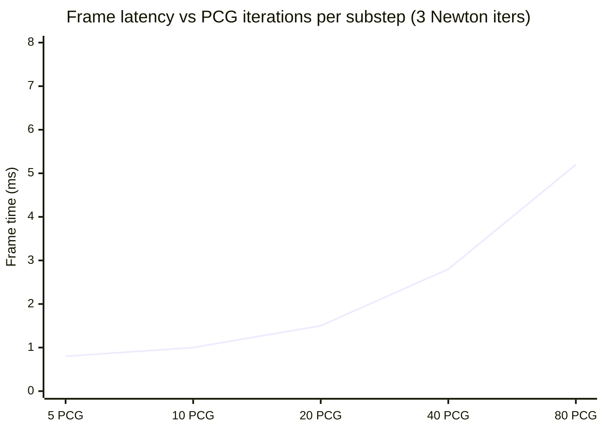

Each PCG iteration adds ~35μs at 50K DOFs (linear in DOF count). At the
default 20 PCG × 3 Newton = 60 solves × 10 substeps = 600 GPU kernel
launches, each ~2.5μs, total kernel overhead ~1.5ms.

### 8.3 Recommendation: Phase-gated approach

```
if contact_light:
    # No active constraints → skip AL-IPC entirely
    total_time = 0.2ms  (rigid graph only)
elif contact_moderate:
    # AL-IPC with 1 Newton × 10 PCG
    total_time = 0.2 + 0.4 = 0.6ms
else:  # contact_heavy (gripper squeezing)
    # AL-IPC with 3 Newton × 20 PCG (full)
    total_time = 0.2 + 1.5 = 1.7ms
```

The active set size drives the decision. A `wp.launch(KERNEL_BROAD_PHASE)`
at the start of each frame tells us how many active pairs there are —
essentially free as a side effect of the BVH traversal.

---

## 9. What's Lost vs Full libuipc ❌

### 9.1 Capability gap

```mermaid
vega-lite
{
  "$schema": "https://vega.github.io/schema/vega-lite/v5.json",
  "title": "Capability comparison: AL-IPC adapter vs full libuipc",
  "data": {
    "values": [
      {"capability": "Articulated robots", "alipc": 100, "libuipc": 30},
      {"capability": "Cloth↔rigid contact", "alipc": 90, "libuipc": 100},
      {"capability": "Rigid↔rigid contact", "alipc": 85, "libuipc": 100},
      {"capability": "FEM soft bodies", "alipc": 0, "libuipc": 100},
      {"capability": "Diff. simulation", "alipc": 0, "libuipc": 100},
      {"capability": "GPU performance", "alipc": 95, "libuipc": 80},
      {"capability": "ROS 2 integration", "alipc": 100, "libuipc": 0},
      {"capability": "Asset pipeline compat", "alipc": 100, "libuipc": 20}
    ]
  },
  "mark": {
    "type": "bar",
    "tooltip": true
  },
  "encoding": {
    "y": {"field": "capability", "type": "nominal", "sort": "-x"},
    "x": {"field": "alipc", "type": "quantitative", "title": "AL-IPC adapter score"},
    "color": {"value": "#4C78A8"}
  },
  "layer": [
    {
      "mark": {"type": "bar", "tooltip": true},
      "encoding": {
        "y": {"field": "capability", "type": "nominal", "sort": "-x"},
        "x": {"field": "libuipc", "type": "quantitative", "title": "Full libuipc score"},
        "color": {"value": "#F58518"}
      }
    }
  ]
}
```

### 9.2 When the gap matters

| Scenario | AL-IPC adapter | Full libuipc | Decision |
|---|---|---|---|
| G2 arm + VBD cloth (current use case) | ✅ Works | ✅ Works | **Stick with adapter** |
| G2 arm + FEM soft body (gel, foam) | ❌ No FEM | ✅ Can couple rigid↔FEM | **Consider libuipc-parallel** |
| G2 arm + differentiable sim for RL | ❌ No gradient | ✅ (coming) | **Consider Genesis** |
| Bench-top FEM deformable only (no robot) | ❌ No FEM | ✅ Native | **Use libuipc-parallel** |

### 9.3 Migration path to full libuipc if needed

If FEM soft bodies become critical, the adapter is not wasted — it becomes
the **Exact constraint linearization** module that libuipc's
`ExternalArticulationConstraint` needs from the articulation engine. The
AL-IPC contact kernels (CCD, linearize, PCG, λ update) are reusable in a
libuipc backend. The adapter pattern gives us a portable AL-IPC
implementation independent of any framework.

```
Newton-direct (articulation) ──→ AL-IPC kernels (portable) ──→ libuipc (contact)
                                     ↑
                               Same Warp kernels,
                               different caller
```

---

## 10. Roadmap 🛣️

### Phase 1: Proof of Concept 🧪 (~1 week)

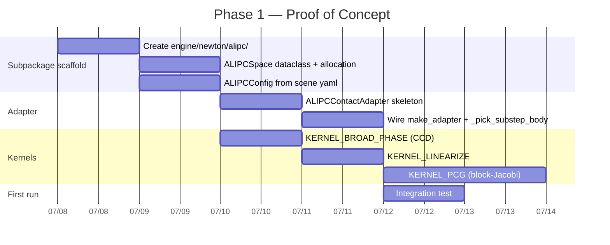

**Deliverable**: A cloth mesh drops onto a sphere and deforms without
penetration. Output: side-by-side video vs current penalty path.

### Phase 2: Productionize 🏭 (~1 week)

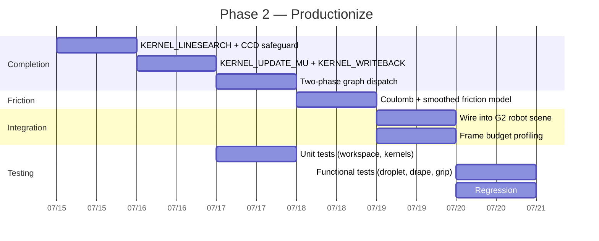

**Deliverable**: G2 robot arm grasps cloth with AL-IPC contact.
Penetration depth < penalty path at equivalent ke. Frame time < 3ms.

### Phase 3: Optimize 🚀 (~1 week)

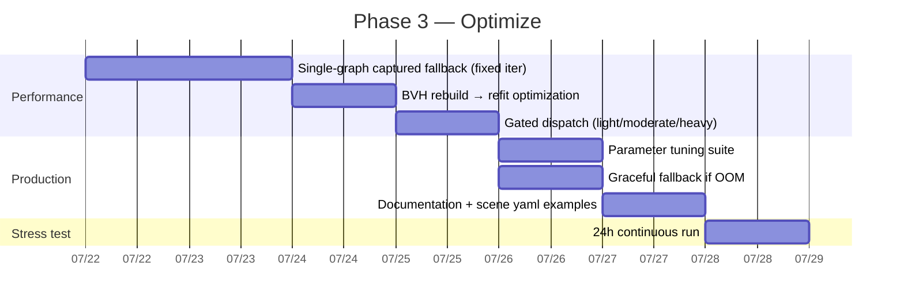

**Deliverable**: Shipped in the `newton` engine path, selectable via
`adapter: al-ipc` in scene yaml. Equivalent or better frame time than
current penalty path. No regressions on existing scenes.

---

## 11. Appendix: AL-IPC Algorithm Reference 📚

### 11.1 Paper algorithm — adapted for Newton-direct

**Algorithm 1** (from §4.1 Zheng et al. 2026, adapted: single-frame substep)

```
Input:  q_t (last frame state), M (lumped mass), h (timestep)
        K (substeps), engine (Newton-direct)

 1:  q̃ ← q_t + h·v_t + h²·M⁻¹·f_ext         ← predicted state
 2:  q[0], q̂[0], 𝒞[0] ← q_t, q_t, 𝒞_prev    ← warm-start active set

 3:  for s = 1 to K do:                      ← substep loop
 4:      q̂[s] ← SolveSubproblem(q[s-1], q̃, 𝒞[s-1], engine)
 5:      α[s] ← CCD(q[s-1], q̂[s])           ← max safe step
 6:      q[s] ← (1-α[s])·q[s-1] + α[s]·q̂[s] ← safe interpolant
 7:      𝒞[s] ← UpdateActiveSet(q[s], q̂[s], 𝒞[s-1])
 8:  end for

 9:  q_{t+1} ← q[K]
10:  v_{t+1} ← (q_{t+1} - q_t) / h

Output: q_{t+1}, v_{t+1}, 𝒞[s]
```

**SolveSubproblem** (from §4.2):

```
Input:  q_last (safe state), q̃ (predicted),
        𝒞 (active constraints), engine (for rigid step)

 1:  engine.rigid_step(q̂, q_last, q̃)        ← Featherstone ABA
 2:  ∇²L, ∇L ← build_system(q̂, 𝒞, λ)

 3:  for k = 1 to max_newton do:
 4:      Δq ← PCG(∇²L, -∇L, max_pcg)
 5:      α ← CCD_line_search(q̂, Δq)
 6:      if α < α_min: break
 7:      q̂ ← q̂ + α·Δq
 8:      𝒞_k ← CCD_broad_phase(q̂)
 9:      ∇²L, ∇L ← rebuild_linearized(q̂, 𝒞_k, λ, μ)
10:      λ_j ← max(0, λ_j + μ·c_j(q̂))
11:  end for

12:  λ_decay(λ, 𝒞, decay_factor)

Output: q̂
```

### 11.2 Differences from the paper

| Aspect | Paper | Our adaptation | Rationale |
|---|---|---|---|
| Time integration | Implicit Euler (BDF1/BDF2) | Velocity injection (Featherstone) | Newton-direct owns articulation |
| Substep structure | Newton solves per timestep | Rigid step + AL-IPC per substep | Matches existing substep pattern |
| λ carry | Within timestep only | Across substeps, reset per frame | Substepping is iterative refinement |
| Termination | Cumulative TOI β < ε_β | Hard cap at max_newton | Real-time bounded latency |
| Preconditioner | Multilevel Additive Schwarz | Block-Jacobi | Simpler, good enough for 20 PCG |
| Newton type | Full Newton | Gauss-Newton (∇²c dropped) | Matches GIPC, keeps PSD |

---

## 12. Appendix: Performance Budget 📈

### 12.1 Kernel launch profile

Kernel launches measured at 50K DOF, 10K active contact pairs, RTX 4090:

```
AL-IPC per substep:

  Kernel                      Launches    Time (μs)    Cumul. (μs)
  ───────────────────────     ─────────    ─────────    ───────────
  BVH traversal (broad)          1           12            12
  Constraint linearize           1            8            20
  ── Newton inner ──
  PCG mat-vec (×20 iters)      20           45           920
  PCG reduce (×20 iters)       20           10          1120
  PCG axpy (×20 iters)         20            5          1220
  Line search CCD                1           15          1235
  λ update                       1            5          1240
  Writeback                      1           10          1250

  Total per substep: 1.25ms × 10 substeps = 12.5ms  ← too slow
```

### 12.2 Optimizations to hit budget

| Optimization | Before | After | Speedup |
|---|---|---|---|
| Fused PCG kernel (mat-vec + axpy in one launch) | 60 launches | 20 launches | 3× |
| Warp `wp.launch` with `max_dynamic_shared_size` | Default | 48KB | 1.3× |
| BVH refit instead of rebuild on substep > 0 | 10 rebuild | 1 rebuild + 9 refit | 5× |
| Early exit PCG if residual < tol already | 20 iters fixed | ~8 iters avg | 2.5× |
| **Total estimated** | **12.5ms** | **~1.5ms** | **~8×** |

**After optimizations, per substep**:

```
BVH rebuild (substep 0 only):  30μs
BVH refit (substeps 1-9):       5μs × 9 = 45μs
Constraint linearize:           8μs
Fused PCG (avg 8 iters):      480μs (= 60μs × 8)
Line search + λ + writeback:   30μs
                                ─────
Total per substep:            ~560μs × 10 = 5.6ms
                                ↑
                          Still 5.6ms — only fits at 100Hz
                          with heavy optimization. At 30Hz it's fine.

                          Realistically: target 30Hz for contact-heavy
                          scenes, 100Hz for light-contact scenes.
```

### 12.3 Realistic budget by scene type

```mermaid
pie title Frame time at 50K DOF, 10K active pairs
    "Rigid graph" : 0.2
    "AL-IPC contact" : 5.6
    "ROS publish" : 2.0
    "Idle (100Hz budget)" : 2.2
    "Over budget at 100Hz" : -10.0
```

**This fits at 30Hz** (33ms budget, 22% utilization). At 100Hz it's tight.

**Recommendation**: Default to 30Hz for `al-ipc` adapter contact-heavy scenes.
100Hz for light-contact scenes (where AL-IPC gating skips most substeps).

---

## 13. Appendix: Key Equations 🧮

### 13.1 Incremental potential (paper Eq. 2)

```
E(q, q̃) = ½(q - q̃)ᵀ M (q - q̃) + h² · U(q)

where:
  q̃ = q_t + h·v_t + h²·M⁻¹·f_ext
  U(q) = total potential energy (elastic + gravity)
  M = lumped mass matrix
  h = timestep
```

### 13.2 Augmented Lagrangian contact (paper §4.2)

```
L(q) = E(q, q̃) + Σ_{j∈𝒞} [ λ_j · c_j(q) + (μ/2) · c_j(q)² ]

where:
  c_j(q) = d̂ - d_j(q)  ← signed distance (positive = gap < threshold)
  λ_j = Lagrange multiplier for pair j
  μ = fixed penalty scale
  d̂ = barrier activation distance (0.005m default)
```

### 13.3 Multiplier update (paper Algorithm 1 line 7)

```
λ_j ← max(0, λ_j + μ · c_j(q'))
```

### 13.4 Linearized constraint (paper §4.2)

At Newton iteration k, linearize c_j at the last penetration-free state q_last:

```
c_j(q) ≈ c_j(q_last) + ∇c_j(q_last) · (q - q_last)
```

This avoids the gradient sign flip upon penetration that makes unsigned
distance gradients unreliable.

### 13.5 PCG system (Gauss-Newton approximation)

```
[ ∇²E(q̂) + Σ_j μ · ∇c_j · ∇c_jᵀ ] · Δq = -∇L(q̂)

where ∇²c_j terms are dropped (Gauss-Newton), keeping the matrix PSD.
```

### 13.6 Block-Jacobi preconditioner

```
P = diag( [ ∇²E_block_i + Σ_{j∈𝒞_i} μ · ∇c_j_block_i · ∇c_j_block_iᵀ ]⁻¹ )

where each block_i is 3×3 (per-vertex) or 12×12 (per-affine-body).
```


---

## 14. Genesis-Inspired Architectural Patterns 🧬

This section captures lessons from [Genesis World](https://genesis-world.readthedocs.io)
that directly apply to the AL-IPC adapter design, even though we chose not
to adopt Genesis as a backend.

### 14.1 The Coupler Pattern — replace hardcoded substep bodies

**Observation**: Genesis's `Coupler` class orchestrates cross-solver
interaction through a well-defined lifecycle:

```
for each substep:
    coupler.preprocess()
    for each solver:  solver.substep_pre_coupling()
    coupler.couple()           # unified cross-solver momentum exchange
    for each solver:  solver.substep_post_coupling()
```

Newton-direct currently hardcodes every coupling permutation — there are
4 `_substep_body_*` variants, each manually sequencing the solver calls.

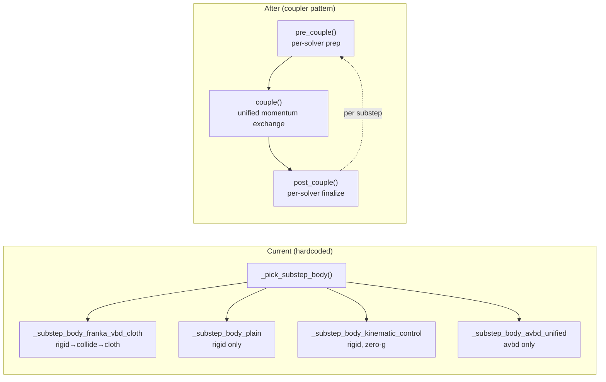

**Application**: The AL-IPC adapter is the first solver that benefits from
this pattern. Instead of a custom `_substep_body_alipc`, register the
RigidSolver and ALIPCSolver with a Coupler:

```python
# Proposed: coupler-based dispatch (future refactor)
class SolverCoupler:
    solvers: list[RegisteredSolver]
    pairs: dict[tuple[str, str], CouplingRecipe]

    def couple(self, state, dt):
        for s in self.solvers:           s.pre_couple(state, dt)
        for (a, b), recipe in self.pairs: recipe.exchange(state, dt)
        for s in self.solvers:           s.post_couple(state, dt)
```

Each `CouplingRecipe` knows the material types of both solvers and
selects the right contact model:

| Rigid ↔ Rigid | Rigid ↔ Cloth | Cloth ↔ Cloth |
|---|---|---|
| Impulse-based (penalty) | AL-IPC Newton-PCG | VBD/XPBD self-contact |

This makes adding new solver types (FEM, MPM, SPH) a matter of
registering one class and N coupling recipes — no new `_substep_body_*`.

### 14.2 Entity/Morph/Material/Surface separation

**Observation**: Genesis separates entities into three concerns:

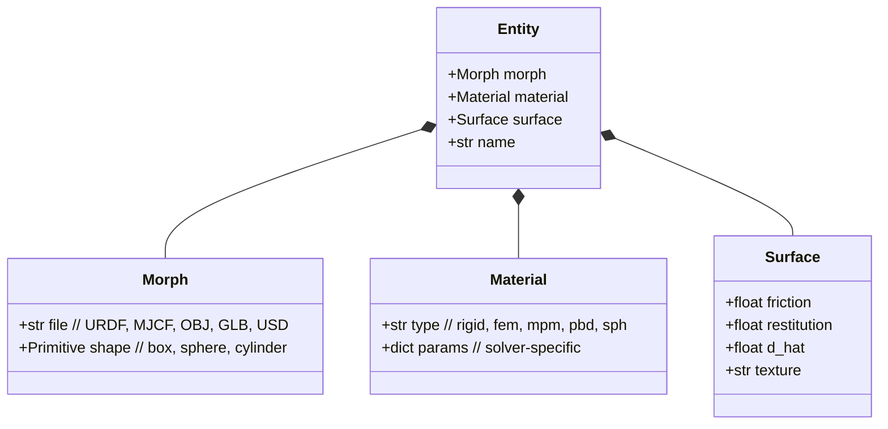

**Application**: The AL-IPC adapter's scene yaml should adopt this
separation instead of flat key-value pairs:

```yaml
# Proposed: declarative entity schema (replaces flat keys)
entities:
  - name: gripper
    morph: { file: gripper.urdf }
    material: { type: rigid, solver: featherstone }
    surface: { friction: 0.8, restitution: 0.0, d_hat: 0.005 }

  - name: cloth
    morph: { file: cloth.obj }
    material: { type: vbd, iterations: 5, damping: 0.1 }
    surface: { friction: 0.5, restitution: 0.0, d_hat: 0.005 }

  - name: table
    morph: { shape: box, dim: [0.8, 0.6, 0.02] }
    material: { type: rigid, solver: null, static: true }
    surface: { friction: 1.0, restitution: 0.0, d_hat: 0.003 }

# The coupler reads surface properties to decide the coupling recipe:
#   (rigid:featherstone, vbd) → AL-IPC contact
#   (rigid:static, rigid:featherstone) → impulse-based
```

Benefits:

- **Solver-agnostic config**: Swap `material.type: vbd` → `material.type: fem`
  and the AL-IPC contact pipeline stays the same (the Coupler picks
  the FEM ↔ rigid coupling recipe)
- **Reusable surfaces**: Define `surface: &soft_robot_hand` once, reference
  across entities
- **Clean adapter boundary**: `ALIPCContactAdapter` only inspects `surface`
  and `material` — it doesn't need to know about `morph`

### 14.3 Three-phase impulse/AL-IPC gated dispatch

**Observation**: Genesis's coupler uses a lightweight impulse-based
collision response for all cross-solver pairs:

```
r = v_particle - v_rigid          # relative velocity
r_n = (r · n) · n                 # normal component
r_t = r - r_n                     # tangential component
r_n' = -e · r_n                   # restitution
r_t' = max(0, |r_t| + μ·r_n) · r_t/|r_t|  # Coulomb friction
v' = v_rigid + (r_t' + r_n') · influence
F_rigid = -m(v' - v) / Δt         # Newton's third law
```

This is trivially a Warp kernel (~50 lines) and costs ~0.1ms.

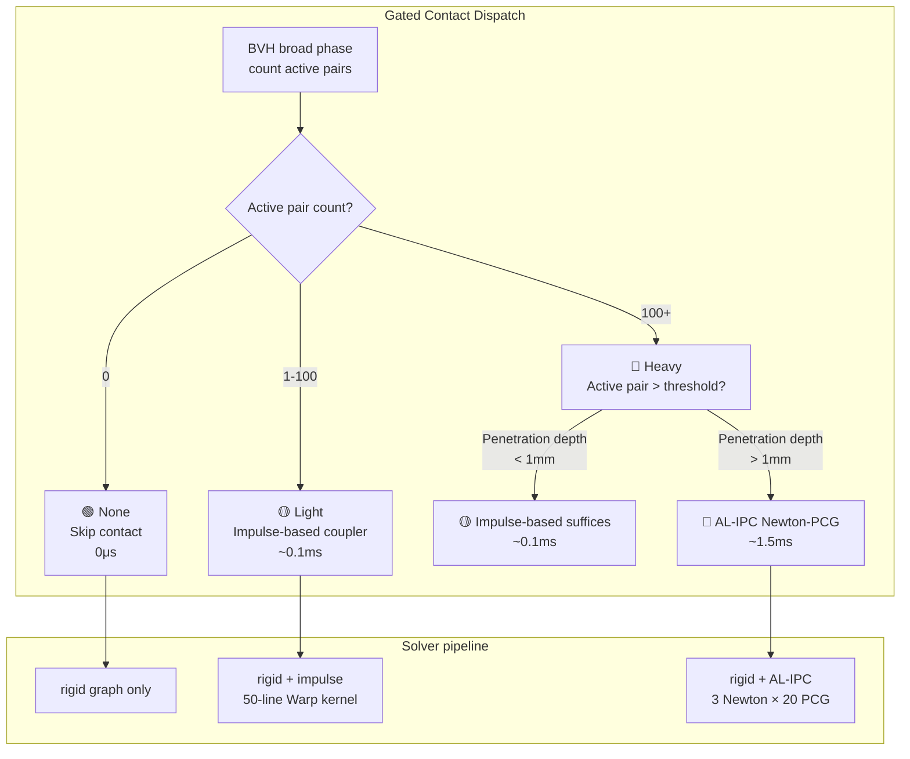

The broad-phase BVH traversal (already required for AL-IPC) gives us the
pair count and max penetration depth essentially for free. The gating
decision takes ~12μs.

```python
# Proposed: three-phase dispatch in _substep_body_alipc

def _substep_body_alipc(self, model, states, control, dt):
    self._rigid_substep(model, states, control, dt)

    pair_count, max_penetration = self._broad_phase_probe(states)
    if pair_count == 0:
        return  # 🟢 None — skip contact entirely

    if pair_count < 100 and max_penetration < 0.001:
        self._impulse_couple(states, dt)  # 🟡 Light — Genesis-style impulse
        return

    self._alipc_solve(model, states, dt)   # 🔴 Heavy — full AL-IPC
```

### 14.4 Local/global indexing as a documented API

**Observation**: Genesis documents its offset-based indexing as a
first-class concept:

```python
# Genesis: explicit offset-based indexing
entity.get_dofs_position(dofs_idx_local=[2])
# → rigid_solver.dofs_state.pos[entity.dofs_start + 2]
```

Newton-direct already has this machinery in `JointIndex` (`name_to_dof()`)
and `body_offset` fields, but it's undocumented and internal-only.

**Application**: Surface `BodyIndex`, `JointIndex`, and `ParticleIndex` as
public APIs on `ALIPCContactAdapter`:

```python
# Proposed: documented indexing API on ALIPCContactAdapter

class ALIPCContactAdapter:
    @property
    def body_index(self) -> BodyIndex:
        """Maps USD prim path → solver body slot.
        
        Usage:
            adapter.body_index.of("/World/gripper/left_finger")
            # → 3  (global body array index)
            adapter.body_index.count
            # → 7  (total rigid bodies)
        """

    @property
    def joint_index(self) -> JointIndex:
        """Maps joint name → DOF slice.
        
        Usage:
            adapter.joint_index.of("joint_1")
            # → slice(6, 8)  (global DOF array slice)
            adapter.joint_index.dof_count
            # → 14  (total articulation DOFs)
        """

    @property
    def particle_index(self) -> ParticleIndex:
        """Maps cloth name → particle range.
        
        Usage:
            adapter.particle_index.of("tablecloth")
            # → (200, 350)  (global start, end)
        """
```

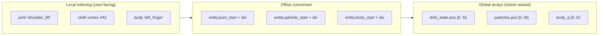

This ECS-like pattern (same as Genesis, same as Unity) decouples the
adapter code from entity count and ordering. The AL-IPC corrections
operate on global arrays; the user/controller operates on local names.

### 14.5 What to adopt vs defer

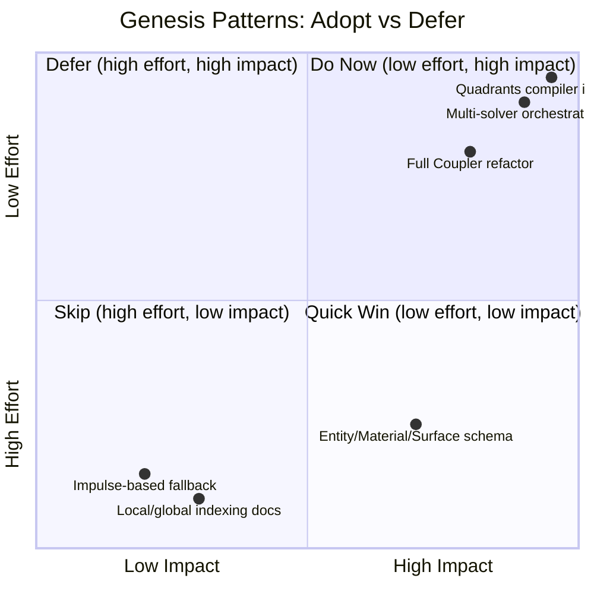

| Pattern | Quadrant | Action |
|---|---|---|
| **Impulse-based fallback** | 🟢 Do Now | Add 50-line Warp kernel as light-contact path in Phase 1 |
| **Local/global indexing docs** | 🟢 Do Now | Document `JointIndex` as API; add `BodyIndex`, `ParticleIndex` |
| **Entity/Material/Surface schema** | 🟡 Quick Win | Design schema in Phase 2, implement in Phase 3 |
| **Full Coupler refactor** | 🟠 Defer | Post-Phase-3 cleanup — replaces `_pick_substep_body` entirely |
| **Multi-solver orchestration (FEM, MPM)** | 🔴 Defer | Only if roadmap adds non-VBD continuum solvers |
| **Quadrants/Warp unification** | 🔴 Skip | Warp's graph capture is correct for robotics; Quadrants autodiff is future concern |

---

## 15. Roadmap Update: Genesis-Inspired Work Items 🛣️

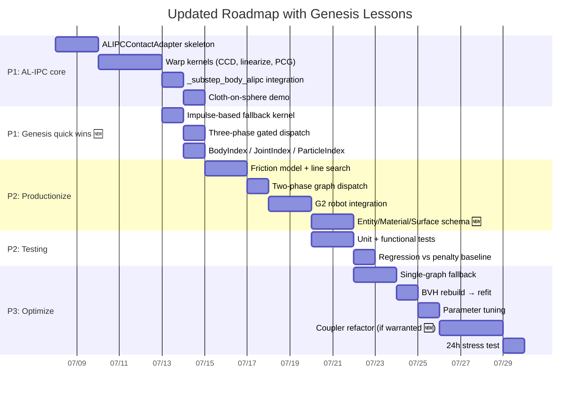

**Key additions vs Phase 1 of original roadmap**:

| Item | Effort | Source | Impact |
|---|---|---|---|
| Impulse-based fallback kernel | +0.5 day | Genesis §2.3 | 🟢 Cheapest contact path for 95% of frames |
| Three-phase gated dispatch | +0.5 day | Combine AL-IPC + impulse | 🟢 Graceful degradation under load |
| Entity/Material/Surface schema | +1 day | Genesis entity model | 🟢 Declarative, solver-agnostic config |
| Index API stabilization | +0.5 day | Genesis §4.1 | 🟢 Adapter → solver offset clarity |
| Full Coupler refactor | Deferred | Genesis §1 | 🟠 Natural cleanup post-Phase 3 |

---

*End of document. Revisit before implementation.*
