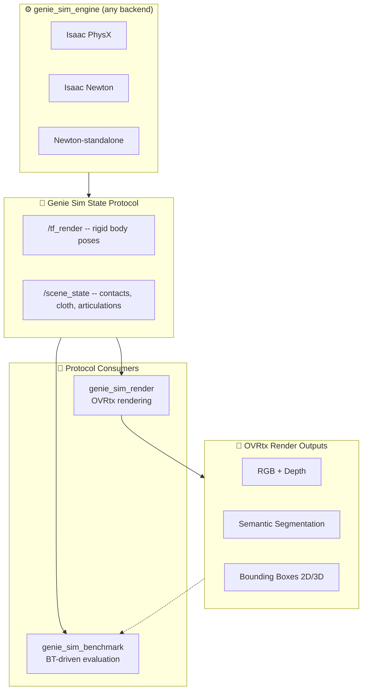
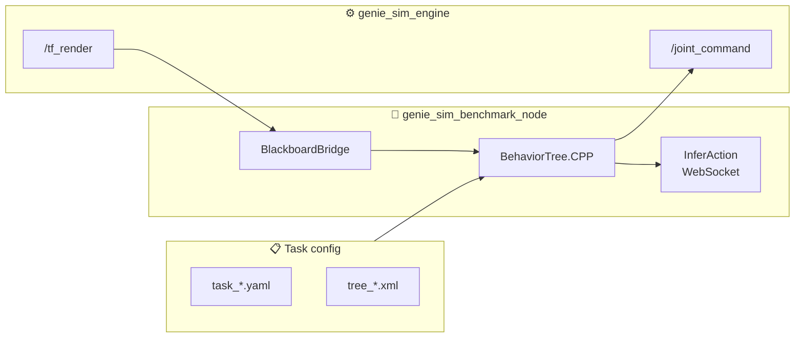
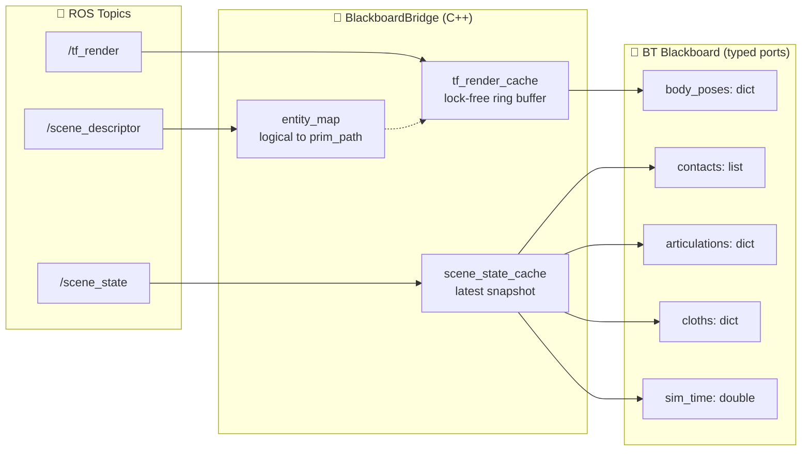
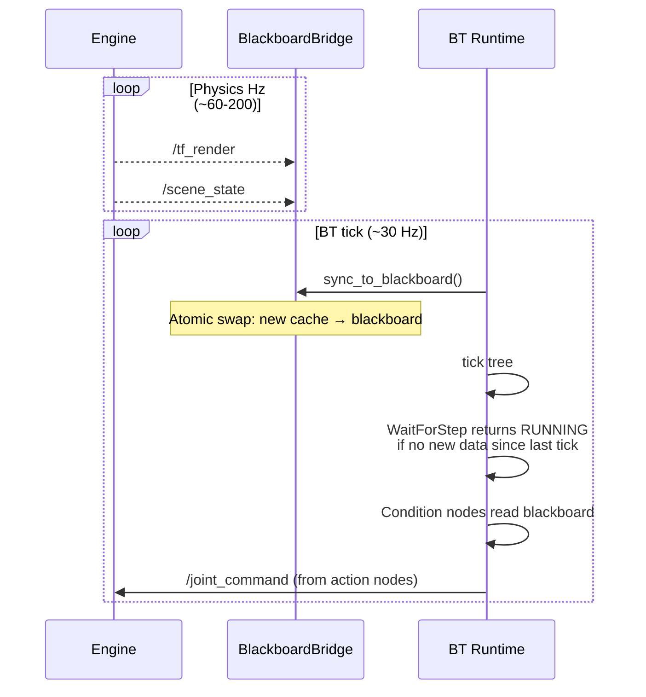
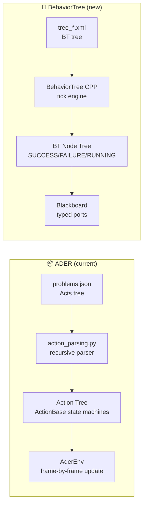

# 🧪 genie_sim_benchmark — Behavior-Tree-Driven Benchmark Design

> **Engine-independent benchmark runtime** driven by BehaviorTree.CPP.
> v1 is a new ROS 2 package derived from `genie_sim_render`'s code patterns:
> the C++ node subscribes to `/tf_render`, runs BT evaluation inline,
> and publishes `/joint_command`. No OVRtx dependency. Render and benchmark
> are separate packages and never run simultaneously.
>
> 📍 Code lives at [`geniesim_ros/src/ros_ws/src/genie_sim_benchmark/`](../genie_sim_benchmark/)

---

## 📚 Document Status

| Field | Value |
|---|---|
| Status | 📝 **Draft for review** |
| Audience | Backend devs, benchmark task authors, evaluation engineers |
| Depends on | Genie Sim State Protocol (`/tf_render`, `/scene_state` — see §5) |
| Version | 0.1.0 |

---
## 1. 🏗️ Architecture Overview



### 🔑 Key decisions

| Decision | Choice | Rationale |
|---|---|---|
| **BT library** | BehaviorTree.CPP (C++) | Nav2-proven, XML trees, Groot2 viz, typed blackboard, subtree composition |
| **Python BT nodes** | pybind11 bridge | Inference clients, ROS 2 pub/sub, scoring logic — all complex Python |
| **Code base** | Forked from `genie_sim_render` patterns | Proven ROS 2 node pattern (subscribe `/tf_render`, timer callback), no OVRtx deps |
| **Data protocol** | `/tf_render` + `/scene_state` (future) | v1 only needs `/tf_render` and `/joint_command`; `/scene_state` added later |
| **Run model** | Benchmark OR render, never both | Separate packages, separate launcher configs |
| **Perceptual input** | OVRtx topics (future) | v1 uses `/tf_render` only; OVRtx for visual conditions added when needed |

### 🏃 Runtime data flow (v1)



---
## 5. 📡 Protocol: BT ↔ Engine Data Exchange

The protocol is the **sole contract** between the engine and the benchmark.
Any engine that implements it is benchmarkable.

### 5.1 Channel inventory

| Channel | Direction | Topic/Service | Message | Update rate | Content |
|---|---|---|---|---|---|
| 🟢 **Rigid poses** | Engine → Bench | `/tf_render` | `tf2_msgs/TFMessage` | Physics Hz | Per-body local xforms, keyed by USD prim path |
| 🔵 **Scene state** | Engine → Bench | `/scene_state` | `SceneState.msg` **NEW** | Physics Hz | Contacts, articulation joints, cloth vertices, sim time |
| 🟡 **Render output** | OVRtx → Bench | Per-camera topics | `sensor_msgs/Image`, etc. | Render Hz | RGB, depth, semseg, instance, bbox 2D/3D |
| 🔴 **Joint commands** | Bench → Engine | `/joint_command` | existing engine msg | BT Hz | Target joint positions |
| 🟣 **Episode control** | Bench → Engine | `/benchmark_reset` | `BenchmarkReset.srv` **NEW** | Per episode | Reset scene to initial state |
| ⚪ **Scene descriptor** | Engine → Bench | `/scene_descriptor` | `std_msgs/String` (JSON) | Once at startup | Prim path inventory with type tags |

### 5.2 SceneState.msg proposal

```ros
# SceneState.msg — per-tick snapshot of everything the benchmark needs
# Published by genie_sim_engine, consumed by genie_sim_benchmark

std_msgs/Header header

# Articulation joints (drawers, doors, cabinet slides)
ArticulationState[] articulations

# Contact pairs currently active
ContactPair[] contacts

# Cloth/particle meshes (vertex positions)
ClothState[] cloths

# Sim time in seconds
float64 sim_time

# Real-time factor
float64 rtf
```

### 5.3 BenchmarkReset.srv proposal

```ros
# BenchmarkReset.srv
# Triggered by benchmark between episodes — no specialisation, no payload
---
bool success
string message
```

### 5.4 How data lands on the BT blackboard



### 5.5 BT tick ↔ engine tick decoupling



---
# 🧪 ADER → BehaviorTree Migration: Checker-Semantics Comparison

> **Pure checker/behavior comparison** — no engine protocol, no ROS topics.
> Maps every `geniesim_benchmark` ADER checker to its `genie_sim_benchmark`
> BehaviorTree counterpart with generic domain-agnostic naming.

---

## 📑 Table of Contents

1. [Architecture: Behavior Model](#1-architecture-behavior-model)
2. [Evaluation Model: Scoring](#2-evaluation-model-scoring)
3. [Checker Family: Grasping / Manipulation](#3-checker-family-grasping--manipulation)
4. [Checker Family: Spatial Relationships](#4-checker-family-spatial-relationships)
5. [Checker Family: Joint / State / Navigation](#5-checker-family-joint--state--navigation)
6. [Checker Family: Vision / VLM](#6-checker-family-vision--vlm)
7. [Checker Family: Physics Special Effects](#7-checker-family-physics-special-effects)
8. [Checker Family: Meta / Composite](#8-checker-family-meta--composite)
9. [Control Structures](#9-control-structures)
10. [Task Configuration Migration](#10-task-configuration-migration)
11. [Scoring Model Migration](#11-scoring-model-migration)
12. [Action ↔ Condition Mapping Issues](#12-action--condition-mapping-issues)
13. [Migration Workflow for Each Task Type](#13-migration-workflow-for-each-task-type)
14. [Checker Specification: Generic Names Reference](#14-checker-specification-generic-names-reference)

---
## 1. Architecture: Behavior Model



### 🆚 ADER vs BT

| Dimension | ADER | BehaviorTree |
|---|---|---|
| **Node state** | `INIT → RUNNING → FINISHED/CANCELED` (4 states) | `IDLE → RUNNING → SUCCESS/FAILURE` (3 + 1 = 4, different semantics) |
| **Tick model** | `update(delta_time)` — wall-clock delta per node | `tick()` — logical tick, no time delta |
| **Completion** | Done flag (`_done_flag`) + `is_end_of_life()` | Return `SUCCESS`/`FAILURE`/`RUNNING` |
| **Interrupt** | `cancel_eval()` on parent env | `HALT()` propagation up the tree (BT::Tree `halt()`) |
| **Parallel** | `ActionSetWaitAny/All/Some` — all children ticked simultaneously | `Parallel(threshold=N)` — all children ticked, returns SUCCESS when N succeed |
| **Sequence** | `ActionList` — sequential, last finishes = done | `Sequence` — sequential, any FAILURE = fail |
| **Time tracking** | Wall-clock `delta_time` passed to every node | `Timeout` decorator wraps subtrees; `Timer` posts |
| **Step tracking** | `StepOut` — counts env steps from start ref | Custom `StepCounter` condition on blackboard |
| **Scoring** | `progress_info["SCORE"]` (float 0 or 1) per checker | Binary SUCCESS/FAILURE; scoring computed in `LogScore` from condition results |
| **Placeholder** | `{@placeholder_name}` — runtime string substitution on action fields | Blackboard ports — typed values passed by reference |
| **Consecutive frames** | Each checker has `_pass_frame` counter for stability | `Timeout` + repeated ticks OR `Delay` decorator |

### 🧠 Key behavioral difference

**ADER nodes poll state every frame** — each `update(delta_time)` reads USD/PhysX and
updates `_done_flag`. **BT conditions return instantly** — they read the blackboard
and return SUCCESS/FAILURE. The BT tree's tick frequency (not wall-clock delta)
determines evaluation cadence.

This means ADER checkers that need **N consecutive frames of stability** (e.g.,
`RelativePositionChecker` requires 2 consecutive frames) must either:
- Rely on repeated BT ticks at Hz > physics Hz (so 2 ticks ≈ 2 physics frames)
- Use a decorator that requires N consecutive SUCCESS ticks before propagating

---
## 2. Evaluation Model: Scoring

```mermaid
flowchart TB
    subgraph ADER_SCORE["📊 ADER Scoring"]
        CP["checker.progress_info['SCORE']<br/>= 0 or 1"]
        EVAL_MGR["AderEnv.action_update()<br/>ticks all checkers each frame"]
        TP["task_progress[]<br/>class_name + progress dict"]
        SUM["TaskEvaluation.summarize_scores()<br/>match class_name → TASK_STEPS<br/>→ STEPS[] + E2E"]
        AGG["EvaluationSummary.get_statistics()<br/>weighted averages, E2E rate"]
    end

    subgraph BT_SCORE["📊 BT Scoring"]
        COND["Condition SUCCESS/FAILURE"]
        BBSEQ["LogScore reads blackboard<br/>path results"]
        EP["per-episode JSON<br/>criteria + efficiency + penalties"]
        AGG2["aggregation script<br/>(not in design yet)"]
    end

    CP --> EVAL_MGR --> TP --> SUM --> AGG
    COND --> BBSEQ --> EP --> AGG2
```



### ADER scoring properties the BT design must replicate

| Property | ADER | BT equivalent | Migration |
|---|---|---|---|
| **Per-step fractional score** | `MixedRules` OR mode returns 0.5 | `Parallel(threshold=1)` means "at least 1 of N succeeds" — binary | **Use `LogScore` to compute fractional score manually from sub-condition results on blackboard** |
| **Scoring order** | `TASK_STEPS[task_name] = ["Follow", "PickUpOnGripper", "Inside"]` — defines which class_names map to which scoring step | Not defined in design | **Mirror `TASK_STEPS` as blackboard keys** — `score.task_name.step_N` |
| **E2E score** | 1.0 if last step scored 1.0 | Not defined | **Compute in `LogScore`** from step results |
| **Aggregation across episodes** | `get_statistics()` — weighted step averages, task averages, E2E rate | Not designed | **Design a post-processing script** that reads per-episode JSON logs |
| **Progress tracking** | `update_progress()` on every checker every frame, stored in `task_progress` list with `hex(id(act))` identity | Not designed | **Trace logging on blackboard writes** — each condition logs its result + timestamp |
| **Stateful counters** | `StableGrasp._pass_frame`, `RelativePositionChecker._consecutive_count` | Blackboard int ports with `setOutput()` | **Each condition maintains counter internally** across consecutive ticks |

---
## 9. Control Structures

### 9.1 ADER → BT mapping

| ADER Control | ADER semantics | BT Equivalent | BT semantics |
|---|---|---|---|
| `ActionList` | Sequential; finish when last finishes | `<Sequence>` | All children in order; FAILURE if any fails |
| `ActionSetWaitAny` | Parallel; finish when ANY finishes (stop others) | `<Parallel threshold="1">` | All ticked; SUCCESS when 1 succeeds |
| `ActionSetWaitAll` | Parallel; finish when ALL finish | `<Parallel threshold="N">` | All ticked; SUCCESS when N succeed |
| `ActionSetWaitSome(N)` | Parallel; finish when N finish | `<Parallel threshold="N">` | All ticked; SUCCESS when N succeed |
| `ActionWaitForTime` | Non-blocking delay N seconds | `<Delay msec="N000">` | Decorator that returns RUNNING for N ms |
| `Timeout(N)` | Cancel eval after N wall-clock seconds | `<Timeout seconds="N">` | Wraps subtree; FAILURE after N seconds |
| `StepOut(N)` | Cancel eval after N sim steps | — | Use `StepLimitCondition` + `Sequence` |
| `Onfloor(...)` | Cancel eval on drop | — | Use `DropCondition` + parent `Fallback` to `CancelEpisode` |

### 9.2 Missing ADER feature: `cancel_eval()` as side-effect

In ADER, cancel actions (`Timeout`, `StepOut`, `Onfloor`) stop the **entire evaluation**
as a side-effect via `EvalExitAction.handle_action_event(FINISHED) → env.cancel_eval()`.
This is a global interrupt outside the action tree hierarchy.

In BT, there is no "global interrupt" — the tree structure controls flow:
- `Timeout` wraps the whole episode: if it fires, the subtree is halted
- `DropCondition` failing → parent `Fallback` → `CancelEpisode` action

To replicate the global-cancel pattern, use a **parallel monitoring subtree**:

```xml
<!-- Episode with global drop monitoring -->
<Parallel threshold="1" name="monitor_or_episode">
  <Sequence name="drop_monitor">
    <Condition ID="DropCondition" entity="{target}" ground_z="0.0"/>
    <Action ID="CancelEpisode" score="0" reason="object_dropped"/>
  </Sequence>
  <Sequence name="main_episode">
    <Timeout seconds="{timeout_sec}">
      <!-- main task subtree -->
    </Timeout>
  </Sequence>
</Parallel>
```

---
## 12. Action ↔ Condition Mapping Issues

### 12.1 Actions that are not Conditions

Some ADER actions perform **operations with side-effects**, not just state checks.
In BT, these must be **Actions** not **Conditions**:

| ADER | Type | BT counterpart | Reason |
|---|---|---|---|
| `InferAction` | Not in ADER (outside eval) | `InferAction` (Action) | Network call, returns RUNNING |
| `MoveJoints` | Not in ADER (outside eval) | `MoveJoints` (Action) | Publishes command, fast SUCCESS |
| `ResetEpisode` | Not in ADER (`api_core.reset()`) | `ResetEpisode` (Action) | Service call, returns SUCCESS |
| `VLM` | EvaluateAction | `VisualLanguageCheck` (Action) | API latency, returns RUNNING |
| `Timeout` | EvalExitAction | `Timeout` (Decorator) | Built into BT library |
| `StepOut` | EvalExitAction | `StepLimitCondition` (Condition) + parent control | Can be Condition or Action |

### 12.2 Consecutive frame requirement

ADER checkers like `Inside`, `Stack`, `RelativePositionChecker`, `PushPull`, and
`StableGrasp` require **N consecutive frames** of satisfaction before marking done.

```python
# ADER pattern:
self._pass_frame += 1 if condition_holds else 0
if self._pass_frame >= self._required_frames:
    self._done_flag = True
```

**BT strategies:**
1. **Internal counter** — the condition tracks its own `_consecutive_passes` counter
   across ticks. It returns SUCCESS only when counter ≥ threshold. Returns FAILURE
   and resets counter on any failed tick.

2. **Decorator** — a `RepeatUntilSuccess` decorator wrapping the condition, but this
   requires N **consecutive** ticks (not reset on failure):
   ```xml
   <RepeatUntilSuccess num_attempts="2" name="two_frame_stability">
     <ContainmentCondition .../>
   </RepeatUntilSuccess>
   ```
   However, `RepeatUntilSuccess` doesn't reset on failure — it keeps trying.
   A custom decorator `Consecutive` would be needed for true frame counting.

3. **Parallel monitoring** — run the condition in a parallel branch that latches
   success after N frames using a custom `StabilityDecorator`.

### 12.3 Placeholder system

ADER's `{@placeholder_name}` is resolved at runtime by setting attributes on action
objects:

```python
# ADER: env.update_place_holder("grabbed_object", "block_01")
# Then iterates all task_progress items and sets:
#   item["acion_obj"].grabbed_object = "block_01"
# This propagates to actions that have:
#   self._holder_name, self._obj_name = self.placeholder_sparser("{@grabbed_object}")

# BT: Blackboard variables
bb.set("grabbed_object", "block_01")
# Then conditions read via blackboard port:
# <GraspCondition entity="{grabbed_object}" .../>
```

BT blackboard variables are **strictly typed** and **explicitly declared** as ports.
This is equivalent but requires explicit port wiring in the XML:

```xml
<Action ID="InferAction" action="{planned_action}" instruction="{instruction}"/>
<GraspCondition entity="{target_block}" effector="{gripper_left}"/>
```

The ADER approach is more dynamic (runtime attribute injection on any object);
the BT approach is more disciplined (declared ports).

---
