# 🧪 ADER → BehaviorTree Migration: Checker-Semantics Comparison

> **Pure checker/behavior comparison** — no engine protocol, no ROS topics.
> Maps every `geniesim_benchmark` ADER checker to its `genie_sim_benchmark`
> BehaviorTree counterpart with generic domain-agnostic naming.

---

## 📑 Table of Contents

1. [Architecture: Behavior Model](#1-architecture-behavior-model)
2. [Evaluation Model: Scoring](#2-evaluation-model-scoring)
3. [Checker Family: Grasping / Manipulation](#3-checker-family-grasping--manipulation)
4. [Checker Family: Spatial Relationships](#4-checker-family-spatial-relationships)
5. [Checker Family: Joint / State / Navigation](#5-checker-family-joint--state--navigation)
6. [Checker Family: Vision / VLM](#6-checker-family-vision--vlm)
7. [Checker Family: Physics Special Effects](#7-checker-family-physics-special-effects)
8. [Checker Family: Meta / Composite](#8-checker-family-meta--composite)
9. [Control Structures](#9-control-structures)
10. [Task Configuration Migration](#10-task-configuration-migration)
11. [Scoring Model Migration](#11-scoring-model-migration)
12. [Action ↔ Condition Mapping Issues](#12-action--condition-mapping-issues)
13. [Migration Workflow for Each Task Type](#13-migration-workflow-for-each-task-type)
14. [Checker Specification: Generic Names Reference](#14-checker-specification-generic-names-reference)

---

## 1. Architecture: Behavior Model

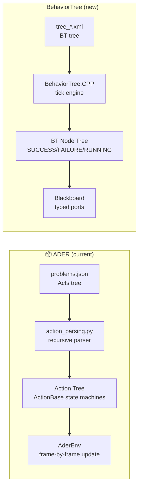

### 🆚 ADER vs BT

| Dimension | ADER | BehaviorTree |
|---|---|---|
| **Node state** | `INIT → RUNNING → FINISHED/CANCELED` (4 states) | `IDLE → RUNNING → SUCCESS/FAILURE` (3 + 1 = 4, different semantics) |
| **Tick model** | `update(delta_time)` — wall-clock delta per node | `tick()` — logical tick, no time delta |
| **Completion** | Done flag (`_done_flag`) + `is_end_of_life()` | Return `SUCCESS`/`FAILURE`/`RUNNING` |
| **Interrupt** | `cancel_eval()` on parent env | `HALT()` propagation up the tree (BT::Tree `halt()`) |
| **Parallel** | `ActionSetWaitAny/All/Some` — all children ticked simultaneously | `Parallel(threshold=N)` — all children ticked, returns SUCCESS when N succeed |
| **Sequence** | `ActionList` — sequential, last finishes = done | `Sequence` — sequential, any FAILURE = fail |
| **Time tracking** | Wall-clock `delta_time` passed to every node | `Timeout` decorator wraps subtrees; `Timer` posts |
| **Step tracking** | `StepOut` — counts env steps from start ref | Custom `StepCounter` condition on blackboard |
| **Scoring** | `progress_info["SCORE"]` (float 0 or 1) per checker | Binary SUCCESS/FAILURE; scoring computed in `LogScore` from condition results |
| **Placeholder** | `{@placeholder_name}` — runtime string substitution on action fields | Blackboard ports — typed values passed by reference |
| **Consecutive frames** | Each checker has `_pass_frame` counter for stability | `Timeout` + repeated ticks OR `Delay` decorator |

### 🧠 Key behavioral difference

**ADER nodes poll state every frame** — each `update(delta_time)` reads USD/PhysX and
updates `_done_flag`. **BT conditions return instantly** — they read the blackboard
and return SUCCESS/FAILURE. The BT tree's tick frequency (not wall-clock delta)
determines evaluation cadence.

This means ADER checkers that need **N consecutive frames of stability** (e.g.,
`RelativePositionChecker` requires 2 consecutive frames) must either:
- Rely on repeated BT ticks at Hz > physics Hz (so 2 ticks ≈ 2 physics frames)
- Use a decorator that requires N consecutive SUCCESS ticks before propagating

---

## 2. Evaluation Model: Scoring

```mermaid
flowchart TB
    subgraph ADER_SCORE["📊 ADER Scoring"]
        CP["checker.progress_info['SCORE']<br/>= 0 or 1"]
        EVAL_MGR["AderEnv.action_update()<br/>ticks all checkers each frame"]
        TP["task_progress[]<br/>class_name + progress dict"]
        SUM["TaskEvaluation.summarize_scores()<br/>match class_name → TASK_STEPS<br/>→ STEPS[] + E2E"]
        AGG["EvaluationSummary.get_statistics()<br/>weighted averages, E2E rate"]
    end

    subgraph BT_SCORE["📊 BT Scoring"]
        COND["Condition SUCCESS/FAILURE"]
        BBSEQ["LogScore reads blackboard<br/>path results"]
        EP["per-episode JSON<br/>criteria + efficiency + penalties"]
        AGG2["aggregation script<br/>(not in design yet)"]
    end

    CP --> EVAL_MGR --> TP --> SUM --> AGG
    COND --> BBSEQ --> EP --> AGG2
```

### ADER scoring properties the BT design must replicate

| Property | ADER | BT equivalent | Migration |
|---|---|---|---|
| **Per-step fractional score** | `MixedRules` OR mode returns 0.5 | `Parallel(threshold=1)` means "at least 1 of N succeeds" — binary | **Use `LogScore` to compute fractional score manually from sub-condition results on blackboard** |
| **Scoring order** | `TASK_STEPS[task_name] = ["Follow", "PickUpOnGripper", "Inside"]` — defines which class_names map to which scoring step | Not defined in design | **Mirror `TASK_STEPS` as blackboard keys** — `score.task_name.step_N` |
| **E2E score** | 1.0 if last step scored 1.0 | Not defined | **Compute in `LogScore`** from step results |
| **Aggregation across episodes** | `get_statistics()` — weighted step averages, task averages, E2E rate | Not designed | **Design a post-processing script** that reads per-episode JSON logs |
| **Progress tracking** | `update_progress()` on every checker every frame, stored in `task_progress` list with `hex(id(act))` identity | Not designed | **Trace logging on blackboard writes** — each condition logs its result + timestamp |
| **Stateful counters** | `StableGrasp._pass_frame`, `RelativePositionChecker._consecutive_count` | Blackboard int ports with `setOutput()` | **Each condition maintains counter internally** across consecutive ticks |

---

## 3. Checker Family: Grasping / Manipulation

### 3.1 `PickUpOnGripper` → `GraspCondition`

```yaml
# ADER: "PickUpOnGripper": "object_hash|gripper_id"
# Meaning: object lifted ≥0.02m above start AND within 0.2m of gripper
#   parsed params[0]=object_id, params[1]=gripper_id (right/left)
#   env._picked_objects set tracked for multi-object tasks
#   comma-separated objects supported ("obj1,obj2" → any match)
#   placeholder: "{@grabbed_object}" supported

# BT:
- condition:
    id: GraspCondition
    ports:
      entity: "{target_block}"          # the object to check
      effector: "{gripper_left}"         # the grasping end-effector
      lift_threshold: 0.02             # meters above initial Z
      proximity_threshold: 0.2          # meters from gripper center
      require_consecutive: 2            # frames of stability
      multi_entity_mode: any            # any|first — for comma-separated
      track_picked: true                # add to picked_entities set
```

| Aspect | ADER | BT |
|---|---|---|
| **Input** | `params[0]\|params[1]` pipe string | Typed blackboard ports |
| **Multi-object** | comma-separated auto-parsed | `multi_entity_mode` port |
| **Placeholder** | `{@name}` — runtime set on action object | `entity` port — blackboard variable |
| **Output** | `progress_info["STATUS"] = "SUCCESS"` | Returns `SUCCESS` on grasp detected |
| **Frame req.** | Single detection | `require_consecutive` frames |
| **Side-effect** | `env._picked_objects.add(obj)` | `picked_entities` blackboard set |

### 3.2 `StableGrasp` → `RigidCouplingCondition`

```yaml
# ADER: "StableGrasp": "obj|gripper|[dist]|[pos_diff]|[rot_diff]"
# Meaning: object stays near gripper AND moves rigidly with it
#   Checks: distance_threshold (0.1), pose_diff_pos (0.02), pose_diff_rot (0.1 rad)
#   min_movement_threshold (0.05): both must be moving
#   Required: 2 consecutive stable frames
#   Robot-specific: resolves base prim path (G1→/G1, G2→/genie)
#   gripper link: gripper_r_center_link or gripper_l_center_link

# BT:
- condition:
    id: RigidCouplingCondition
    ports:
      entity: "{target_block}"
      effector: "{gripper_left}"
      proximity_threshold: 0.1          # max distance effector↔entity
      position_delta_threshold: 0.02    # max diff in delta-position per frame
      rotation_delta_threshold_rad: 0.1 # max diff in delta-rotation per frame
      min_movement_threshold: 0.05      # both must move this much
      require_consecutive: 2            # stable frames needed
      effector_origin: "{effector_origin_prim}"  # e.g. gripper_r_center_link
```

### 3.3 `Follow` → `EffectorAtTargetCondition`

```yaml
# ADER: "Follow": "object_hash|[x,y,z]|gripper_id"
# Meaning: gripper center inside a box of size [x,y,z] around the object
#   Multi-object comma-separated supported (any match)
#   env._followed_objects tracked
#   Used as "pre-grasp proximity check"

# BT:
- condition:
    id: EffectorAtTargetCondition
    ports:
      effector: "{gripper_right}"
      target: "{target_block}"
      proximity_box: [0.1, 0.2, 0.1]   # XYZ half-extents around target
      multi_entity_mode: any
      track_followed: true
```

### 3.4 `Approach` → `PositionalCondition`

```yaml
# ADER: "Approach": "x|y|z"
# Meaning: right gripper center within 0.01m of target point (per axis)
#   Hardcoded to /G2/gripper_r_center_link
#   Used for precise prepositioning before grasp

# BT:
- condition:
    id: PositionalCondition
    ports:
      entity: "{gripper_right}"          # which body to check
      target_position: [0.45, 0.0, 0.2]  # target XYZ in world frame
      tolerance: 0.01                     # per-axis tolerance
      reference_frame: world              # world|entity|<named>
```

### 3.5 `LiftUp` → `ElevationCondition`

```yaml
# ADER: "LiftUp": "object_hash|lift_threshold"
# Meaning: object Z risen ≥ lift_threshold above its initial Z
#   Initial Z recorded at STARTED event
#   Single-frame detection (no consecutive requirement)
#   Used as "did the pick actually lift the object?"

# BT:
- condition:
    id: ElevationCondition
    ports:
      entity: "{target_block}"
      lift_threshold: 0.05              # meters above initial
      reference_frame: world            # world|initial|relative_to
      track_initial: true               # record initial Z on first tick
```

### 3.6 `GripperPassing` → `TransferCondition`

```yaml
# ADER: "GripperPassing": "obj_prim|reverse"
# Meaning: handover detection (left↔right) using gripper joint state
#   State machine: IDLE → LEFT_HOLD → BOTH_HOLD → RIGHT_HOLD
#   + line-AABB intersection: gripper-EE line must cross object AABB
#   Joint threshold: gripper inner joint < 0.3 rad = grasping
#   Robot-specific: /G1/gripper_l/r_center_link hardcoded
#   reverse=false: left→right; reverse=true: right→left

# BT:
- condition:
    id: TransferCondition
    ports:
      entity: "{handover_object}"
      source_effector: "{gripper_left}"
      target_effector: "{gripper_right}"
      direction: left_to_right
      joint_state_threshold: 0.3       # rad — closed = grasping
      require_line_intersection: true   # EE-line must cross object AABB
      # Alternative: proximity + release detection
```

### 3.7 Migration example: `place_block_into_box` task

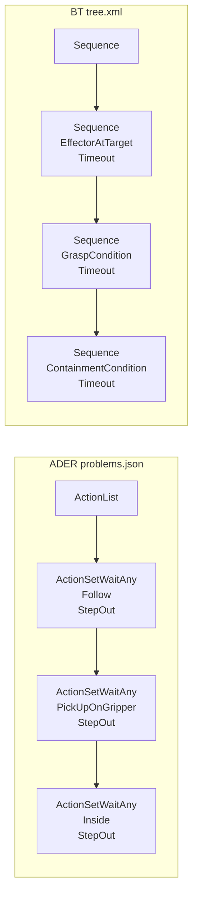

---

## 4. Checker Family: Spatial Relationships

### 4.1 `Inside` → `ContainmentCondition`

```yaml
# ADER: "Inside": "active_obj|passive_obj|scale"
# Meaning: active's center inside passive's AABB scaled by `scale`
#   AABB scaled: center ± (half_extents × scale)
#   scale > 1 = relaxed containment, scale < 1 = strict containment
#   Requires 2 consecutive frames
#   Uses get_obj_aabb_new() for USD-prim AABB query

# BT:
- condition:
    id: ContainmentCondition
    ports:
      entity: "{target_block}"
      container: "{goal_zone}"
      containment_scale: 1.2             # scale factor on container AABB
      reference_point: center_of_mass    # center_of_mass|aabb_center
      require_consecutive: 2
```

### 4.2 `InBBox` → `InBoundingBoxCondition`

```yaml
# ADER: "InBBox": "obj_id|center_x,center_y,center_z|len_x,len_y,len_z"
# Meaning: object center inside a fixed world AABB defined by center + size
#   Not relative to any container prim — absolute world coordinates
#   Requires 2 consecutive frames
#   Used for: "object inside zone Z", "part inside machine"

# BT:
- condition:
    id: InBoundingBoxCondition
    ports:
      entity: "{target_block}"
      region_center: [0.5, 0.0, 0.3]     # world XYZ
      region_size: [0.4, 0.4, 0.4]       # full side lengths
      require_consecutive: 2
```

### 4.3 `Ontop` → `StackedOnTopCondition`

```yaml
# ADER: "Ontop": "active_obj|passive_obj"
# Meaning: active sits on passive: vertical gap ≤ 0.02m AND XY overlap ≥ 50%
#   XY overlap computed via largest face area (max of 3 axial faces)
#   Single-frame detection
#   Used for: stacking, placing-on-table, nesting

# BT:
- condition:
    id: StackedOnTopCondition
    ports:
      upper_entity: "{target_block}"
      lower_entity: "{support_surface}"
      vertical_gap_threshold: 0.02
      overlap_fraction_threshold: 0.5    # 0-1 fraction of smaller face
      comparison_axis: z                 # which axis is "up"
```

### 4.4 `Cover` → `CoveredByCondition`

```yaml
# ADER: "Cover": "active_obj|passive_obj"
# Meaning: active covers passive: active CoG ≤ passive top + 0.002m AND XY overlap ≥ 50%
#   "Cover" means the active object is ABOVE and COVERS the passive
#   Single-frame detection
#   Used for: lid-on-container, cloth-over-object, blanket

# BT:
- condition:
    id: CoveredByCondition
    ports:
      covering_entity: "{lid}"
      covered_entity: "{container}"
      max_vertical_gap: 0.002
      overlap_fraction_threshold: 0.5
      comparison_axis: z
```

### 4.5 `Stack` → `AlignedStackCondition`

```yaml
# ADER: "Stack": "[a,b,c]|[x,y]"
# Meaning: all objects' XY centers within (x,y) tolerance of first object's center
#   First object is the anchor; all others must be within XY threshold
#   Requires 2 consecutive frames
#   Used for: stacking bowls, stacking blocks, sorting by position

# BT:
- condition:
    id: AlignedStackCondition
    ports:
      entities: ["{bowl_1}", "{bowl_2}", "{bowl_3}"]
      xy_tolerance: [0.05, 0.05]        # X and Y tolerance
      anchor_entity: first               # first|index:0|entity_name
      require_consecutive: 2
```

### 4.6 `OnShelf` → `OnSupportCondition`

```yaml
# ADER: "OnShelf": "obj|target|[xmin,xmax,ymin,ymax,zmin,zmax]|height"
# Meaning: object's z minus height is within the offset box relative to target
#   Requires >5 consecutive success frames
#   Used for: placing on shelf, stocking inventory

# BT:
- condition:
    id: OnSupportCondition
    ports:
      entity: "{product_box}"
      support_entity: "{shelf_surface}"
      offset_region: [-0.1, 0.1, -0.1, 0.1, -0.02, 0.02]  # XY(Z) offset from support
      support_height: 0.3               # height of support surface
      require_consecutive: 5
```

### 4.7 `Onfloor` → `DropCondition`

```yaml
# ADER: "Onfloor": "obj|ref_z"
# Meaning: **CANCEL action** — if object drops to within 0.3m of ref_z, SCORE=0
#   Extends EvalExitAction (not EvaluateAction)
#   When fired: env.cancel_eval() → has_done=true → evaluation stops
#   Uses: drop detection, knocking-over detection
#   Typically a guard inside ActionSetWaitAny: "grasp OR it fell"

# BT:
- condition:
    id: DropCondition
    ports:
      entity: "{target_object}"
      ground_z: 0.0                     # reference Z for ground
      drop_threshold: 0.3               # meters above ground_z
      on_failure: cancel_episode        # cancel_episode|warn|continue
      # Note: In BT, this is a Condition that, when FAILURE
      # (entity dropped), triggers a parent Fallback to a
      # CancelEpisode action, or sets a score=0 blackboard key.
```

### 4.8 `Upright` → `OrientationCondition`

```yaml
# ADER: "Upright": "obj|tilt_deg|[allow_flipped]"
# Meaning: object's local +Y axis within tilt_deg of world +Z
#   allow_flipped=true also accepts −Z alignment
#   Default tilt: 15° (from code), allow_flipped: false
#   Single-frame detection
#   Uses isaacsim.core.utils.stage.get_current_stage for USD read
#   Used for: straightening objects, upright placement

# BT:
- condition:
    id: OrientationCondition
    ports:
      entity: "{pencil_box}"
      target_axis: [0, 0, 1]            # world up vector
      entity_axis: [0, 1, 0]            # entity's local axis to align
      tolerance_deg: 15.0
      allow_flipped: false              # accept anti-parallel?
```

### 4.9 `RelativePosition` → `RelativePositionCondition`

```yaml
# ADER: "RelativePosition": "objA|objB|relation|[threshold]"
# Meaning: A vs B in robot body frame
#   Relations: leftof, rightof, topof, bottomof, aligned_x, aligned_y, aligned_z
#   Projects positions onto robot's local X/Y axes
#   threshold (default 0.05) used by aligned_* relations
#   Robot-specific: resolves base_link (G1→/G1/base_link, G2→/genie/base_link)
#   Requires 2 consecutive frames

# BT:
- condition:
    id: RelativePositionCondition
    ports:
      subject: "{mouse}"
      reference: "{laptop}"
      relation: rightof                  # leftof|rightof|topof|bottomof
                                        # aligned_x|aligned_y|aligned_z
      alignment_threshold: 0.05          # for aligned_* relations
      reference_frame: robot_base        # robot_base|world|entity|<entity_name>
      require_consecutive: 2
```

---

## 5. Checker Family: Joint / State / Navigation

### 5.1 `PushPull` → `JointLimitCondition`

```yaml
# ADER: "PushPull": "obj|min|max|[joint_index]"
# Meaning: prismatic joint position within [min, max]
#   joint_index default 0
#   Requires 2 consecutive frames
#   Used for: drawer open/closed, door slide, linear actuator

# BT:
- condition:
    id: JointLimitCondition
    ports:
      entity: "{drawer}"
      joint_index: 0                     # which joint on the entity
      min_position: 0.15                 # closed position
      max_position: 0.45                 # open position
      require_consecutive: 2
```

### 5.2 `TriggerAction` → `AttributeCondition`

```yaml
# ADER: "TriggerAction": "prim_path|expected"
# Meaning: get_trigger_action(prim_path) equals expected value
#   Uses APICore custom trigger query
#   Single-frame detection
#   Used for: button press, switch toggle, button state

# BT:
- condition:
    id: AttributeCondition
    ports:
      entity: "{button_prim}"
      attribute: trigger_state           # attribute key to query
      expected_value: pressed            # string|number|bool
      comparison: equals                 # equals|greater_than|less_than|contains
```

### 5.3 `ChassisAtTarget` → `PoseRegionCondition`

```yaml
# ADER: "ChassisAtTarget": "[x,y,yaw]|[x_th,y_th,yaw_th]"
# Meaning: chassis within XY box AND orientation within yaw threshold
#   yaw from base_link quaternion → degrees
#   Dynamic robot base resolution (G1 vs G2)
#   Single-frame detection
#   Used for: navigation tasks, docking

# BT:
- condition:
    id: PoseRegionCondition
    ports:
      entity: "{robot_base}"
      target_position: [2.0, 1.5]        # XY target
      target_orientation_deg: 90.0       # yaw target in degrees
      position_tolerance: [0.1, 0.1]     # XY tolerance
      orientation_tolerance_deg: 5.0     # yaw tolerance
      reference_frame: world
```

### 5.4 `PlaceOnRivet` → `PrecisionPlacementCondition`

```yaml
# ADER: "PlaceOnRivet": "active|passive|rx,ry,rz|qw,qx,qy,qz|[tols]"
# Meaning: workpiece achieves target relative pose vs workspace AND holds still
#   Checks: XY tolerance (0.02), Z tolerance (0.01), orientation (0.15 rad)
#   Stillness: speed < threshold for N consecutive steps
#   Used for: precision assembly, peg-in-hole, rivet insertion

# BT:
- condition:
    id: PrecisionPlacementCondition
    ports:
      entity: "{workpiece}"
      reference: "{fixture}"
      target_relative_position: [0.0, 0.0, 0.05]   # relative XYZ
      target_relative_orientation: [1, 0, 0, 0]     # relative quaternion
      xy_tolerance: 0.02
      z_tolerance: 0.01
      orientation_tolerance_rad: 0.15
      stillness_speed_threshold: 0.02
      stillness_required_steps: 15
```

---

## 6. Checker Family: Vision / VLM

### 6.1 `VLM` → `VisualLanguageCondition`

```yaml
# ADER: "VLM": "task_id|interval"
# Meaning: VLM model judges task description from observation images
#   Uses VLM_TEMPLATE[task_id] for a text description
#   auto_score() calls VLM API (e.g., Qwen-VL) with image history
#   Every `interval` updates: capture image, call VLM, check score ≥ 1.0
#   Accumulates image history for context
#   Best-score tracking: updates SCORE only when higher

# BT:
- condition:
    id: VisualLanguageCondition
    ports:
      description: "{vlm_prompt}"        # text description for VLM
      check_interval: 30                 # ticks between VLM calls
      pass_threshold: 1.0                # minimum VLM score to pass
      use_image_history: true            # accumulate images for context
      image_source: camera_head          # which camera to capture
      model_endpoint: "{vlm_config}"     # model API config
      # Status: RUNNING while polling, SUCCESS when VLM score ≥ threshold
      # Note: VLM is an Action (not Condition) in BT because it blocks
      #       for API latency. Returns RUNNING between API calls.
```

### ⚠️ Important: VLM is an Action, not a Condition

VLM involves network calls and image capture — it's inherently async. In the BT design,
this should be a **BT Action** (not Condition) that returns RUNNING between API calls
and SUCCESS when the VLM score passes. This matches how `InferAction` works.

```xml
<!-- BT pattern for VLM evaluation -->
<Action ID="VisualLanguageCheck"
  description="Is the desktop clean with objects properly arranged?"
  check_interval="{vlm_interval}"
  pass_threshold="1.0"/>
```

---

## 7. Checker Family: Physics Special Effects

### 7.1 `FluidInside` → `ParticleInVolumeCondition`

```yaml
# ADER: "FluidInside": "container|object_info_dir"
# Meaning: >50 fluid particles inside container's AABB
#   Reads object size from SIM_ASSETS + object_info_dir/object_parameters.json
#   RPC call GetPartiPointNumInbbox to count particles
#   Used for: pouring tasks, liquid transfer

# BT:
- condition:
    id: ParticleInVolumeCondition
    ports:
      volume_entity: "{container}"
      min_particle_count: 50
      volume_source: aabb                # aabb|mesh|region
      query_method: rpc                  # rpc|topic|computation
```

### 7.2 `CheckParticleInBBox` → `ParticleThresholdCondition`

```yaml
# ADER: "CheckParticleInBBox": "threshold|xmin,ymin,zmin,xmax,ymax,zmax"
# Meaning: particle count inside box drops BELOW threshold
#   Used for: cleaning, filtering, particle removal

# BT:
- condition:
    id: ParticleThresholdCondition
    ports:
      region_min: [-0.1, -0.1, 0.0]
      region_max: [0.1, 0.1, 0.3]
      max_particle_count: 10             # pass when count drops below this
```

### 7.3 `CheckStainClean` → `VisibilityCountCondition`

```yaml
# ADER: "CheckStainClean": "stain_prim|threshold"
# Meaning: visible stain meshes drop BELOW threshold
#   Reads mesh visibility state
#   Used for: cleaning evaluation, stain removal

# BT:
- condition:
    id: VisibilityCountCondition
    ports:
      entity_group: "{stain_meshes}"  # collection of stain prims
      max_visible_count: 3              # pass when visible ≤ this
      visibility_attribute: visibility  # attribute key for visibility
```

---

## 8. Checker Family: Meta / Composite

### 8.1 `MixedRules` → `AggregateCondition`

```yaml
# ADER: "MixedRules": { "rules": [...], "check_interval": 1, "mode": "or" }
# Meaning: aggregate multiple sub-checkers with OR (partial credit) or AND (all-required)
#   OR mode: score = passed/total (fractional, e.g. 0.5)
#   AND mode: score = 1.0 only if ALL pass
#   Supported sub-types: Inside, PushPull, Upright, RelativePosition, Ontop,
#     Onfloor, Cover, LiftUp, InBBox, Stack, StableGrasp
#   Best-score tracking: only updates when new score higher
#   Used for: complex tasks with multiple criteria

# BT:
- condition:
    id: AggregateCondition
    ports:
      mode: or                           # or|and|weighted
      sub_conditions:                     # list of sub-condition configs
        - condition: ContainmentCondition
          ports:
            entity: "{cup}"
            container: "{tray}"
            containment_scale: 1.0
        - condition: OrientationCondition
          ports:
            entity: "{cup}"
            tolerance_deg: 15.0
      weights: [0.5, 0.5]                # for weighted mode, defaults to equal
      check_interval: 1                  # ticks between evaluation
      pass_threshold: 1.0                # min aggregate score to pass
      # Output: fractional score on blackboard
```

### 8.2 `Timeout` → `TimeoutCondition`

```yaml
# ADER: "Timeout": 120
# Meaning: CANCEL action — fires after N seconds of accumulated time
#   Wall-clock time, tracked via delta_time
#   Sets SCORE=0, calls env.cancel_eval()
#   Composite: typically inside ActionSetWaitAny ("succeed OR timeout")

# BT:
# BehaviorTree.CPP has built-in: <Timeout seconds="{max_sec}">
# Wraps a subtree; if subtree doesn't complete within N seconds,
# halts the subtree and returns FAILURE.
- decorator:
    id: Timeout
    ports:
      seconds: 30.0
```

### 8.3 `StepOut` → `StepLimitCondition`

```yaml
# ADER: "StepOut": 200
# Meaning: CANCEL action — fires after N simulation steps from start
#   ref_step set at STARTED event
#   Uses env.current_step counter
#   Sets SCORE=0

# BT:
- condition:
    id: StepLimitCondition
    ports:
      max_steps: 200
      step_counter: "{episode_step_count}"  # blackboard counter
```

---

## 9. Control Structures

### 9.1 ADER → BT mapping

| ADER Control | ADER semantics | BT Equivalent | BT semantics |
|---|---|---|---|
| `ActionList` | Sequential; finish when last finishes | `<Sequence>` | All children in order; FAILURE if any fails |
| `ActionSetWaitAny` | Parallel; finish when ANY finishes (stop others) | `<Parallel threshold="1">` | All ticked; SUCCESS when 1 succeeds |
| `ActionSetWaitAll` | Parallel; finish when ALL finish | `<Parallel threshold="N">` | All ticked; SUCCESS when N succeed |
| `ActionSetWaitSome(N)` | Parallel; finish when N finish | `<Parallel threshold="N">` | All ticked; SUCCESS when N succeed |
| `ActionWaitForTime` | Non-blocking delay N seconds | `<Delay msec="N000">` | Decorator that returns RUNNING for N ms |
| `Timeout(N)` | Cancel eval after N wall-clock seconds | `<Timeout seconds="N">` | Wraps subtree; FAILURE after N seconds |
| `StepOut(N)` | Cancel eval after N sim steps | — | Use `StepLimitCondition` + `Sequence` |
| `Onfloor(...)` | Cancel eval on drop | — | Use `DropCondition` + parent `Fallback` to `CancelEpisode` |

### 9.2 Missing ADER feature: `cancel_eval()` as side-effect

In ADER, cancel actions (`Timeout`, `StepOut`, `Onfloor`) stop the **entire evaluation**
as a side-effect via `EvalExitAction.handle_action_event(FINISHED) → env.cancel_eval()`.
This is a global interrupt outside the action tree hierarchy.

In BT, there is no "global interrupt" — the tree structure controls flow:
- `Timeout` wraps the whole episode: if it fires, the subtree is halted
- `DropCondition` failing → parent `Fallback` → `CancelEpisode` action

To replicate the global-cancel pattern, use a **parallel monitoring subtree**:

```xml
<!-- Episode with global drop monitoring -->
<Parallel threshold="1" name="monitor_or_episode">
  <Sequence name="drop_monitor">
    <Condition ID="DropCondition" entity="{target}" ground_z="0.0"/>
    <Action ID="CancelEpisode" score="0" reason="object_dropped"/>
  </Sequence>
  <Sequence name="main_episode">
    <Timeout seconds="{timeout_sec}">
      <!-- main task subtree -->
    </Timeout>
  </Sequence>
</Parallel>
```

---

## 10. Task Configuration Migration

### 10.1 Three-layer config equivalence

| Layer | ADER current format | BT new format | Migration |
|---|---|---|---|
| **Run** | YAML: `config/g2op_*.yaml` — task_name, sub_task_name, seed, num_episode, model_arc | YAML: `config/tasks/pick_block.yaml` — task.name, scene, bt_tree, blackboard, scoring | **Manual rewrite** — schema is different but 1:1 |
| **Eval task** | JSON: `config/eval_tasks/<scene>_<robot>.json` — 27 files with scene/robot/gen/recording config | Scene ref in task YAML; generalization + recording not yet designed | **Partial** — scene/robot mapping can be embedded in task YAML; generalization needs new design |
| **Instance** | `llm_task/<task>/<id>/` — instructions.json, problems.json, scene_info.json, scene.usda | Task YAML + BT XML (one tree per instruction pattern) | **Auto-converter** from problems.json → BT XML is feasible (see §10.2) |

### 10.2 problems.json → BT XML converter design

Since ADER's `problems.json` has a simple recursive structure (`ActionList` → `ActionSetWaitAny` →
`checkers`), a **Python converter script** can translate it to BT XML:

```python
# pseudo-code for converter
def convert_problem_to_bt_xml(problem_json, task_name):
    acts = problem_json["Acts"][0]  # top-level ActionList
    tree = BT.Tree()
    
    for checkpoint in acts["ActionList"]:
        for key, value in checkpoint.items():
            if key == "ActionSetWaitAny":
                subtree = build_wait_any(value, task_name)
                tree.add_subtree(subtree)
            # ...
    
    return render_bt_xml(tree)

def build_wait_any(children, task_name):
    # ActionSetWaitAny → Parallel(threshold=1)
    parallel = ParallelNode(threshold=1)
    for child in children:
        for k, v in child.items():
            if k == "Follow":
                parallel.add(EffectorAtTargetCondition(...))
            elif k == "PickUpOnGripper":
                parallel.add(GraspCondition(...))
            elif k == "StepOut":
                parallel.add(StepLimitCondition(max_steps=v))
            # ...
    return parallel
```

**Conversion is lossy** — the following ADER features have no direct BT XML equivalent:
- `MixedRules` with OR mode (fractional scoring) → `AggregateCondition` with custom C++ node
- `VLM` (async VLM check) → custom async action node
- `Onfloor` (mid-episode cancel) → parallel monitoring subtree
- Placeholder `{@name}` → blackboard variables (different mechanism, same effect)
- Consecutive frame counting → decorator or condition-internal counter

### 10.3 Full task directory migration: `pick_block_color`

```diff
- llm_task/pick_block_color/
- ├── 0/
- │   ├── instructions.json
- │   ├── problems.json
- │   ├── scene_info.json
- │   └── scene.usda
- ├── 1/
- │   └── ...
- └── ...

+ config/tasks/
+ ├── pick_block_color.yaml      # task config
+ └── trees/
+     ├── pick_block_color.xml    # BT tree
+     └── pick_block_color_subtask.xml  # (optional) if subtask mode
```

Each `instructions.json` → YAML `task.instructions[]` or separate per-instruction
BT trees. Each `problems.json` → BT XML tree. Each `scene_info.json` → scene ref
+ entity mapping in YAML.

---

## 11. Scoring Model Migration

### 11.1 Full scoring pipeline

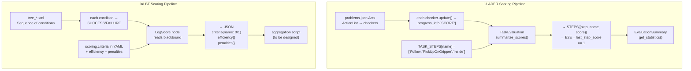

### 11.2 How `TASK_STEPS` maps to BT

The current `TASK_STEPS` dict defines the **ordered scoring layout** per task:

```python
TASK_STEPS = {
    "clean_the_desktop": ["Inside", "PushPull", "Inside", "RelativePositionChecker", "Upright"],
    "pick_block_color":  ["Follow", "PickUpOnGripper"],
    "sorting_packages":  ["Follow", "PickUpOnGripper", "Inside", "Upright", "PickUpOnGripper", "Inside"],
    # ... 30 more entries
}
```

In BT, this ordering is **implicit in the tree structure** — the sequence of conditions
in the BT XML defines evaluation order. The `LogScore` node can extract the result of
each condition from the blackboard:

```yaml
# task YAML scoring section
scoring:
  steps:                          # mirrors TASK_STEPS ordering
    - condition: EffectorAtTargetCondition    # "Follow" equivalent
      entity: "{block}"
      weight: 1.0
    - condition: GraspCondition               # "PickUpOnGripper" equivalent
      entity: "{block}"
      weight: 1.0
    - condition: ContainmentCondition         # "Inside" equivalent
      entity: "{block}"
      container: "{box}"
      weight: 1.0
```

### 11.3 Subtask mode migration

`TASK_SUBTASK_STEPS` maps subtask-mode scoring for tasks with per-step checkers:

```yaml
# ADER subtask: clean_the_desktop/0/instructions.json
#   subtask_steps[0].checker = { "Inside": "pen|cup|1.2" }
#   subtask_steps[1].checker = { "PushPull": "laptop|1.57|2.09" }
#   subtask_steps[2].checker = { "Inside": "tissue|trash|1.2" }
#   subtask_steps[3].checker = { "RelativePosition": "mouse|laptop|rightof" }
#   subtask_steps[4].checker = { "Upright": "pencil_box|5.0|true" }

# BT equivalent: Sequence with one SubTree per subtask step
<Sequence name="clean_the_desktop">
  <SubTree ID="subtask_step_1_place_pen">
    <EffectorAtTargetCondition entity="{pen}" target="{cup}"/>
    <GraspCondition entity="{pen}" effector="{gripper_right}"/>
    <ContainmentCondition entity="{pen}" container="{cup}" containment_scale="1.2"/>
  </SubTree>
  <SubTree ID="subtask_step_2_close_laptop">
    <JointLimitCondition entity="{laptop}" joint_index="0" min_position="1.57" max_position="2.09"/>
  </SubTree>
  <!-- ... -->
</Sequence>
```

---

## 12. Action ↔ Condition Mapping Issues

### 12.1 Actions that are not Conditions

Some ADER actions perform **operations with side-effects**, not just state checks.
In BT, these must be **Actions** not **Conditions**:

| ADER | Type | BT counterpart | Reason |
|---|---|---|---|
| `InferAction` | Not in ADER (outside eval) | `InferAction` (Action) | Network call, returns RUNNING |
| `MoveJoints` | Not in ADER (outside eval) | `MoveJoints` (Action) | Publishes command, fast SUCCESS |
| `ResetEpisode` | Not in ADER (`api_core.reset()`) | `ResetEpisode` (Action) | Service call, returns SUCCESS |
| `VLM` | EvaluateAction | `VisualLanguageCheck` (Action) | API latency, returns RUNNING |
| `Timeout` | EvalExitAction | `Timeout` (Decorator) | Built into BT library |
| `StepOut` | EvalExitAction | `StepLimitCondition` (Condition) + parent control | Can be Condition or Action |

### 12.2 Consecutive frame requirement

ADER checkers like `Inside`, `Stack`, `RelativePositionChecker`, `PushPull`, and
`StableGrasp` require **N consecutive frames** of satisfaction before marking done.

```python
# ADER pattern:
self._pass_frame += 1 if condition_holds else 0
if self._pass_frame >= self._required_frames:
    self._done_flag = True
```

**BT strategies:**
1. **Internal counter** — the condition tracks its own `_consecutive_passes` counter
   across ticks. It returns SUCCESS only when counter ≥ threshold. Returns FAILURE
   and resets counter on any failed tick.

2. **Decorator** — a `RepeatUntilSuccess` decorator wrapping the condition, but this
   requires N **consecutive** ticks (not reset on failure):
   ```xml
   <RepeatUntilSuccess num_attempts="2" name="two_frame_stability">
     <ContainmentCondition .../>
   </RepeatUntilSuccess>
   ```
   However, `RepeatUntilSuccess` doesn't reset on failure — it keeps trying.
   A custom decorator `Consecutive` would be needed for true frame counting.

3. **Parallel monitoring** — run the condition in a parallel branch that latches
   success after N frames using a custom `StabilityDecorator`.

### 12.3 Placeholder system

ADER's `{@placeholder_name}` is resolved at runtime by setting attributes on action
objects:

```python
# ADER: env.update_place_holder("grabbed_object", "block_01")
# Then iterates all task_progress items and sets:
#   item["acion_obj"].grabbed_object = "block_01"
# This propagates to actions that have:
#   self._holder_name, self._obj_name = self.placeholder_sparser("{@grabbed_object}")

# BT: Blackboard variables
bb.set("grabbed_object", "block_01")
# Then conditions read via blackboard port:
# <GraspCondition entity="{grabbed_object}" .../>
```

BT blackboard variables are **strictly typed** and **explicitly declared** as ports.
This is equivalent but requires explicit port wiring in the XML:

```xml
<Action ID="InferAction" action="{planned_action}" instruction="{instruction}"/>
<GraspCondition entity="{target_block}" effector="{gripper_left}"/>
```

The ADER approach is more dynamic (runtime attribute injection on any object);
the BT approach is more disciplined (declared ports).

---

## 13. Migration Workflow for Each Task Type

### 13.1 All 34 task types and their checker requirements

| # | Task name | ADER checkers used | BT conditions needed | Migration complexity |
|---|---|---|---|---|
| 1 | `pick_block_color` | Follow, PickUpOnGripper | EffectorAtTarget, GraspCondition | 🟢 Low |
| 2 | `pick_block_number` | Follow, PickUpOnGripper | EffectorAtTarget, GraspCondition | 🟢 Low |
| 3 | `pick_block_shape` | Follow, PickUpOnGripper | EffectorAtTarget, GraspCondition | 🟢 Low |
| 4 | `pick_block_size` | Follow, PickUpOnGripper | EffectorAtTarget, GraspCondition | 🟢 Low |
| 5 | `pick_common_sense` | Follow, PickUpOnGripper | EffectorAtTarget, GraspCondition | 🟢 Low |
| 6 | `pick_object_type` | Follow, PickUpOnGripper | EffectorAtTarget, GraspCondition | 🟢 Low |
| 7 | `pick_specific_object` | Follow, PickUpOnGripper | EffectorAtTarget, GraspCondition | 🟢 Low |
| 8 | `pick_billiards_color` | Follow, PickUpOnGripper | EffectorAtTarget, GraspCondition | 🟢 Low |
| 9 | `pick_object_absolute_position` | Follow, PickUpOnGripper | EffectorAtTarget, GraspCondition | 🟢 Low |
| 10 | `pick_object_relative_position` | Follow, PickUpOnGripper | EffectorAtTarget, GraspCondition | 🟢 Low |
| 11 | `pick_follow_logic_or` | Follow, PickUpOnGripper | EffectorAtTarget, GraspCondition | 🟢 Low |
| 12 | `place_object_into_box_color` | Follow, PickUpOnGripper, Inside | EffectorAtTarget, GraspCondition, ContainmentCondition | 🟢 Low |
| 13 | `place_block_into_box` | Follow, PickUpOnGripper, Inside | EffectorAtTarget, GraspCondition, ContainmentCondition | 🟢 Low |
| 14 | `place_block_into_drawer` | Inside | ContainmentCondition | 🟢 Low |
| 15 | `place_beverage_to_anothers_position` | Follow, MixedRules | EffectorAtTarget, AggregateCondition | 🟡 Medium |
| 16 | `place_object_relative_position` | Follow, MixedRules | EffectorAtTarget, AggregateCondition | 🟡 Medium |
| 17 | `clean_the_desktop` | Inside, PushPull, RelativePosition, Upright | ContainmentCondition, JointLimitCondition, RelativePositionCondition, OrientationCondition | 🟡 Medium |
| 18 | `sort_fruit` | Inside | ContainmentCondition | 🟢 Low |
| 19 | `sort_number` | MixedRules | AggregateCondition | 🟡 Medium |
| 20 | `sort_cubes_by_size` | MixedRules | AggregateCondition | 🟡 Medium |
| 21 | `sorting_packages` | Follow, PickUpOnGripper, Inside, Upright, PickUpOnGripper, Inside | EffectorAtTarget, GraspCondition, ContainmentCondition, OrientationCondition, ... (repeat) | 🟡 Medium |
| 22 | `sorting_packages_continuous` | Upright, Upright, Upright, Upright | OrientationCondition ×4 | 🟢 Low |
| 23 | `stack_bowls` | Stack | AlignedStackCondition | 🟢 Low |
| 24 | `stack_three_building_blocks` | Stack | AlignedStackCondition | 🟢 Low |
| 25 | `hold_pot` | LiftUp, InBBox, Upright | ElevationCondition, InBoundingBoxCondition, OrientationCondition | 🟢 Low |
| 26 | `open_door` | PushPull | JointLimitCondition | 🟢 Low |
| 27 | `pour_workpiece` | Inside, Inside, Inside, Inside | ContainmentCondition ×4 | 🟢 Low |
| 28 | `stock_and_straighten_shelf` | Follow, PickUpOnGripper, InBBox, Follow, Upright | EffectorAtTarget, GraspCondition, InBoundingBoxCondition, EffectorAtTarget, OrientationCondition | 🟡 Medium |
| 29 | `take_wrong_item_shelf` | Follow, Inside | EffectorAtTarget, ContainmentCondition | 🟢 Low |
| 30 | `pack_in_supermarket` | Inside | ContainmentCondition | 🟢 Low |
| 31 | `straighten_object` | Follow, Upright | EffectorAtTarget, OrientationCondition | 🟢 Low |
| 32 | `scoop_popcorn` | VLM | VisualLanguageCheck (Action) | 🔴 High (needs VLM API integration) |
| 33 | `bimanual_chip_handover` | Upright | OrientationCondition | 🟢 Low |
| 34 | `geniesim_place_workpiece` | PlaceOnRivet | PrecisionPlacementCondition | 🔴 High (precise tolerances + stillness) |

### 13.2 Migration complexity summary

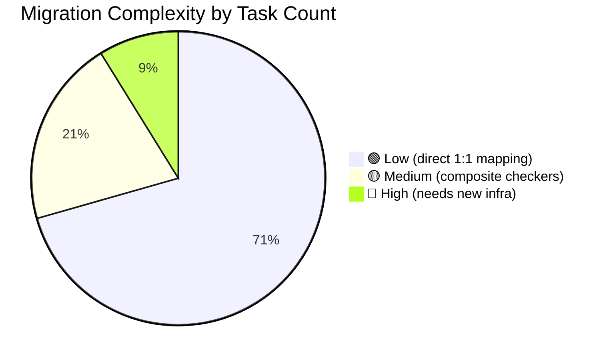

**24 of 34 task types** (71%) are straightforward — they use only `Follow`,
`PickUpOnGripper`, `Inside`, `Upright`, `Stack`, `LiftUp`, `InBBox`, `PushPull`,
which all have direct generic BT equivalents.

**7 task types** (21%) use `MixedRules` (composite aggregation) or multi-step variants
that need `AggregateCondition` or repeated subtrees — these are structurally portable.

**3 task types** (9%) need new infrastructure:
- `scoop_popcorn` — VLM evaluation (needs async action + VLM API integration)
- `geniesim_place_workpiece` — precision assembly (needs `PrecisionPlacementCondition` with stillness detection)
- `bimanual_chip_handover` had `Upright` only but may need the `TransferCondition` in practice

---

## 14. Checker Specification: Generic Names Reference

### 14.1 Condition library (state checkers — return SUCCESS/FAILURE)

| # | Generic Name | ADER Origin | What it checks | Consecutive frames |
|---|---|---|---|---|
| C01 | `EffectorAtTargetCondition` | `Follow` | Effector center inside proximity box around target | 1 |
| C02 | `GraspCondition` | `PickUpOnGripper` | Entity lifted above start AND near effector | 1 |
| C03 | `RigidCouplingCondition` | `StableGrasp` | Entity moves rigidly with effector (delta-pose correlation) | 2 |
| C04 | `PositionalCondition` | `Approach` | Entity at target world position within tolerance | 1 |
| C05 | `ElevationCondition` | `LiftUp` | Entity Z risen above initial Z | 1 |
| C06 | `TransferCondition` | `GripperPassing` | Handover detected via state machine + line geometry | N/A (state machine) |
| C07 | `ContainmentCondition` | `Inside` | Entity center inside container's scaled AABB | 2 |
| C08 | `InBoundingBoxCondition` | `InBBox` | Entity center inside fixed world AABB | 2 |
| C09 | `StackedOnTopCondition` | `Ontop` | Upper entity sits on lower with small gap + XY overlap | 1 |
| C10 | `CoveredByCondition` | `Cover` | Covering entity above + overlapping covered entity | 1 |
| C11 | `AlignedStackCondition` | `Stack` | All entities within XY tolerance of anchor | 2 |
| C12 | `OnSupportCondition` | `OnShelf` | Entity within offset region above support | 5 |
| C13 | `DropCondition` | `Onfloor` | Entity within drop distance of ground | 1 (cancel action) |
| C14 | `OrientationCondition` | `Upright` | Entity local axis within tolerance of world axis | 1 |
| C15 | `RelativePositionCondition` | `RelativePositionChecker` | Entity A leftof/rightof/topof/bottomof/aligned with B in robot frame | 2 |
| C16 | `JointLimitCondition` | `PushPull` | Joint position within [min, max] | 2 |
| C17 | `AttributeCondition` | `TriggerAction` | Entity attribute equals expected value | 1 |
| C18 | `PoseRegionCondition` | `ChassisAtTarget` | Entity within XY + yaw tolerance of target | 1 |
| C19 | `PrecisionPlacementCondition` | `PlaceOnRivet` | Entity at exact relative pose + still for N steps | N (stillness) |
| C20 | `ParticleInVolumeCondition` | `FluidInside` | Particle count inside volume above threshold | 1 |
| C21 | `ParticleThresholdCondition` | `CheckParticleInBBox` | Particle count inside region below threshold | 1 |
| C22 | `VisibilityCountCondition` | `CheckStainClean` | Visible entity count below threshold | 1 |
| C23 | `StepLimitCondition` | `StepOut` | Step counter exceeded maximum | 1 (cancel) |

### 14.2 Action library (side-effecting — return SUCCESS after completion)

| # | Generic Name | ADER Origin | What it does | Duration |
|---|---|---|---|---|
| A01 | `VisualLanguageCheck` | `VLM` | Captures image, calls VLM API, returns SUCCESS when score ≥ threshold | Multi-tick (RUNNING between API calls) |
| A02 | `InferAction` | (CoRobotPolicy) | Calls inference server, writes action to blackboard | Multi-tick |
| A03 | `MoveJoints` | (direct API call) | Publishes joint command to actuators | 1 tick |
| A04 | `ResetEpisode` | `api_core.reset()` | Resets simulation state | Multi-tick (wait for reset) |
| A05 | `CancelEpisode` | `EvalExitAction` | Sets score=0, halts evaluation | 1 tick |
| A06 | `LogScore` | (output_system) | Writes scoring JSON to disk | 1 tick |

### 14.3 Composite / Decorator library

| # | Generic Name | ADER Origin | Behavior |
|---|---|---|---|
| D01 | `Sequence` | `ActionList` | Run children in order; FAILURE if any fails |
| D02 | `Parallel(threshold=N)` | `ActionSetWaitAny/All/Some` | Run all children; SUCCESS when N succeed |
| D03 | `Fallback` | (try-else pattern) | Try first child; on FAILURE try next |
| D04 | `IfThenElse` | (conditional) | Condition → Then-subtree / Else-subtree |
| D05 | `Timeout(seconds)` | `Timeout` | Wrap subtree; FAILURE after N seconds |
| D06 | `Retry(num_attempts)` | (manual retry in ADER) | Re-run subtree on FAILURE, up to N attempts |
| D07 | `Repeat(num_cycles)` | (episode loop) | Re-run subtree N times |
| D08 | `AggregateCondition` | `MixedRules` | Evaluate N sub-conditions with OR/AND/weighted scoring |

### 14.4 Full task type → conditions mapping table

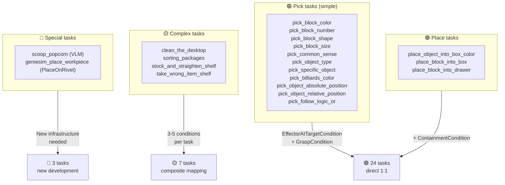

---

## Appendix: ADER checker classification by data requirement

Each ADER checker needs specific simulator data. This determines whether it can work
immediately in a new protocol or needs additional data channels:

```
                      ┌─────────────────────────────────────┐
                      │  Data needed for each checker family │
                      ├─────────────────────────────────────┤
                      │                                     │
  Pose only ──────────┤  C01 EffectorAtTarget ✓            │
                      │  C02 GraspCondition ✓               │
                      │  C04 PositionalCondition ✓          │
                      │  C05 ElevationCondition ✓           │
                      │  C14 OrientationCondition ✓          │
                      │  C18 PoseRegionCondition ✓           │
                      │                                     │
  Pose + AABB ────────┤  C07 ContainmentCondition ✓         │
                      │  C08 InBoundingBoxCondition ✓        │
                      │  C09 StackedOnTopCondition ✓         │
                      │  C10 CoveredByCondition ✓            │
                      │  C11 AlignedStackCondition ✓         │
                      │  C12 OnSupportCondition ✓            │
                      │  C13 DropCondition ✓                 │
                      │  C15 RelativePositionCondition ✓     │
                      │                                     │
  Pose + joints ──────┤  C16 JointLimitCondition ✓          │
                      │  C06 TransferCondition ✓             │
                      │  C03 RigidCouplingCondition ✓        │
                      │                                     │
  Pose + eff. state ──┤  C19 PrecisionPlacementCondition ✓   │
                      │                                     │
  Vision/VLM ─────────┤  A01 VisualLanguageCheck ✓          │
                      │                                     │
  Particles ──────────┤  C20 ParticleInVolumeCondition ✓    │
                      │  C21 ParticleThresholdCondition ✓   │
                      │                                     │
  Mesh state ─────────┤  C22 VisibilityCountCondition ✓     │
                      └─────────────────────────────────────┘
```

---

## 15. 🧩 Four-Layer Checker Architecture

The generic checker library follows a strict 4-layer dependency hierarchy. Each layer depends only on layers below it — no skipping, no circular references. This guarantees that domain conditions are built from composable math primitives, not from other domain conditions.

### 15.1 Architecture overview

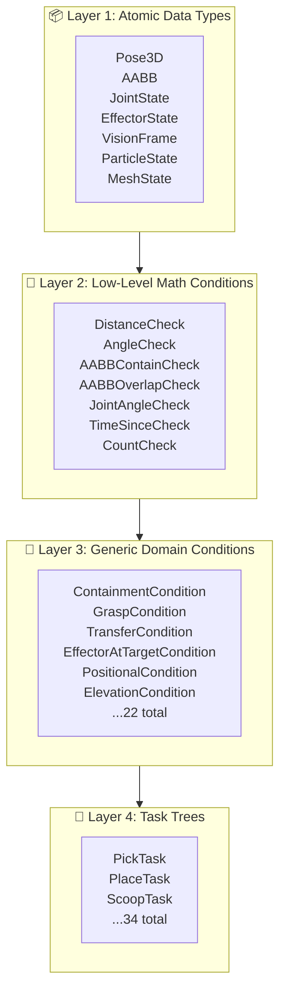

### 15.2 Layer 1: Atomic Data Types

These are the raw data structures flowing from the simulator data bus. Every field is a flat, serialisable type (float, int, string, or flat array) — no nested objects.

```yaml
# Atomic data type definitions
atomic_types:
  Pose3D:
    fields:
      - { name: position, type: float[3], description: "World-space XYZ" }
      - { name: orientation, type: float[4], description: "XYZW quaternion" }
      - { name: frame_id, type: string, description: "Reference frame name" }
      - { name: timestamp, type: float, description: "Simulation time (seconds)" }

  AABB:
    fields:
      - { name: min, type: float[3], description: "Minimum corner XYZ" }
      - { name: max, type: float[3], description: "Maximum corner XYZ" }
      - { name: frame_id, type: string, description: "Reference frame name" }
      - { name: timestamp, type: float, description: "Simulation time (seconds)" }

  JointState:
    fields:
      - { name: position, type: float[N], description: "Per-joint positions (rad)" }
      - { name: velocity, type: float[N], description: "Per-joint velocities (rad/s)" }
      - { name: effort, type: float[N], description: "Per-joint efforts (Nm)" }
      - { name: joint_names, type: string[N], description: "Ordered joint name array" }
      - { name: timestamp, type: float, description: "Simulation time (seconds)" }

  EffectorState:
    fields:
      - { name: is_closed, type: bool, description: "Gripper closed?" }
      - { name: width, type: float, description: "Gripper opening width (m)" }
      - { name: force, type: float, description: "Applied grip force (N)" }
      - { name: timestamp, type: float }

  VisionFrame:
    fields:
      - { name: image, type: uint8[HxWxC], description: "RGB or depth tensor" }
      - { name: camera_pose, type: Pose3D, description: "Camera extrinsics" }
      - { name: intrinsics, type: float[9], description: "3x3 intrinsics (row-major)" }
      - { name: timestamp, type: float }

  ParticleState:
    fields:
      - { name: positions, type: float[Nx3], description: "Per-particle positions" }
      - { name: velocities, type: float[Nx3], description: "Per-particle velocities" }
      - { name: count, type: int, description: "Active particle count" }
      - { name: timestamp, type: float }

  MeshState:
    fields:
      - { name: visible_vertices, type: int, description: "Rasterised visible vertex count" }
      - { name: total_vertices, type: int, description: "Total mesh vertex count" }
      - { name: occlusion_ratio, type: float, description: "Fraction of occluded vertices" }
      - { name: timestamp, type: float }
```

### 15.3 Layer 2: Low-Level Math Conditions

Pure stateless functions. Input -> evaluate -> return `{SUCCESS|FAILURE}`. No domain knowledge, no temporal state.

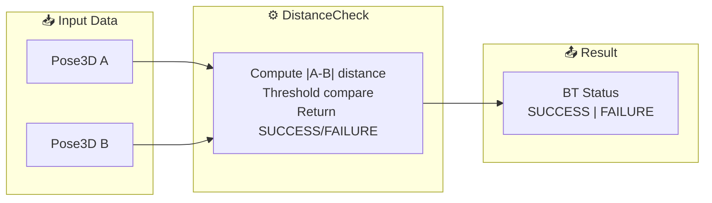

```yaml
# Layer 2 condition specifications
math_conditions:
  DistanceCheck:
    inputs:
      - { type: Pose3D, label: source }
      - { type: Pose3D, label: target }
    params:
      - { name: max_distance, type: float, default: 0.05, description: "Threshold (m)" }
      - { name: use_2d, type: bool, default: false, description: "Ignore Z?" }
    behavior: "Compute Euclidean distance. SUCCESS if <= max_distance."

  AngleCheck:
    inputs:
      - { type: Pose3D, label: source }
      - { type: Pose3D, label: target }
    params:
      - { name: max_angle, type: float, default: 0.1, description: "Threshold (rad)" }
    behavior: "Compute angular distance between two quaternions. SUCCESS if <= max_angle."

  AABBContainCheck:
    inputs:
      - { type: Pose3D, label: point }
      - { type: AABB, label: volume }
    behavior: "SUCCESS if point.position is inside volume (min <= p <= max on all axes)."

  AABBOverlapCheck:
    inputs:
      - { type: AABB, label: a }
      - { type: AABB, label: b }
    behavior: "SUCCESS if AABB a and AABB b overlap on all three axes."

  JointAngleCheck:
    inputs:
      - { type: JointState, label: joints }
    params:
      - { name: joint_name, type: string }
      - { name: min, type: float, description: "Min angle (rad)" }
      - { name: max, type: float, description: "Max angle (rad)" }
    behavior: "SUCCESS if joint_state.position[joint_name] is in [min, max]."

  TimeSinceCheck:
    inputs:
      - { type: float, label: start_time }
    params:
      - { name: min_elapsed, type: float, default: 1.0, description: "Seconds" }
    behavior: "SUCCESS if (current_time - start_time) >= min_elapsed."

  CountCheck:
    params:
      - { name: threshold, type: int }
      - { name: comparator, type: enum, values: [">=", ">", "==", "<=", "<"] }
    behavior: "SUCCESS if accumulated count satisfies comparator(threshold)."

  VectorCompareCheck:
    inputs:
      - { type: float[N], label: actual }
      - { type: float[N], label: expected }
    params:
      - { name: tolerance, type: float, default: 0.01 }
    behavior: "SUCCESS if |actual[i] - expected[i]| <= tolerance for all i."
```

### 15.4 Layer 3: Generic Domain Conditions

Compose one or more Layer 2 conditions with domain-specific parameters and an optional stability guard. Every condition here maps to exactly one ADER checker (see Section 7).

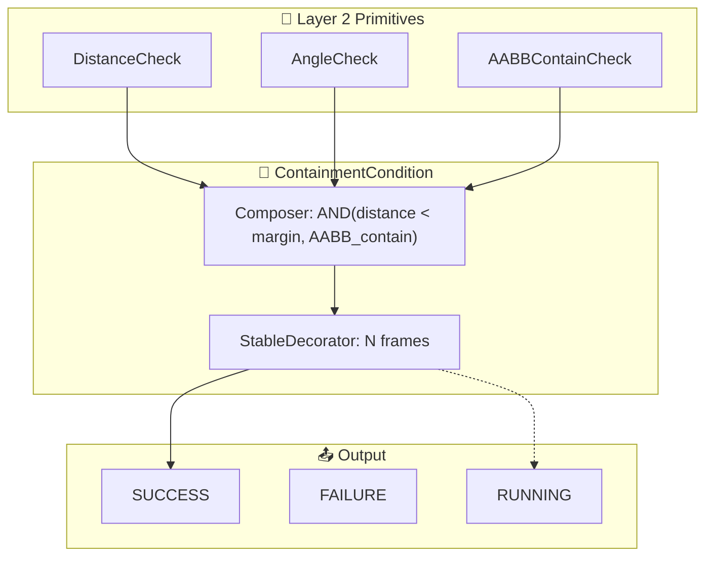

```yaml
# Selected Layer 3 condition specifications

generic_conditions:
  ContainmentCondition:
    mapping: "ADER C07 ContainmentCondition"
    description: "Is object A inside container B?"
    inputs:
      - { type: Pose3D, label: object_pose }
      - { type: AABB, label: container_aabb }
    params:
      - { name: margin, type: float, default: 0.02, description: "Extra tolerance (m)" }
      - { name: stable_frames, type: int, default: 5 }
    composition:
      - DistanceCheck: { source: object_pose, target: container_aabb.center, max_distance: container_aabb.half_diagonal + margin }
      - AABBContainCheck: { point: object_pose, volume: container_aabb }
    logic: "AND"

  GraspCondition:
    mapping: "ADER C02 GraspCondition"
    description: "Is the gripper holding the object?"
    inputs:
      - { type: Pose3D, label: effector_pose }
      - { type: Pose3D, label: object_pose }
      - { type: EffectorState, label: gripper }
    params:
      - { name: distance_margin, type: float, default: 0.03 }
      - { name: angle_margin, type: float, default: 0.15 }
      - { name: require_closed, type: bool, default: true }
      - { name: stable_frames, type: int, default: 3 }
    composition:
      - DistanceCheck: { source: effector_pose, target: object_pose, max_distance: distance_margin }
      - AngleCheck: { source: effector_pose, target: object_pose, max_angle: angle_margin }
      - CountCheck: { threshold: 1, comparator: ">=", source: gripper.force }
    logic: "AND"
    notes: "If require_closed, also check gripper.is_closed == true."

  EffectorAtTargetCondition:
    mapping: "ADER C01 EffectorAtTargetCondition"
    description: "Is the end-effector at the target pose?"
    inputs:
      - { type: Pose3D, label: effector_pose }
      - { type: Pose3D, label: target_pose }
    params:
      - { name: position_tolerance, type: float, default: 0.02 }
      - { name: orientation_tolerance, type: float, default: 0.1 }
      - { name: stable_frames, type: int, default: 3 }
    composition:
      - DistanceCheck: { source: effector_pose, target: target_pose, max_distance: position_tolerance }
      - AngleCheck: { source: effector_pose, target: target_pose, max_angle: orientation_tolerance }
    logic: "AND"

  TransferCondition:
    mapping: "ADER C06 GripperPassing"
    description: "Was object A transferred from gripper B to gripper C?"
    inputs:
      - { type: Pose3D, label: object_pose }
      - { type: EffectorState, label: giver }
      - { type: EffectorState, label: receiver }
      - { type: Pose3D, label: giver_pose }
      - { type: Pose3D, label: receiver_pose }
    params:
      - { name: stable_frames, type: int, default: 5 }
      - { name: grasp_distance, type: float, default: 0.03 }
    composition:
      phase_1:
        - GraspCondition: { effector_pose: giver_pose, object_pose: object_pose, gripper: giver }
        logic: "AND"
      phase_2:
        - GraspCondition: { effector_pose: receiver_pose, object_pose: object_pose, gripper: receiver }
        - CountCheck: { threshold: 1, comparator: ">=", source: receiver.force }
        logic: "AND"
      phase_3:
        - GraspCondition: { effector_pose: giver_pose, object_pose: object_pose, gripper: giver }
        logic: "NOT"
    logic: "AND_phases"

  MixedCondition:
    mapping: "ADER C23 MixedRules"
    description: "Composite condition with configurable logic."
    params:
      - { name: mode, type: enum, values: ["AND", "OR", "XOR", "WEIGHTED"] }
      - { name: weights, type: float[N], description: "Per-child weights (WEIGHTED mode)" }
      - { name: threshold, type: float, default: 0.5, description: "Min score for SUCCESS" }
      - { name: stable_frames, type: int, default: 3 }
    children:
      - type: "array of Condition"
      - description: "Nested conditions evaluated per mode"
    behavior: |
      AND: SUCCESS if all children SUCCESS
      OR: SUCCESS if any child SUCCESS
      XOR: SUCCESS if exactly one child SUCCESS
      WEIGHTED: SUCCESS if sum(weight_i * score_i) >= threshold

  PositionalCondition:
    mapping: "ADER C04 PositionalCondition"
    description: "Is object within a named region?"
    inputs:
      - { type: Pose3D, label: object_pose }
      - { type: AABB, label: region_aabb }
    params:
      - { name: stable_frames, type: int, default: 3 }
    composition:
      - AABBContainCheck: { point: object_pose, volume: region_aabb }
    logic: "AND"

  ElevationCondition:
    mapping: "ADER C05 ElevationCondition"
    description: "Is object above/below a height threshold?"
    inputs:
      - { type: Pose3D, label: object_pose }
    params:
      - { name: min_height, type: float, default: -inf }
      - { name: max_height, type: float, default: +inf }
      - { name: stable_frames, type: int, default: 3 }
    behavior: "Compare object_pose.position.z to [min_height, max_height]."

  OrientationCondition:
    mapping: "ADER C14 OrientationCondition"
    description: "Is object within orientation tolerance of target?"
    inputs:
      - { type: Pose3D, label: object_pose }
      - { type: Pose3D, label: target_pose }
    params:
      - { name: max_angle, type: float, default: 0.15 }
      - { name: stable_frames, type: int, default: 3 }
    composition:
      - AngleCheck: { source: object_pose, target: target_pose, max_angle: max_angle }
    logic: "AND"

  StackedOnTopCondition:
    mapping: "ADER C09 StackedOnTopCondition"
    description: "Is object A stacked on top of object B?"
    inputs:
      - { type: Pose3D, label: top_pose }
      - { type: AABB, label: bottom_aabb }
    params:
      - { name: vertical_margin, type: float, default: 0.02 }
      - { name: lateral_margin, type: float, default: 0.05 }
      - { name: stable_frames, type: int, default: 5 }
    composition:
      - DistanceCheck: { source: top_pose, target: bottom_aabb.top_center, max_distance: lateral_margin }
      - ElevationCondition: { object_pose: top_pose, min_height: bottom_aabb.max.z - vertical_margin, max_height: bottom_aabb.max.z + vertical_margin }
    logic: "AND"

  PrecisionPlacementCondition:
    mapping: "ADER C19 PrecisionPlacementCondition"
    description: "Is the peg fully inserted into the hole?"
    inputs:
      - { type: Pose3D, label: peg_pose }
      - { type: Pose3D, label: hole_pose }
      - { type: EffectorState, label: gripper }
    params:
      - { name: insertion_depth, type: float, default: 0.02 }
      - { name: alignment_angle, type: float, default: 0.05 }
      - { name: stable_frames, type: int, default: 10 }
    composition:
      - DistanceCheck: { source: peg_pose, target: hole_pose, max_distance: insertion_depth }
      - AngleCheck: { source: peg_pose, target: hole_pose, max_angle: alignment_angle }
      - CountCheck: { threshold: 0, comparator: "==", source: gripper.force }
    logic: "AND"
```

### 15.5 Mid-Level Decorators

Decorators wrap conditions to add temporal or logical behavior without modifying the condition itself.

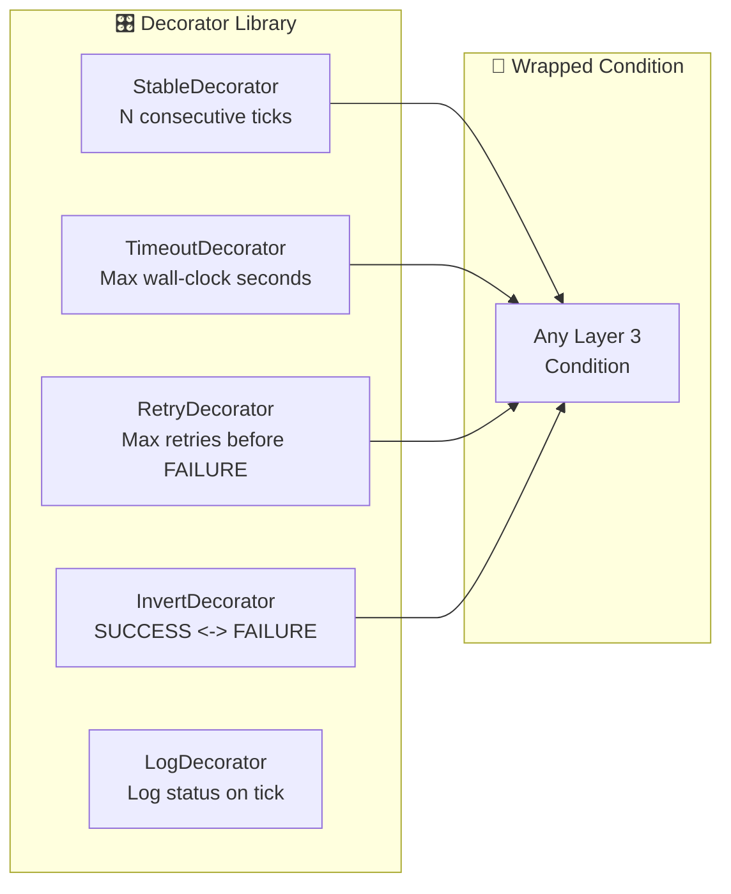

```yaml
decorators:
  StableDecorator:
    description: "Require N consecutive SUCCESS ticks before returning SUCCESS. Any FAILURE resets the counter."
    params:
      - { name: required_frames, type: int, default: 5 }
      - { name: reset_on_failure, type: bool, default: true }
    behavior: |
      Counter starts at 0.
      Tick: child SUCCESS -> counter++. If counter >= required_frames -> SUCCESS.
      Tick: child FAILURE -> counter = 0 (if reset_on_failure) -> FAILURE.
      Tick: child RUNNING -> RUNNING.

  TimeoutDecorator:
    description: "Return FAILURE if child has not completed within time limit."
    params:
      - { name: max_seconds, type: float, default: 10.0 }
    behavior: |
      Track first-tick timestamp.
      If current_time - start_time > max_seconds -> FAILURE.
      Otherwise -> child status.

  RetryDecorator:
    description: "Retry child up to N times on FAILURE."
    params:
      - { name: max_retries, type: int, default: 3 }
    behavior: |
      Count FAILUREs. If count > max_retries -> FAILURE.
      Otherwise -> rerun child.
```

### 15.6 Layer 4: Task Trees

Each of the 34 benchmark tasks is a BehaviorTree composed from Layer 3 conditions and decorators. Trees use BT control nodes (Sequence, Fallback, Parallel) ordered as a directed acyclic graph.

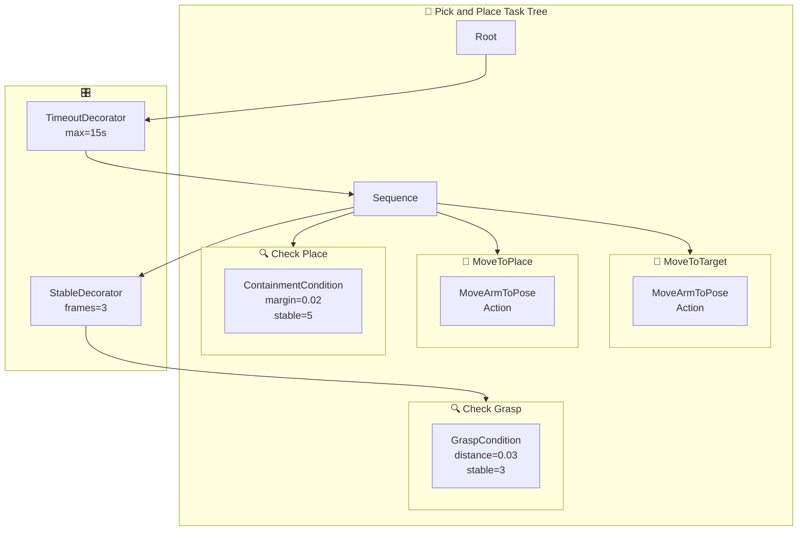

```yaml
# Example task tree: pick_and_place
task_trees:
  pick_and_place:
    root: "TimeoutDecorator(max_seconds=15)"
    children:
      - "Sequence":
          children:
            - "MoveArmToPose": { target: pre-grasp, action: true }
            - "StableDecorator(frames=3)":
                child: "GraspCondition(distance_margin=0.03, require_closed=true)"
            - "MoveArmToPose": { target: place, action: true }
            - "ContainmentCondition(margin=0.02, stable_frames=5)"

  scoop_popcorn:
    root: "Sequence"
    children:
      - "MoveArmToPose": { target: scoop_start, action: true }
      - "Parallel(threshold=1)":
          children:
            - "VisualLanguageCondition(prompt='Is scoop under popcorn?')"
            - "EffectorAtTargetCondition(position_tolerance=0.03)"
      - "MoveArmToPose": { target: scoop_end, action: true }
      - "ParticleInVolumeCondition(threshold=0.8)"

  sorting_packages:
    root: "Parallel(threshold=ALL_SUCCESS)"
    children:
      - "Sequence":
          children:
            - "PickSubtree": { object: package_A }
            - "PlaceSubtree": { container: bin_1 }
      - "Sequence":
          children:
            - "PickSubtree": { object: package_B }
            - "PlaceSubtree": { container: bin_2 }
```

### 15.7 Subtree Reuse

Common operation patterns are extracted as named BT subtrees. Any task can instantiate a subtree with parameter overrides.

```yaml
# Reusable subtree library
subtree_library:
  PickSubtree:
    params:
      - { name: object, type: string }
      - { name: distance_margin, type: float, default: 0.03 }
      - { name: stable_frames, type: int, default: 3 }
    tree:
      root: "Sequence"
      children:
        - "MoveArmToPose": { target: "pre-grasp_${object}", action: true }
        - "GraspCondition": { object_pose: "${object}_pose", distance_margin: "${distance_margin}", stable_frames: "${stable_frames}" }

  PlaceSubtree:
    params:
      - { name: container, type: string }
      - { name: margin, type: float, default: 0.02 }
    tree:
      root: "Sequence"
      children:
        - "MoveArmToPose": { target: "above_${container}", action: true }
        - "ContainmentCondition": { object_pose: held_object_pose, container_aabb: "${container}_aabb", margin: "${margin}" }

  SpatialCheckSubtree:
    params:
      - { name: object_a, type: string }
      - { name: object_b, type: string }
      - { name: relation, type: enum, values: ["on_top", "inside", "next_to", "aligned"] }
    tree:
      root: "Sequence"
      children:
        - "Switch":
            value: "${relation}"
            cases:
              on_top: "StackedOnTopCondition(top: ${object_a}, bottom: ${object_b})"
              inside: "ContainmentCondition(object: ${object_a}, container: ${object_b})"
              next_to: "DistanceCheck(source: ${object_a}, target: ${object_b}, max_distance: 0.1)"
              aligned: "AlignedStackCondition(objects: [${object_a}, ${object_b}])"
```

### 15.8 Checker-Addition Workflow

Adding a new checker follows a defined decision tree:

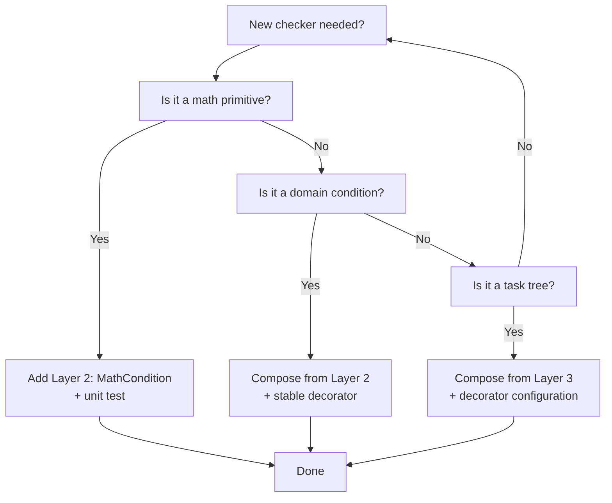

```yaml
# Addition workflow
checker_addition_workflow:
  step_1: "Identify the layer (Section 15.1 decision tree)"
  step_2: "Define inputs, params, and behavior in YAML spec"
  step_3: "If Layer 2: Write pure math function + unit test"
  step_4: "If Layer 3: Compose from Layer 2 using AND/OR/XOR logic + stable decorator"
  step_5: "If Layer 4: Compose tree from Layer 3 conditions + BT control nodes"
  step_6: "Register in condition factory (YAML or code)"
  step_7: "Add to task config if used by an existing task"
  step_8: "Run benchmark smoke test with the new checker"
```

---

## 16. 🔄 OVRtx Data Pipeline for VLM/LLM Actions

The OVRtx (Omniverse RTX) renderer produces GPU-resident AOV (Arbitrary Output Variable) data that feeds VLM-based checkers and LLM action inference. This pipeline is relevant for three hard tasks (scoop_popcorn, place_workpiece, handover) and any VisualLanguageCondition.

### 16.1 AOV Inventory

OVRtx can stream the following AOVs. Each is a GPU tensor produced per render frame.

```yaml
aov_inventory:
  Color:
    format: float32[HxWx4]
    data: "sRGB linear, alpha channel"
    gpu_resident: true
    size_class: "large (1920x1080 = 33 MB)"

  Depth:
    format: float32[HxWx1]
    data: "Per-pixel depth (m)"
    gpu_resident: true
    size_class: "medium (8 MB at 1080p)"

  Normals:
    format: float32[HxWx4]
    data: "World-space normal vectors"
    gpu_resident: true
    size_class: "large"

  ObjectId:
    format: uint32[HxWx1]
    data: "Per-pixel USD prim path hash"
    gpu_resident: true
    size_class: "small (8 MB)"

  SemanticLabel:
    format: uint32[HxWx1]
    data: "Semantic segment ID"
    gpu_resident: true
    size_class: "small"

  BoundingBox2D:
    format: float32[Nx4]
    data: "2D bounding boxes {x, y, w, h} per object"
    gpu_resident: true
    size_class: "negligible"

  InstanceMask:
    format: uint32[HxWx1]
    data: "Instance segmentation mask"
    gpu_resident: true
    size_class: "small"

  MotionVectors:
    format: float32[HxWx2]
    data: "Per-pixel motion (dx, dy)"
    gpu_resident: true
    size_class: "medium"
```

### 16.2 Data Flow Diagram

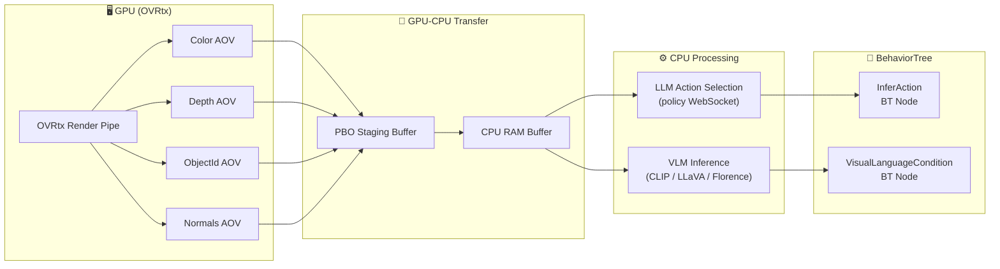

### 16.3 VisualLanguageCondition Action Spec

Maps to ADER A01 VisualLanguageCheck. Uses GPU AOV data to answer visual questions.

```yaml
visual_language_condition:
  mapping: "ADER A01 VisualLanguageCheck"
  description: "VLM-based visual verification condition."
  inputs:
    - { type: VisionFrame, label: color_image, aov: Color, gpu_resident: true }
    - { type: VisionFrame, label: depth_image, aov: Depth, optional: true }
  params:
    - { name: prompt, type: string, description: "VLM query" }
    - { name: model, type: string, default: florence-2, enum: ["clip", "florence-2", "llava", "custom"] }
    - { name: confidence_threshold, type: float, default: 0.7 }
    - { name: stable_frames, type: int, default: 3 }
    - { name: cache_seconds, type: float, default: 0.5, description: "Reuse last result within N seconds" }
  behavior: |
    On tick:
    1. If cached result is fresh (< cache_seconds), return cached status.
    2. Request latest Color AOV from GPU staging buffer.
    3. If depth is available and requested, also transfer Depth AOV.
    4. Run VLM inference with prompt.
    5. Parse response: "yes" / "no" / confidence score.
    6. If confidence >= confidence_threshold AND answer is affirmative -> SUCCESS.
    7. Otherwise -> FAILURE.
    Wraps with StableDecorator(required_frames) for temporal consistency.
  performance:
    typical_latency: "100-500ms per inference (depends on model and resolution)"
    gpu_transfer_cost: "~5ms for 1080p Color (PBO async)"
    recommended_aovs: ["Color", "Depth"]
```

### 16.4 InferAction Spec

LLM-driven action selection node. Sends the current visual state + task context to the LLM and receives a next-action command.

```yaml
infer_action:
  description: |
    BT Action node that:
    1. Captures current visual state (Color AOV + condition status)
    2. Sends to LLM policy via WebSocket
    3. Receives next-action command (which sub-behavior to run)
    4. Returns SUCCESS with action payload
  inputs:
    - { type: VisionFrame, label: current_view, aov: Color }
    - { type: ConditionSnapshot, label: active_conditions, description: "Current status of all monitoring conditions" }
  params:
    - { name: task_context, type: string, description: "Task description / instructions" }
    - { name: endpoint, type: string, default: "ws://localhost:8765" }
    - { name: timeout_ms, type: int, default: 5000 }
    - { name: max_retries, type: int, default: 2 }
  output:
    - { name: action_command, type: string, description: "Next action name" }
    - { name: action_params, type: dict, description: "Action parameters" }
  behavior: |
    1. Serialise current_view (jpg-compress to reduce transfer size)
    2. Build prompt: task_context + active condition summary
    3. Send via WebSocket to LLM policy
    4. Wait for response or timeout
    5. Parse JSON response: {action: string, params: dict, confidence: float}
    6. If confidence < 0.3 -> return FAILURE (retry)
    7. Return SUCCESS with action_command
```

### 16.5 BT-Node-to-AOV Mapping

Which BT nodes consume which AOVs:

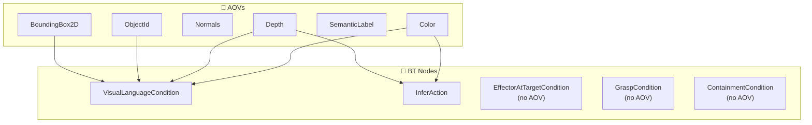

```yaml
bt_aov_mapping:
  VisualLanguageCondition:
    required: ["Color"]
    optional: ["Depth", "ObjectId", "SemanticLabel"]
    notes: "Color is always needed. Depth helps spatial reasoning."

  InferAction:
    required: ["Color"]
    optional: ["Depth", "Normals"]
    notes: "Some LLM policies use depth for 3D grounding."

  EffectorAtTargetCondition:
    required: []
    notes: "Uses Pose3D data from simulator, not AOV."

  GraspCondition:
    required: []
    notes: "Uses Pose3D + EffectorState from simulator."

  ContainmentCondition:
    required: []
    notes: "Uses Pose3D + AABB from simulator."
```

### 16.6 Task Benefit Matrix

Which tasks benefit from which AOVs:

| Task | Color | Depth | ObjectId | Normals | Notes |
|---|---|---|---|---|---|
| scoop_popcorn | Required | Required | Optional | -- | VLM verifies scoop under popcorn |
| geniesim_place_workpiece | Required | Required | Required | -- | VLM verifies peg-in-hole alignment |
| handover | Required | Optional | Required | -- | VLM detects gripper-object contact |
| clean_the_desktop | Required | Required | -- | -- | VLM identifies clutter |
| sorting_packages | Required | Required | Required | -- | VLM reads package labels |
| stock_and_straighten_shelf | Required | Required | Required | -- | VLM checks shelf arrangement |
| All other tasks (28) | -- | -- | -- | -- | Pure pose/joint checkers suffice |

### 16.7 GPU-to-CPU Transfer Performance

OVRtx AOVs live on the GPU. Transfer to CPU is the bottleneck for VLM checkers. Key performance characteristics:

```yaml
gpu_transfer_performance:
  method: "PBO (Pixel Buffer Object) async DMA"
  bandwidth: "~12 GB/s (PCIe 4.0 x16)"

  transfer_timings_1080p:
    Color (float32, 1920x1080x4, 33 MB):
      gpu_to_pbo: "~0.3 ms"
      pbo_to_cpu: "~2.8 ms"
      total_latency: "~4 ms (with PBO double-buffering)"

    Depth (float32, 1920x1080x1, 8 MB):
      total_latency: "~1 ms"

    ObjectId (uint32, 1920x1080x1, 8 MB):
      total_latency: "~1 ms"

  optimisation_notes:
    - "Use PBO double-buffering to overlap transfer with rendering."
    - "Downsample Color to 640x480 for VLM input (~3.7 MB instead of 33 MB)."
    - "JPEG-compress Color before WebSocket send (~100 KB at quality 85)."
    - "Cache VLM results (default 0.5s) to avoid re-inference every tick."
    - "Run VLM inference on GPU (same device) to avoid CPU round-trip."

  frame_pipeline:
    tick_0: "OVRtx renders -> Color AOV on GPU"
    tick_0_async: "PBO transfer starts (overlaps with physics tick)"
    tick_1: "CPU receives Color -> VLM inference -> result ready"
    tick_1_end: "VisualLanguageCondition tick returns SUCCESS/FAILURE"
    typical_end_to_end: "1-2 simulation ticks (16-33 ms at 60 Hz)"
```

---

*End of Sections 15-16*
