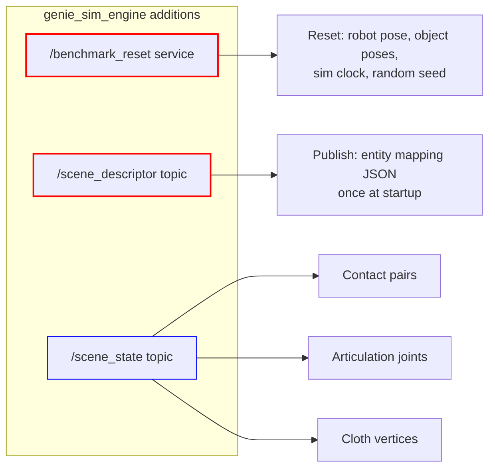
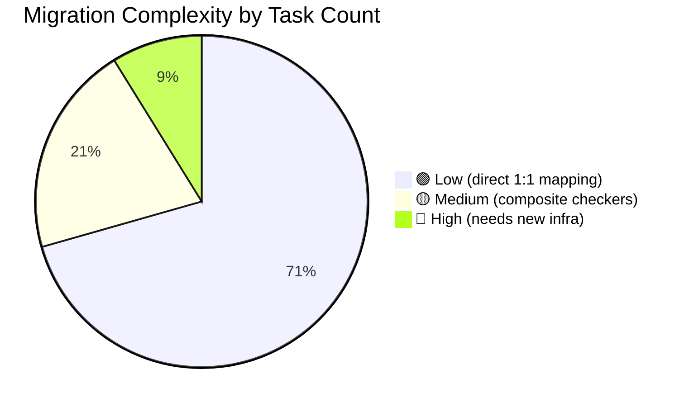

## 2. 📦 Package Layout

```
geniesim_ros/src/ros_ws/src/genie_sim_benchmark/
├── src/                              # 🏭 C++ node (derived from genie_sim_render patterns)
│   ├── benchmark_node.cpp            # rclcpp node, BT factory, /tf_render subscriber, tick loop
│   ├── benchmark_node.hpp
│   ├── blackboard_bridge.cpp         # /tf_render → BT blackboard
│   ├── blackboard_bridge.hpp
│   └── python_nodes.cpp              # pybind11: register Python BT node classes
├── bt_nodes/                         # 🧠 Python BT nodes
│   ├── __init__.py
│   ├── conditions/
│   │   ├── __init__.py
│   │   ├── pose_condition.py         # entity_a within tolerance of entity_b?
│   │   └── time_condition.py         # timeout elapsed?
│   ├── actions/
│   │   ├── __init__.py
│   │   ├── infer_action.py           # WebSocket call → blackboard.action
│   │   ├── move_joints.py            # Publish /joint_command
│   │   ├── reset_episode.py          # Call /benchmark_reset service
│   │   ├── wait_for_step.py          # Block until fresh /tf_render
│   │   └── log_score.py              # Write JSON result to disk
│   └── decorators/
│       ├── __init__.py
│       ├── retry.py
│       └── timeout.py
├── config/                           # 📋 Task configs
│   ├── tasks/
│   │   └── pick_block_color.yaml
│   └── trees/
│       └── pick_block.xml
├── launch/
│   └── benchmark.launch.py
├── msg/                              # 📦 Custom messages
│   └── BenchmarkReset.srv            # Episode reset service
├── AGENTS.md
├── README.md
├── package.xml
└── CMakeLists.txt
```

---
## 9. 🚀 Launch Integration

### 9.1 Launcher YAML addition

```yaml
# launcher_newton_benchmark.yaml (new)
launcher:
  physics:
    engine: genie_sim_engine
    engines:
      genie_sim_engine:
        package: genie_sim_engine
        executable: genie_sim_engine_newton.py
  benchmarks:
    - benchmark_node: pick_block_color

benchmark_node:
  ros__parameters:
    task_yaml: tasks/pick_block_color.yaml
    bt_tick_hz: 30.0
    output_dir: /tmp/benchmark_results
```

### 9.2 Launch file

```python
# launch/benchmark.launch.py
from launch import LaunchDescription
from launch_ros.actions import Node

def generate_launch_description():
    return LaunchDescription([
        Node(
            package='genie_sim_benchmark',
            executable='benchmark_node',
            name='benchmark_node',
            parameters=[{
                'task_yaml': LaunchConfiguration('task_yaml'),
                'bt_tick_hz': LaunchConfiguration('bt_tick_hz', default=30.0),
                'output_dir': LaunchConfiguration('output_dir', default='/tmp/benchmark_results'),
            }],
            output='screen',
        ),
    ])
```

### 9.3 bringup integration

In `genie_sim_bringup/launch/utils.py`, parallel to `make_render_*_node()`:

```python
def make_benchmark_node(context, task_name: str):
    """Construct a benchmark Node from launcher YAML config."""
    # …
```

---
## 10. 🗺️ Migration Path: Legacy → New

### v1-POC: Minimal benchmark node (this version)

| Step | What | Key files |
|---|---|---|
| P0.1 | Scaffold `genie_sim_benchmark` package — `package.xml`, `CMakeLists.txt`, `benchmark.launch.py` | `package.xml`, `CMakeLists.txt`, `launch/` |
| P0.2 | Port `BlackboardBridge` from `render_node.cpp` tf_render subscription pattern | `src/blackboard_bridge.cpp` |
| P0.3 | Build `benchmark_node.cpp` — `/tf_render` sub + BT tick timer + `/joint_command` pub | `src/benchmark_node.cpp` |
| P0.4 | Build `python_nodes.cpp` — pybind11 bridge, register `InferAction` + `MoveJoints` + `PoseCondition` + `WaitForStep` + `LogScore` | `src/python_nodes.cpp` |
| P0.5 | Implement 5 Python BT nodes | `bt_nodes/` |
| P0.6 | Wire into bringup launcher YAML + `app.launch.py` (like `make_render_*_node()`) | `genie_sim_bringup` |

### v1.1: First task + scoring

| Step | What |
|---|---|
| 1.1 | Write `pick_block_color.xml` BT tree |
| 1.2 | Write `pick_block_color.yaml` task config |
| 1.3 | Implement `ResetEpisode` action + `/benchmark_reset` service in engine |
| 1.4 | Implement scoring model + `LogScore` output |
| 1.5 | End-to-end test: engine + benchmark + inference server |

### v1.2: Richer BT node library

| Step | What |
|---|---|
| 2.1 | `Grasp` / `Release` actions + `ContactCondition` |
| 2.2 | `TimeCondition`, `Retry`, `Timeout` decorators |
| 2.3 | Port 3-5 existing `geniesim_benchmark` tasks to BT XML |

### v2: Scale

| Step | What |
|---|---|
| 3.1 | `/scene_state` protocol design + engine publishing side |
| 3.2 | `ContactCondition`, `ClothCondition`, `ArticulationCondition` |
| 3.3 | Groot2 monitoring |
| 3.4 | Port remaining ~80 legacy tasks |
| 3.5 | OVRtx integration (`VisualCondition`)

---
## 11. ⚙️ Engine Feature Requirements

The benchmark depends on the engine exposing certain control and data interfaces
that are not yet implemented. This section lists them grouped by priority so they
can be slotted into the engine's roadmap.

### 🔴 v1 blocking (required for POC)

| # | Feature | Interface | Why |
|---|---|---|---|
| 1 | **Episode reset** | ROS 2 service `/benchmark_reset` (`std_srvs/Empty` or `BenchmarkReset.srv`) | Between episodes, the benchmark needs to reset robot pose, object poses, and sim clock to initial state without restarting the engine process |
| 2 | **Scene entity inventory** | ROS 2 topic `/scene_descriptor` (`std_msgs/String` — JSON payload) published once at startup | The benchmark needs to know the mapping from logical entity names to USD prim paths (e.g. `target_block → /World/Objects/block_01`) to configure its blackboard correctly |
| 3 | **Joint command topic** | Existing `/joint_command` must accept **all controllable joints** (robot arm + gripper + articulation joints like drawers/doors) | The benchmark's `MoveJoints` BT node publishes to this topic; if articulation joints aren't addressable, tasks involving doors/drawers won't work |

### 🟡 v1.1 important

| # | Feature | Interface | Why |
|---|---|---|---|
| 4 | **Sim clock in `/tf_render`** | `header.stamp` must carry sim time (not wall clock) | The `TimeCondition` BT node and scoring's `duration_sec` metric need simulation time to be meaningfully comparable across runs with different physics Hz |
| 5 | **Deterministic reset** | `/benchmark_reset` must produce identical initial conditions given the same seed | Benchmark reproducibility — without it, scores vary between runs on the same task |
| 6 | **Scene load** | ROS 2 service `/benchmark_load_scene` with scene name parameter | Enables running multiple task configs without restarting the engine (batch evaluation) |

### 🔵 v2+ future

| # | Feature | Interface | Why |
|---|---|---|---|
| 7 | **Contact pair streaming** | `/scene_state` topic with per-tick active contact pairs: `(body_a, body_b, point, normal, force)` | `ContactCondition` / `GraspedCondition` need contact data to detect grasp success, collisions |
| 8 | **Articulation joint state** | `/scene_state` topic with non-robot articulation positions (drawers, doors, cabinet slides) | Tasks involving interactive environments (open drawer, close door) need joint-position feedback from non-robot articulations |
| 9 | **Cloth/particle vertex data** | `/scene_state` topic with per-cloth vertex positions | Cloth tasks (folding, draping, coverage evaluation) need mesh-level feedback |
| 10 | **Pause / play control** | ROS 2 service `/benchmark_pause` / `/benchmark_play` | Some tasks need the simulation paused during observation setup (e.g. initialising objects without physics interference) |
| 11 | **Simulation time scaling** | ROS 2 service `/benchmark_time_scale` | Benchmarking at faster/slower-than-realtime for stress testing or debugging |

### 📋 Implementation notes for engine team



- `/benchmark_reset` (#1) and `/scene_descriptor` (#2) are **red — blocking for v1 POC**
- `/scene_state` (#7-9) is **blue — v2+**
- The reset service should accept an optional `seed` field so each episode can be
  deterministically varied (object pose perturbation, colour randomisation, etc.)

---
## 12. ⚠️ Open Questions (for further design)

| Question | Status |
|---|---|---|
| How does `/scene_state` get its contact/cloth data from each engine backend? | 🔴 Out of scope for v1 |
| How does the BT handle continuous action streaming vs discrete action chunks? | 🟡 Depends on inference server protocol |
| How does the benchmark node know when `/tf_render` has "new" data (vs same tick)? | 🟡 Sequence counters in header |
| Does the benchmark need to publish `/cmd_4ws` for mobile bases? | 🟡 Not needed for first tasks |
| OVRtx integration (`VisualCondition` node) | 🔴 Future |
| What is the exact `SceneState.msg` schema? | 🔴 Out of scope for v1 |
| Where does the benchmark launcher YAML live — in `genie_sim_bringup` or in `genie_sim_benchmark`? | 🟡 Resolve during bringup wiring |

---
## 13. 🔗 References

| Document | Relevance |
|---|---|
| [`DESIGN.CORE.md`](./DESIGN.CORE.md) | Engine architecture — benchmark is a protocol consumer |
| [`DESIGN.ABI.md`](./DESIGN.ABI.md) | Engine ABI — `/tf_render` spec, ROS topic contracts |
| [`genie_sim_render/AGENTS.md`](../genie_sim_render/AGENTS.md) | **Code parent** — `benchmark_node.cpp` follows `render_node.cpp` patterns |
| [`genie_sim_render/src/render_node.cpp`](../genie_sim_render/src/render_node.cpp) | **Reference implementation** for `/tf_render` subscription + timer callback |
| [BehaviorTree.CPP docs](https://www.behaviortree.dev/) | BT library reference, XML schema, blackboard API, Groot2 |

---
## 📄 Revision History

| Date | Change |
|---|---|
| 2026-07-12 | Initial draft — architecture, protocol, BT runtime, task YAML, scoring model |
## 10. Task Configuration Migration

### 10.1 Three-layer config equivalence

| Layer | ADER current format | BT new format | Migration |
|---|---|---|---|
| **Run** | YAML: `config/g2op_*.yaml` — task_name, sub_task_name, seed, num_episode, model_arc | YAML: `config/tasks/pick_block.yaml` — task.name, scene, bt_tree, blackboard, scoring | **Manual rewrite** — schema is different but 1:1 |
| **Eval task** | JSON: `config/eval_tasks/<scene>_<robot>.json` — 27 files with scene/robot/gen/recording config | Scene ref in task YAML; generalization + recording not yet designed | **Partial** — scene/robot mapping can be embedded in task YAML; generalization needs new design |
| **Instance** | `llm_task/<task>/<id>/` — instructions.json, problems.json, scene_info.json, scene.usda | Task YAML + BT XML (one tree per instruction pattern) | **Auto-converter** from problems.json → BT XML is feasible (see §10.2) |

### 10.2 problems.json → BT XML converter design

Since ADER's `problems.json` has a simple recursive structure (`ActionList` → `ActionSetWaitAny` →
`checkers`), a **Python converter script** can translate it to BT XML:

```python
# pseudo-code for converter
def convert_problem_to_bt_xml(problem_json, task_name):
    acts = problem_json["Acts"][0]  # top-level ActionList
    tree = BT.Tree()
    
    for checkpoint in acts["ActionList"]:
        for key, value in checkpoint.items():
            if key == "ActionSetWaitAny":
                subtree = build_wait_any(value, task_name)
                tree.add_subtree(subtree)
            # ...
    
    return render_bt_xml(tree)

def build_wait_any(children, task_name):
    # ActionSetWaitAny → Parallel(threshold=1)
    parallel = ParallelNode(threshold=1)
    for child in children:
        for k, v in child.items():
            if k == "Follow":
                parallel.add(EffectorAtTargetCondition(...))
            elif k == "PickUpOnGripper":
                parallel.add(GraspCondition(...))
            elif k == "StepOut":
                parallel.add(StepLimitCondition(max_steps=v))
            # ...
    return parallel
```

**Conversion is lossy** — the following ADER features have no direct BT XML equivalent:
- `MixedRules` with OR mode (fractional scoring) → `AggregateCondition` with custom C++ node
- `VLM` (async VLM check) → custom async action node
- `Onfloor` (mid-episode cancel) → parallel monitoring subtree
- Placeholder `{@name}` → blackboard variables (different mechanism, same effect)
- Consecutive frame counting → decorator or condition-internal counter

### 10.3 Full task directory migration: `pick_block_color`

```diff
- llm_task/pick_block_color/
- ├── 0/
- │   ├── instructions.json
- │   ├── problems.json
- │   ├── scene_info.json
- │   └── scene.usda
- ├── 1/
- │   └── ...
- └── ...

+ config/tasks/
+ ├── pick_block_color.yaml      # task config
+ └── trees/
+     ├── pick_block_color.xml    # BT tree
+     └── pick_block_color_subtask.xml  # (optional) if subtask mode
```

Each `instructions.json` → YAML `task.instructions[]` or separate per-instruction
BT trees. Each `problems.json` → BT XML tree. Each `scene_info.json` → scene ref
+ entity mapping in YAML.

---
## 13. Migration Workflow for Each Task Type

### 13.1 All 34 task types and their checker requirements

| # | Task name | ADER checkers used | BT conditions needed | Migration complexity |
|---|---|---|---|---|
| 1 | `pick_block_color` | Follow, PickUpOnGripper | EffectorAtTarget, GraspCondition | 🟢 Low |
| 2 | `pick_block_number` | Follow, PickUpOnGripper | EffectorAtTarget, GraspCondition | 🟢 Low |
| 3 | `pick_block_shape` | Follow, PickUpOnGripper | EffectorAtTarget, GraspCondition | 🟢 Low |
| 4 | `pick_block_size` | Follow, PickUpOnGripper | EffectorAtTarget, GraspCondition | 🟢 Low |
| 5 | `pick_common_sense` | Follow, PickUpOnGripper | EffectorAtTarget, GraspCondition | 🟢 Low |
| 6 | `pick_object_type` | Follow, PickUpOnGripper | EffectorAtTarget, GraspCondition | 🟢 Low |
| 7 | `pick_specific_object` | Follow, PickUpOnGripper | EffectorAtTarget, GraspCondition | 🟢 Low |
| 8 | `pick_billiards_color` | Follow, PickUpOnGripper | EffectorAtTarget, GraspCondition | 🟢 Low |
| 9 | `pick_object_absolute_position` | Follow, PickUpOnGripper | EffectorAtTarget, GraspCondition | 🟢 Low |
| 10 | `pick_object_relative_position` | Follow, PickUpOnGripper | EffectorAtTarget, GraspCondition | 🟢 Low |
| 11 | `pick_follow_logic_or` | Follow, PickUpOnGripper | EffectorAtTarget, GraspCondition | 🟢 Low |
| 12 | `place_object_into_box_color` | Follow, PickUpOnGripper, Inside | EffectorAtTarget, GraspCondition, ContainmentCondition | 🟢 Low |
| 13 | `place_block_into_box` | Follow, PickUpOnGripper, Inside | EffectorAtTarget, GraspCondition, ContainmentCondition | 🟢 Low |
| 14 | `place_block_into_drawer` | Inside | ContainmentCondition | 🟢 Low |
| 15 | `place_beverage_to_anothers_position` | Follow, MixedRules | EffectorAtTarget, AggregateCondition | 🟡 Medium |
| 16 | `place_object_relative_position` | Follow, MixedRules | EffectorAtTarget, AggregateCondition | 🟡 Medium |
| 17 | `clean_the_desktop` | Inside, PushPull, RelativePosition, Upright | ContainmentCondition, JointLimitCondition, RelativePositionCondition, OrientationCondition | 🟡 Medium |
| 18 | `sort_fruit` | Inside | ContainmentCondition | 🟢 Low |
| 19 | `sort_number` | MixedRules | AggregateCondition | 🟡 Medium |
| 20 | `sort_cubes_by_size` | MixedRules | AggregateCondition | 🟡 Medium |
| 21 | `sorting_packages` | Follow, PickUpOnGripper, Inside, Upright, PickUpOnGripper, Inside | EffectorAtTarget, GraspCondition, ContainmentCondition, OrientationCondition, ... (repeat) | 🟡 Medium |
| 22 | `sorting_packages_continuous` | Upright, Upright, Upright, Upright | OrientationCondition ×4 | 🟢 Low |
| 23 | `stack_bowls` | Stack | AlignedStackCondition | 🟢 Low |
| 24 | `stack_three_building_blocks` | Stack | AlignedStackCondition | 🟢 Low |
| 25 | `hold_pot` | LiftUp, InBBox, Upright | ElevationCondition, InBoundingBoxCondition, OrientationCondition | 🟢 Low |
| 26 | `open_door` | PushPull | JointLimitCondition | 🟢 Low |
| 27 | `pour_workpiece` | Inside, Inside, Inside, Inside | ContainmentCondition ×4 | 🟢 Low |
| 28 | `stock_and_straighten_shelf` | Follow, PickUpOnGripper, InBBox, Follow, Upright | EffectorAtTarget, GraspCondition, InBoundingBoxCondition, EffectorAtTarget, OrientationCondition | 🟡 Medium |
| 29 | `take_wrong_item_shelf` | Follow, Inside | EffectorAtTarget, ContainmentCondition | 🟢 Low |
| 30 | `pack_in_supermarket` | Inside | ContainmentCondition | 🟢 Low |
| 31 | `straighten_object` | Follow, Upright | EffectorAtTarget, OrientationCondition | 🟢 Low |
| 32 | `scoop_popcorn` | VLM | VisualLanguageCheck (Action) | 🔴 High (needs VLM API integration) |
| 33 | `bimanual_chip_handover` | Upright | OrientationCondition | 🟢 Low |
| 34 | `geniesim_place_workpiece` | PlaceOnRivet | PrecisionPlacementCondition | 🔴 High (precise tolerances + stillness) |

### 13.2 Migration complexity summary



**24 of 34 task types** (71%) are straightforward — they use only `Follow`,
`PickUpOnGripper`, `Inside`, `Upright`, `Stack`, `LiftUp`, `InBBox`, `PushPull`,
which all have direct generic BT equivalents.

**7 task types** (21%) use `MixedRules` (composite aggregation) or multi-step variants
that need `AggregateCondition` or repeated subtrees — these are structurally portable.

**3 task types** (9%) need new infrastructure:
- `scoop_popcorn` — VLM evaluation (needs async action + VLM API integration)
- `geniesim_place_workpiece` — precision assembly (needs `PrecisionPlacementCondition` with stillness detection)
- `bimanual_chip_handover` had `Upright` only but may need the `TransferCondition` in practice

---
