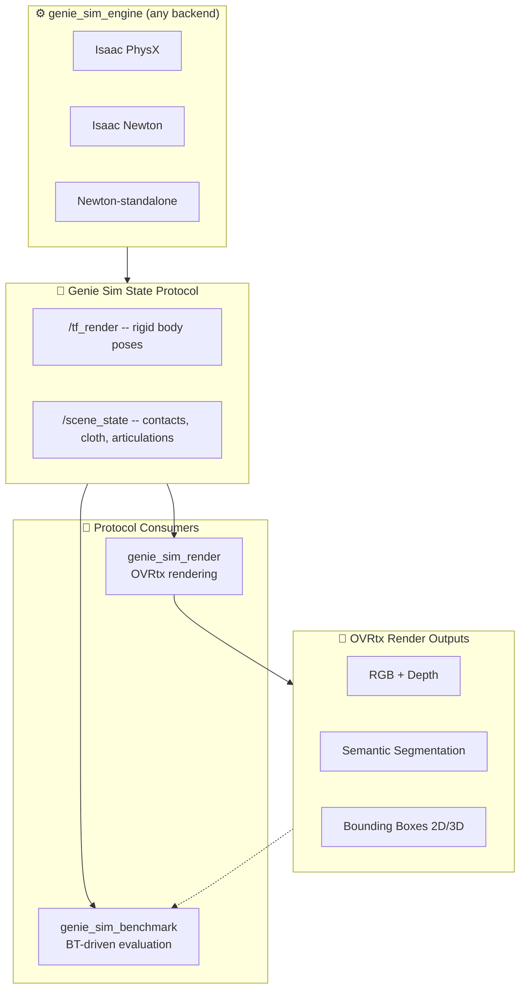
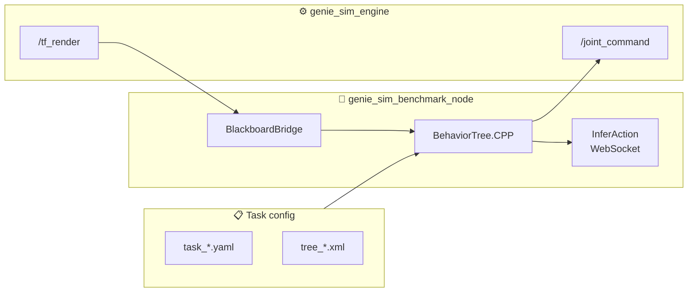
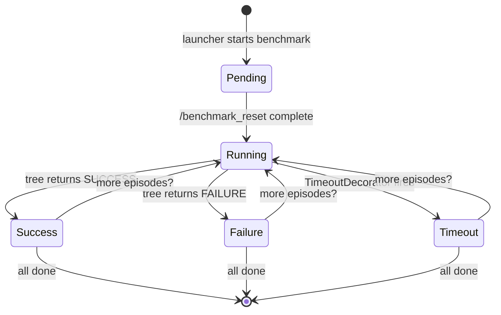
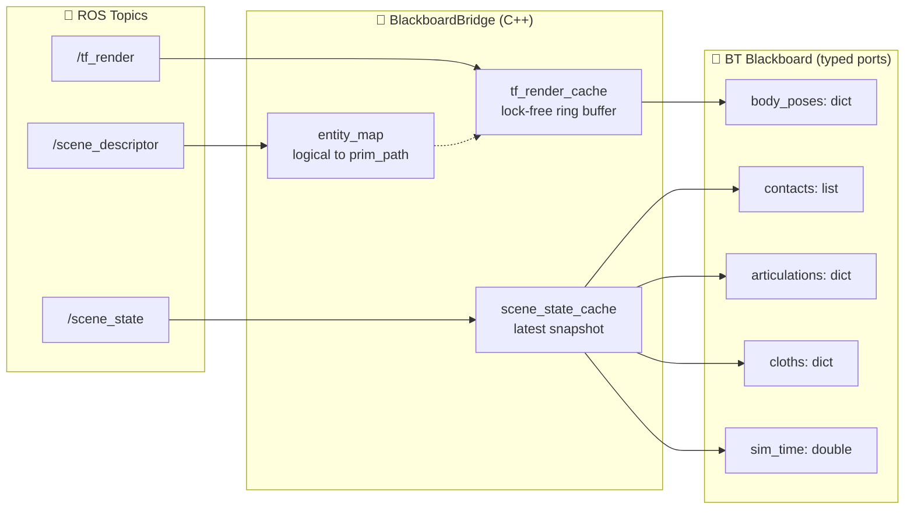
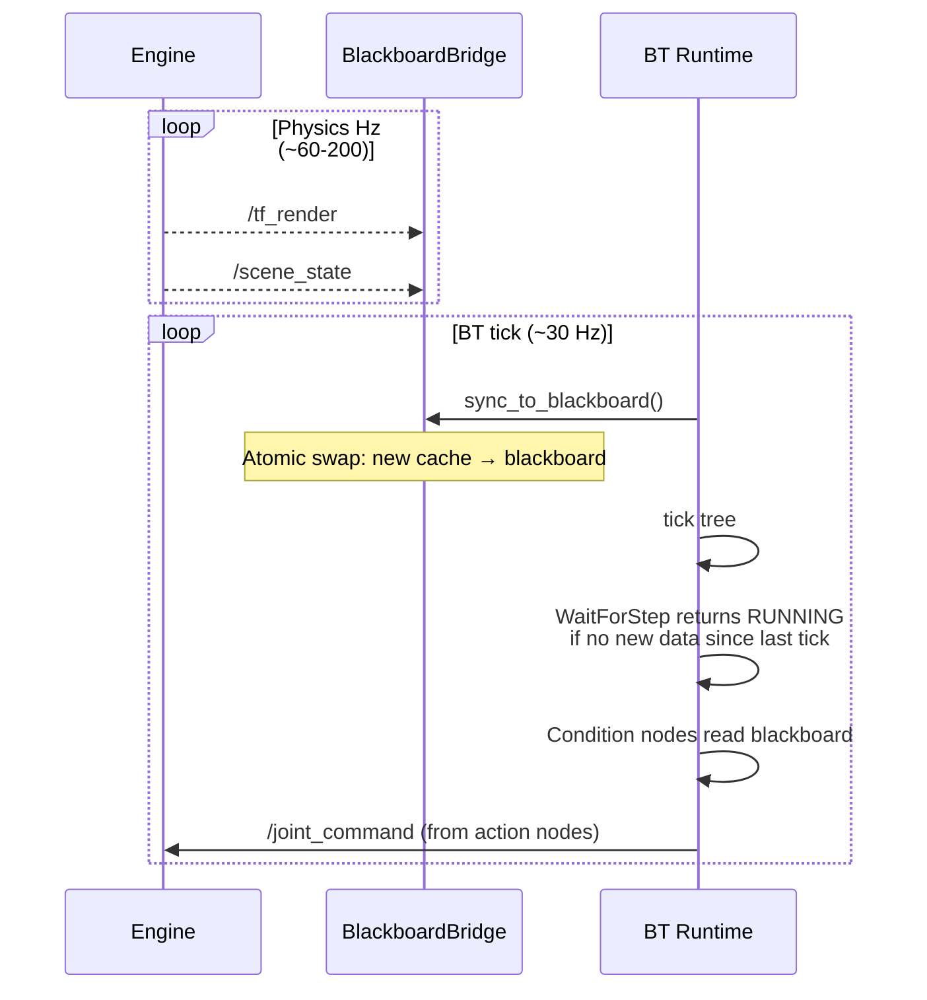
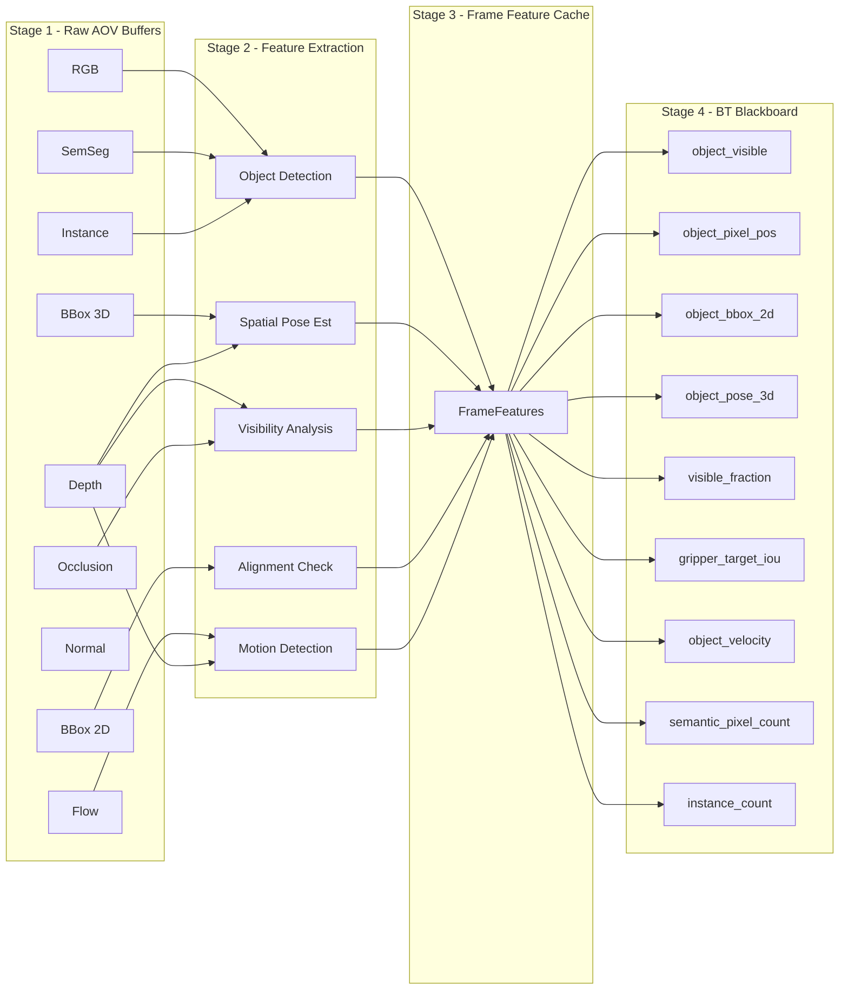
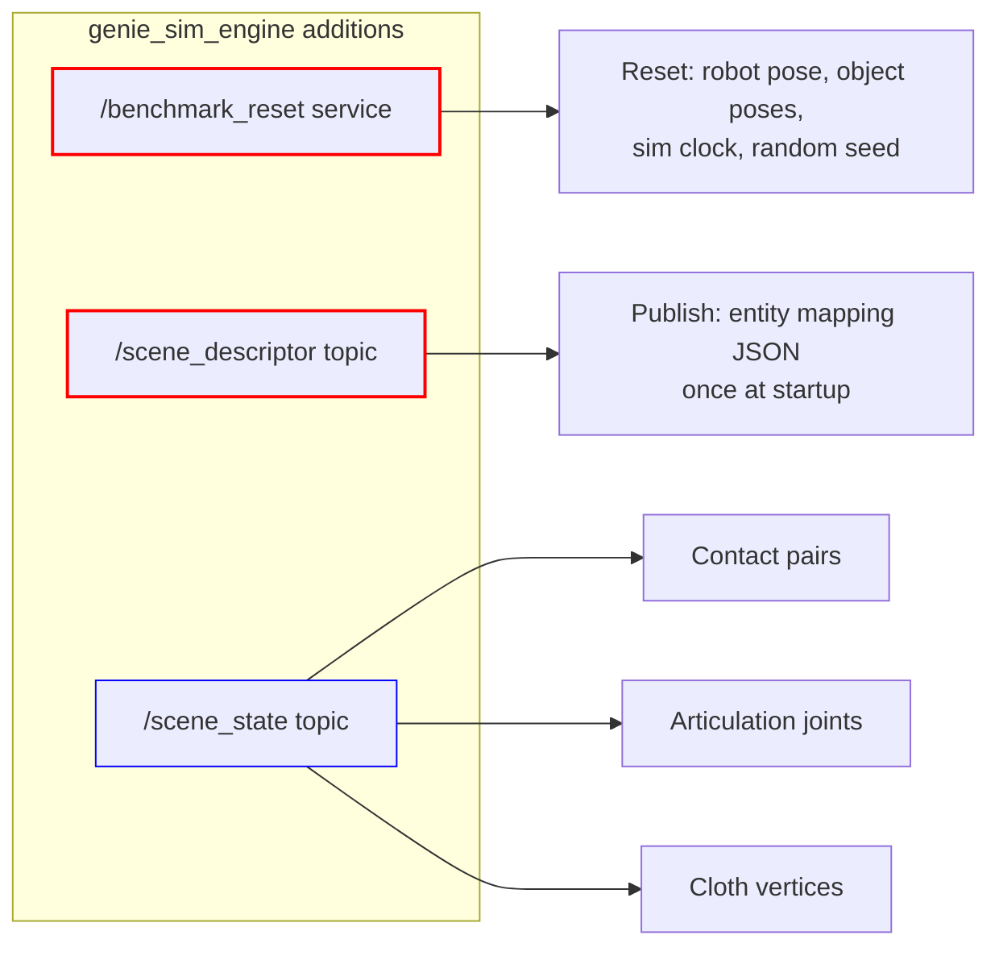

# 🧪 genie_sim_benchmark — Behavior-Tree-Driven Benchmark Design

> **Engine-independent benchmark runtime** driven by BehaviorTree.CPP.
> v1 is a new ROS 2 package derived from `genie_sim_render`'s code patterns:
> the C++ node subscribes to `/tf_render`, runs BT evaluation inline,
> and publishes `/joint_command`. No OVRtx dependency. Render and benchmark
> are separate packages and never run simultaneously.
>
> 📍 Code lives at [`geniesim_ros/src/ros_ws/src/genie_sim_benchmark/`](../genie_sim_benchmark/)

---

## 📚 Document Status

| Field | Value |
|---|---|
| Status | 📝 **Draft for review** |
| Audience | Backend devs, benchmark task authors, evaluation engineers |
| Depends on | Genie Sim State Protocol (`/tf_render`, `/scene_state` — see §5) |
| Version | 0.1.0 |

---

## 1. 🏗️ Architecture Overview



### 🔑 Key decisions

| Decision | Choice | Rationale |
|---|---|---|
| **BT library** | BehaviorTree.CPP (C++) | Nav2-proven, XML trees, Groot2 viz, typed blackboard, subtree composition |
| **Python BT nodes** | pybind11 bridge | Inference clients, ROS 2 pub/sub, scoring logic — all complex Python |
| **Code base** | Forked from `genie_sim_render` patterns | Proven ROS 2 node pattern (subscribe `/tf_render`, timer callback), no OVRtx deps |
| **Data protocol** | `/tf_render` + `/scene_state` (future) | v1 only needs `/tf_render` and `/joint_command`; `/scene_state` added later |
| **Run model** | Benchmark OR render, never both | Separate packages, separate launcher configs |
| **Perceptual input** | OVRtx topics (future) | v1 uses `/tf_render` only; OVRtx for visual conditions added when needed |

### 🏃 Runtime data flow (v1)



---

## 2. 📦 Package Layout

```
geniesim_ros/src/ros_ws/src/genie_sim_benchmark/
├── src/                              # 🏭 C++ node (derived from genie_sim_render patterns)
│   ├── benchmark_node.cpp            # rclcpp node, BT factory, /tf_render subscriber, tick loop
│   ├── benchmark_node.hpp
│   ├── blackboard_bridge.cpp         # /tf_render → BT blackboard
│   ├── blackboard_bridge.hpp
│   └── python_nodes.cpp              # pybind11: register Python BT node classes
├── bt_nodes/                         # 🧠 Python BT nodes
│   ├── __init__.py
│   ├── conditions/
│   │   ├── __init__.py
│   │   ├── pose_condition.py         # entity_a within tolerance of entity_b?
│   │   └── time_condition.py         # timeout elapsed?
│   ├── actions/
│   │   ├── __init__.py
│   │   ├── infer_action.py           # WebSocket call → blackboard.action
│   │   ├── move_joints.py            # Publish /joint_command
│   │   ├── reset_episode.py          # Call /benchmark_reset service
│   │   ├── wait_for_step.py          # Block until fresh /tf_render
│   │   └── log_score.py              # Write JSON result to disk
│   └── decorators/
│       ├── __init__.py
│       ├── retry.py
│       └── timeout.py
├── config/                           # 📋 Task configs
│   ├── tasks/
│   │   └── pick_block_color.yaml
│   └── trees/
│       └── pick_block.xml
├── launch/
│   └── benchmark.launch.py
├── msg/                              # 📦 Custom messages
│   └── BenchmarkReset.srv            # Episode reset service
├── AGENTS.md
├── README.md
├── package.xml
└── CMakeLists.txt
```

---

## 3. 🧩 Behavior Tree Runtime

### 3.1 Node structure (derived from `genie_sim_render::RenderNode`)

The `BenchmarkNode` follows the same ROS 2 node pattern as `render_node.cpp`:
subscribe to `/tf_render` in a callback, run a timer for the main loop.
The rendering pipeline is replaced with the BT runtime.

```cpp
// benchmark_node.cpp — v1 POC structure
class BenchmarkNode : public rclcpp::Node {
    // ── inherited from render_node pattern ──
    rclcpp::Subscription<tf2_msgs::msg::TFMessage>::SharedPtr tf_render_sub_;
    rclcpp::TimerBase::SharedPtr tick_timer_;

    // ── BT runtime (new) ──
    BT::Tree tree_;
    BT::Blackboard::Ptr blackboard_;
    std::unique_ptr<BlackboardBridge> bridge_;

    void on_tf_render(const tf2_msgs::msg::TFMessage::SharedPtr msg) {
        bridge_->feed(msg);  // lock-free write to transform cache
    }

    void on_tick() {
        bridge_->sync_to_blackboard();  // latest transforms → blackboard
        auto status = tree_.tickExactlyOnce();
        if (status != BT::NodeStatus::RUNNING) {
            if (more_episodes_remaining()) {
                reset_episode();
            } else {
                shutdown();
            }
        }
    }
};
```

### 3.2 BT tree lifecycle per episode



### 3.3 pybind11 bridge for Python nodes

All BT leaf nodes are Python classes registered via pybind11 in a single
translation unit, mirroring how `pybinding.cpp` works in `genie_sim_engine`.

```cpp
// python_nodes.cpp — v1
void register_python_nodes(BT::BehaviorTreeFactory& factory) {
    py::module_ nodes = py::module_::import("genie_sim_benchmark.bt_nodes");

    factory.registerSimpleAction("InferAction", [&](BT::TreeNode& self) {
        return nodes.attr("infer_action")(self.blackboard()).cast<BT::NodeStatus>();
    });
    factory.registerSimpleAction("MoveJoints", [&](BT::TreeNode& self) {
        return nodes.attr("move_joints")(self.blackboard()).cast<BT::NodeStatus>();
    });
    factory.registerSimpleCondition("PoseCondition", [&](BT::TreeNode& self) {
        return nodes.attr("pose_condition")(self.blackboard()).cast<BT::NodeStatus>();
    });
    // One entry per Python BT node — adding a new node = one line of C++ registration
}
```

### 3.4 Groot2 monitoring

The C++ runtime opens a ZMQ publisher so Groot2 can attach live:

```cpp
BT::PublisherZMQ publisher(tree);  // Groot2 connects to 127.0.0.1:1666
```

---

## 4. 📋 Config & Schema

### 4.1 Task YAML

```yaml
# config/tasks/pick_block_color.yaml
task:
  name: pick_block_color
  scene: scene_tabletop_g2            # references genie_sim_bringup scene_*.yaml
  bt_tree: trees/pick_block.xml       # path relative to config/

  blackboard:                         # initial blackboard port values
    target_color: blue
    timeout_sec: 30.0
    num_episodes: 10

  entities:                           # logical name → prim path mapping
    - name: target_block
      prim_path: /World/Objects/block_01
      type: rigid
    - name: gripper_left
      prim_path: /genie/gripper_l_base_link
      type: rigid
    - name: goal_zone
      prim_path: /World/Goals/red_zone
      type: rigid
    - name: drawer
      prim_path: /World/Cabinet/drawer_top
      type: articulation
      joint_name: drawer_slide_joint

  observation:                        # data streams the benchmark consumes
    tf_render: true
    # scene_state: true               (future — contact, cloth, articulation data)

  scoring:
    success_criteria:
      - condition: target_block within 5cm of goal_zone
        weight: 1.0
    efficiency:
      steps: 0.5                      # fewer steps = higher score
      duration_sec: 0.5               # faster = higher score
    penalties:
      collision: 0.2                  # penalty per collision event
```

### 4.2 BT XML

```xml
<!-- config/trees/pick_block.xml -->
<root BTCPP_format="4">
  <BehaviorTree ID="PickBlockColor">
    <Timeout seconds="{timeout_sec}">
      <Sequence name="main_episode">
        <Action ID="ResetEpisode"/>

        <Action ID="InferAction"
          instruction="{target_color}"
          observation="{latest_observation}"
          action="{planned_action}"/>

        <Action ID="MoveJoints"
          joint_targets="{planned_action}"/>

        <Retry name="grasp_retry" num_attempts="3">
          <Sequence>
            <Action ID="Grasp"
              gripper="gripper_left"
              target="{target_block}"/>
            <Condition ID="ContactCondition"
              body_a="gripper_left"
              body_b="target_block"/>
          </Sequence>
        </Retry>

        <Action ID="InferAction"
          instruction="place on goal_zone"
          action="{place_action}"/>

        <Action ID="MoveJoints"
          joint_targets="{place_action}"/>

        <Action ID="Release"
          gripper="gripper_left"/>

        <Condition ID="PoseCondition"
          entity_a="target_block"
          entity_b="goal_zone"
          position_tolerance="0.05"/>

        <Action ID="LogScore"/>
      </Sequence>
    </Timeout>
  </BehaviorTree>
</root>
```

### 4.3 Episode management in the BT

```xml
<Sequence name="run_all_episodes">
  <Action ID="ResetEpisode"/>
  <Repeat name="episode_loop" num_cycles="{num_episodes}">
    <Sequence>
      <SubTree ID="PickBlockColor"/>
      <Action ID="LogScore"/>
      <Action ID="IncrementEpisode"/>
      <Action ID="ResetEpisode"/>
    </Sequence>
  </Repeat>
</Sequence>
```

---

## 5. 📡 Protocol: BT ↔ Engine Data Exchange

The protocol is the **sole contract** between the engine and the benchmark.
Any engine that implements it is benchmarkable.

### 5.1 Channel inventory

| Channel | Direction | Topic/Service | Message | Update rate | Content |
|---|---|---|---|---|---|
| 🟢 **Rigid poses** | Engine → Bench | `/tf_render` | `tf2_msgs/TFMessage` | Physics Hz | Per-body local xforms, keyed by USD prim path |
| 🔵 **Scene state** | Engine → Bench | `/scene_state` | `SceneState.msg` **NEW** | Physics Hz | Contacts, articulation joints, cloth vertices, sim time |
| 🟡 **Render output** | OVRtx → Bench | Per-camera topics | `sensor_msgs/Image`, etc. | Render Hz | RGB, depth, semseg, instance, bbox 2D/3D |
| 🔴 **Joint commands** | Bench → Engine | `/joint_command` | existing engine msg | BT Hz | Target joint positions |
| 🟣 **Episode control** | Bench → Engine | `/benchmark_reset` | `BenchmarkReset.srv` **NEW** | Per episode | Reset scene to initial state |
| ⚪ **Scene descriptor** | Engine → Bench | `/scene_descriptor` | `std_msgs/String` (JSON) | Once at startup | Prim path inventory with type tags |

### 5.2 SceneState.msg proposal

```ros
# SceneState.msg — per-tick snapshot of everything the benchmark needs
# Published by genie_sim_engine, consumed by genie_sim_benchmark

std_msgs/Header header

# Articulation joints (drawers, doors, cabinet slides)
ArticulationState[] articulations

# Contact pairs currently active
ContactPair[] contacts

# Cloth/particle meshes (vertex positions)
ClothState[] cloths

# Sim time in seconds
float64 sim_time

# Real-time factor
float64 rtf
```

### 5.3 BenchmarkReset.srv proposal

```ros
# BenchmarkReset.srv
# Triggered by benchmark between episodes — no specialisation, no payload
---
bool success
string message
```

### 5.4 How data lands on the BT blackboard



### 5.5 BT tick ↔ engine tick decoupling



---

## 6. 🧠 BT Node Library

### 6.1 Conditions (return SUCCESS or FAILURE)

| Node | Input ports | Logic |
|---|---|---|
| `PoseCondition` | `entity_a`, `entity_b`, `pos_tolerance`, `rot_tolerance` | FAILURE if `|a.pose - b.pose| > tolerance` |
| `JointCondition` | `joint_name`, `threshold`, `operator` (gt/lt) | FAILURE if joint position does not satisfy operator |
| `ContactCondition` | `body_a`, `body_b` | FAILURE if no active contact between the two bodies |
| `ClothCondition` | `cloth_name`, `metric` (coverage/drape), `threshold` | FAILURE if cloth state below threshold |
| `TimeCondition` | `seconds` | FAILURE if `sim_time - episode_start > seconds` |
| `GraspedCondition` | `gripper`, `object` | FAILURE if object not in gripper (contact + joint effort) |
| `VisualCondition` | `ovrtx_topic`, `class_name`, `count` | FAILURE if semantic/instance seg doesn't match expected class count |
| `MoreEpisodes` | — | FAILURE when `current_episode >= num_episodes` |

### 6.2 Actions (return RUNNING while in progress, SUCCESS/FAILURE on completion)

| Node | Input ports | Output ports | Behavior |
|---|---|---|---|
| `InferAction` | `instruction`, `observation` | `action` | Calls WebSocket, returns RUNNING until response |
| `MoveJoints` | `joint_targets` | — | Publishes `/joint_command`, returns SUCCESS immediately |
| `MoveEEF` | `target_pose`, `eef_name` | — | IK solve → `/joint_command`, returns SUCCESS |
| `Grasp` | `gripper`, `object` | — | Closes gripper, returns RUNNING until contact detected or timeout |
| `Release` | `gripper` | — | Opens gripper, returns SUCCESS |
| `WaitForStep` | — | — | Returns RUNNING until new `/scene_state` with newer timestamp |
| `Wait` | `seconds` | — | Returns RUNNING for N seconds of sim time |
| `ResetEpisode` | — | — | Calls `/benchmark_reset` service, returns SUCCESS on completion |
| `IncrementEpisode` | — | `episode_index` | Increments episode counter on blackboard |
| `LogScore` | — | — | Evaluates scoring criteria, writes JSON result to disk |

### 6.3 Composites / Decorators

| Node | Type | Behavior |
|---|---|---|
| `Sequence` | Control | All children in order; fails if any child fails (like Nav2) |
| `Fallback` | Control | Try first child; if FAILURE, try next |
| `Parallel` | Control | `threshold` children must succeed |
| `IfThenElse` | Control | Condition → Then / Else |
| `Timeout` | Decorator | Wraps subtree; returns FAILURE if elapsed > `seconds` |
| `Retry` | Decorator | Re-runs subtree on FAILURE, up to `num_attempts` |

---

## 7. 🎨 OVRtx Render Data Pipeline (future integration)

OVRtx is not just a renderer — it's a **GPU-accelerated data factory** that
produces rich scene descriptions every frame. The benchmark processes these
raw render outputs through a staged pipeline before they become BT-atomic
condition data.

> ⏱ v1 uses only `/tf_render` for state. OVRtx integration is deferred,
> but the pipeline is designed now so BT nodes and blackboard schema are
> forward-compatible.

### 7.1 Raw render AOV buffers (GPU, every render tick)

OVRtx publishes these as ROS 2 topics per camera:

| AOV | ROS topic pattern | Data type | What it measures |
|---|---|---|---|
| 🟥 **RGB** | `<cam>/image_raw` | `uint8[H×W×3]` | Visual appearance — human review, offline replay |
| 📏 **Depth** | `<cam>/depth/image_raw` | `float32[H×W]` (metres) | Distance from camera — object proximity, occlusion |
| 🏷️ **Semantic seg** | `<cam>/semseg/image_raw` | `uint8[H×W]` (class index) | "What class is at pixel (u,v)?" — object presence by category |
| 🔢 **Instance seg** | `<cam>/instseg/image_raw` | `uint32[H×W]` (instance ID) | "Which specific object is at pixel (u,v)?" — instance-level tracking |
| 📦 **BBox 2D** | `<cam>/bbox2d` | `vision_msgs/BoundingBox2DArray` | Axis-aligned rectangles in image — object localisation in-frame |
| 🧊 **BBox 3D** | `<cam>/bbox3d` | `vision_msgs/BoundingBox3DArray` | Oriented 3D boxes in world — object pose + dimensions |
| 🌊 **Normal** | `<cam>/normals/image_raw` | `float32[H×W×3]` (unit vector) | Surface orientation — grasp surface alignment check |
| 🌀 **Optical flow** | `<cam>/flow/image_raw` | `float32[H×W×2]` (dx, dy) | Per-pixel motion — object movement detection, velocity |
| 🎨 **Albedo** | `<cam>/albedo/image_raw` | `uint8[H×W×3]` | Base colour without lighting — colour-based identification |
| 👁️ **Occlusion** | `<cam>/occlusion/image_raw` | `float32[H×W]` (0-1) | Visibility fraction — is the target occluded by another object? |

### 7.2 Processing pipeline: raw AOV → BT atomic data



### 7.3 Feature extraction modules

Each module runs as an async CPU worker fed by ROS subscription callbacks.
The GPU→CPU transfer happens once per frame via the existing OVRtx render
node pipeline — no additional GPU syncs.

| Module | Input AOVs | Algorithm | Output features |
|---|---|---|---|
| **Object Detection** | SemSeg, Instance, RGB | Per-class pixel aggregation; connected components on instance ID map | `(class, instance_id, pixel_count, centroid_uv, bbox_2d)[]` |
| **Spatial Pose Est.** | BBox3D, Depth | Read depth at bbox3d centroid; unproject to world via camera intrinsics + extrinsics | `(instance_id, pose_3d, distance)[]` |
| **Visibility Analysis** | Occlusion, Depth | Average occlusion value over bbox2d area; fraction with valid depth | `(instance_id, visible_fraction, depth_valid_fraction)` |
| **Alignment Check** | BBox2D | Per-frame IoU of gripper bbox vs target bbox in each camera | `(camera, gripper, target, iou)` |
| **Motion Detection** | Optical Flow, Depth | Median flow over bbox2d; unproject flow vectors to 3D via depth | `(instance_id, velocity_3d, angular_velocity)` |

### 7.4 BT atomic data primitives

These are the fundamental data types that land on the BT blackboard after
Stage 4 processing. Each is produced from one or more AOVs through the
feature pipeline.

| Blackboard key | Type | Atomic meaning | Consumed by BT node |
|---|---|---|---|
| `object_visible["block_01"]` | `bool` | Is the object detected in any camera's semseg/instance map? | `VisibleCondition` |
| `object_pixel_pos["block_01"]` | `PixelCoord (u, v)` | Where in the primary camera's image does the object's centroid fall? | `PixelCondition` |
| `object_bbox_2d["block_01"]` | `BBox2D (x, y, w, h)` | What is the axis-aligned bounding box in the primary camera? | `BBox2DCondition` |
| `object_pose_3d["block_01"]` | `Pose3D (x,y,z,qx,qy,qz,qw)` | What is the 3D world pose estimated from bbox3d + depth? | `PoseCondition` (render-derived) |
| `object_visible_fraction["block_01"]` | `float [0, 1]` | What fraction of the object's bbox area has valid, non-occluded depth? | `OcclusionCondition` |
| `gripper_target_iou` | `float [0, 1]` | How much does the gripper's bbox overlap with the target's bbox in image space? | `GripperAlignCondition` |
| `object_velocity["block_01"]` | `float [m/s]` | Estimated 3D speed from optical flow + depth | `MotionCondition` (is object moving?) |
| `semantic_pixel_count["target_block"]` | `int` | How many pixels of class `target_block` are visible across all cameras? | `PixelCountCondition` |
| `instance_count["target_block"]` | `int` | How many distinct instances of class `target_block` are detected? | `InstanceCountCondition` |

### 7.5 Example: grasp success from multiple modalities

A single "grasp success" check can fuse contact physics AND visual evidence:

```xml
<Parallel name="confirm_grasp" threshold="2">
  <!-- Physics channel: engine says contact -->
  <Condition ID="ContactCondition"
    body_a="gripper_left"
    body_b="target_block"/>

  <!-- Visual channel: OVRtx says gripper and target overlap -->
  <Condition ID="GripperAlignCondition"
    camera="head_front_camera"
    gripper="gripper_left"
    target="target_block"
    min_iou="0.3"/>
</Parallel>

<Fallback name="grasp_or_retry">
  <SubTree ID="confirm_grasp"/>
  <Sequence>
    <Action ID="MoveJoints" joint_targets="{retreat_pose}"/>
    <Action ID="RetryGrasp"/>
  </Sequence>
</Fallback>
```

### 7.6 Blackboard bridge integration with /tf_render

The render-derived features complement (not replace) the physics-derived
`/tf_render` data. Both write to the same blackboard namespace:

```cpp
// blackboard_bridge.cpp — dual source
void BlackboardBridge::sync_to_blackboard() {
    // Source A: physics engine (/tf_render)
    auto latest_tf = tf_cache_.consume_latest();
    bb_->set("body_poses", latest_tf.poses);       // dict[str, Pose3D]

    // Source B: OVRtx render pipeline (future)
    auto latest_render = render_feature_cache_.consume_latest();
    bb_->set("object_visible", latest_render.visible);    // dict[str, bool]
    bb_->set("gripper_target_iou", latest_render.iou);    // float
    // ... more render-derived keys ...
}
```

This dual-source design means a BT condition like `PoseCondition` can be
resolved from EITHER `/tf_render` (physics-accurate) OR OVRtx pose
estimation (camera-observed), depending on which blackboard keys are set
in the task YAML's entity config.

---

## 8. 🎯 Scoring Model

Scoring is evaluated **inside the BT** as a leaf node at the end of each episode.

### 8.1 Score calculation

```
total_score = Σ(weight_i × criterion_i) - Σ(penalty_j)

where criterion_i = success_criteria conditions (0 or 1)
× weight, plus efficiency metrics normalised to [0, 1]
```

### 8.2 Output format

```json
{
  "task": "pick_block_color",
  "scene": "scene_tabletop_g2",
  "episode": 3,
  "total_episodes": 10,
  "seed": 42,
  "success": true,
  "total_score": 0.85,
  "criteria": {
    "grasp_success": 1.0,
    "placement_accuracy": 0.92,
    "collision_free": 0.7
  },
  "efficiency": {
    "steps": 142,
    "duration_sec": 12.3
  },
  "penalties": {
    "collisions": 0.2
  },
  "timeline": {
    "start_time": "2026-07-12T10:00:00Z",
    "end_time": "2026-07-12T10:00:12Z"
  },
  "bt_trace": {
    "tree": "PickBlockColor",
    "node_hits": {
      "InferAction": 14,
      "PoseCondition": 142,
      "Grasp": 1
    }
  }
}
```

---

## 9. 🚀 Launch Integration

### 9.1 Launcher YAML addition

```yaml
# launcher_newton_benchmark.yaml (new)
launcher:
  physics:
    engine: genie_sim_engine
    engines:
      genie_sim_engine:
        package: genie_sim_engine
        executable: genie_sim_engine_newton.py
  benchmarks:
    - benchmark_node: pick_block_color

benchmark_node:
  ros__parameters:
    task_yaml: tasks/pick_block_color.yaml
    bt_tick_hz: 30.0
    output_dir: /tmp/benchmark_results
```

### 9.2 Launch file

```python
# launch/benchmark.launch.py
from launch import LaunchDescription
from launch_ros.actions import Node

def generate_launch_description():
    return LaunchDescription([
        Node(
            package='genie_sim_benchmark',
            executable='benchmark_node',
            name='benchmark_node',
            parameters=[{
                'task_yaml': LaunchConfiguration('task_yaml'),
                'bt_tick_hz': LaunchConfiguration('bt_tick_hz', default=30.0),
                'output_dir': LaunchConfiguration('output_dir', default='/tmp/benchmark_results'),
            }],
            output='screen',
        ),
    ])
```

### 9.3 bringup integration

In `genie_sim_bringup/launch/utils.py`, parallel to `make_render_*_node()`:

```python
def make_benchmark_node(context, task_name: str):
    """Construct a benchmark Node from launcher YAML config."""
    # …
```

---

## 10. 🗺️ Migration Path: Legacy → New

### v1-POC: Minimal benchmark node (this version)

| Step | What | Key files |
|---|---|---|
| P0.1 | Scaffold `genie_sim_benchmark` package — `package.xml`, `CMakeLists.txt`, `benchmark.launch.py` | `package.xml`, `CMakeLists.txt`, `launch/` |
| P0.2 | Port `BlackboardBridge` from `render_node.cpp` tf_render subscription pattern | `src/blackboard_bridge.cpp` |
| P0.3 | Build `benchmark_node.cpp` — `/tf_render` sub + BT tick timer + `/joint_command` pub | `src/benchmark_node.cpp` |
| P0.4 | Build `python_nodes.cpp` — pybind11 bridge, register `InferAction` + `MoveJoints` + `PoseCondition` + `WaitForStep` + `LogScore` | `src/python_nodes.cpp` |
| P0.5 | Implement 5 Python BT nodes | `bt_nodes/` |
| P0.6 | Wire into bringup launcher YAML + `app.launch.py` (like `make_render_*_node()`) | `genie_sim_bringup` |

### v1.1: First task + scoring

| Step | What |
|---|---|
| 1.1 | Write `pick_block_color.xml` BT tree |
| 1.2 | Write `pick_block_color.yaml` task config |
| 1.3 | Implement `ResetEpisode` action + `/benchmark_reset` service in engine |
| 1.4 | Implement scoring model + `LogScore` output |
| 1.5 | End-to-end test: engine + benchmark + inference server |

### v1.2: Richer BT node library

| Step | What |
|---|---|
| 2.1 | `Grasp` / `Release` actions + `ContactCondition` |
| 2.2 | `TimeCondition`, `Retry`, `Timeout` decorators |
| 2.3 | Port 3-5 existing `geniesim_benchmark` tasks to BT XML |

### v2: Scale

| Step | What |
|---|---|
| 3.1 | `/scene_state` protocol design + engine publishing side |
| 3.2 | `ContactCondition`, `ClothCondition`, `ArticulationCondition` |
| 3.3 | Groot2 monitoring |
| 3.4 | Port remaining ~80 legacy tasks |
| 3.5 | OVRtx integration (`VisualCondition`)

---

## 11. ⚙️ Engine Feature Requirements

The benchmark depends on the engine exposing certain control and data interfaces
that are not yet implemented. This section lists them grouped by priority so they
can be slotted into the engine's roadmap.

### 🔴 v1 blocking (required for POC)

| # | Feature | Interface | Why |
|---|---|---|---|
| 1 | **Episode reset** | ROS 2 service `/benchmark_reset` (`std_srvs/Empty` or `BenchmarkReset.srv`) | Between episodes, the benchmark needs to reset robot pose, object poses, and sim clock to initial state without restarting the engine process |
| 2 | **Scene entity inventory** | ROS 2 topic `/scene_descriptor` (`std_msgs/String` — JSON payload) published once at startup | The benchmark needs to know the mapping from logical entity names to USD prim paths (e.g. `target_block → /World/Objects/block_01`) to configure its blackboard correctly |
| 3 | **Joint command topic** | Existing `/joint_command` must accept **all controllable joints** (robot arm + gripper + articulation joints like drawers/doors) | The benchmark's `MoveJoints` BT node publishes to this topic; if articulation joints aren't addressable, tasks involving doors/drawers won't work |

### 🟡 v1.1 important

| # | Feature | Interface | Why |
|---|---|---|---|
| 4 | **Sim clock in `/tf_render`** | `header.stamp` must carry sim time (not wall clock) | The `TimeCondition` BT node and scoring's `duration_sec` metric need simulation time to be meaningfully comparable across runs with different physics Hz |
| 5 | **Deterministic reset** | `/benchmark_reset` must produce identical initial conditions given the same seed | Benchmark reproducibility — without it, scores vary between runs on the same task |
| 6 | **Scene load** | ROS 2 service `/benchmark_load_scene` with scene name parameter | Enables running multiple task configs without restarting the engine (batch evaluation) |

### 🔵 v2+ future

| # | Feature | Interface | Why |
|---|---|---|---|
| 7 | **Contact pair streaming** | `/scene_state` topic with per-tick active contact pairs: `(body_a, body_b, point, normal, force)` | `ContactCondition` / `GraspedCondition` need contact data to detect grasp success, collisions |
| 8 | **Articulation joint state** | `/scene_state` topic with non-robot articulation positions (drawers, doors, cabinet slides) | Tasks involving interactive environments (open drawer, close door) need joint-position feedback from non-robot articulations |
| 9 | **Cloth/particle vertex data** | `/scene_state` topic with per-cloth vertex positions | Cloth tasks (folding, draping, coverage evaluation) need mesh-level feedback |
| 10 | **Pause / play control** | ROS 2 service `/benchmark_pause` / `/benchmark_play` | Some tasks need the simulation paused during observation setup (e.g. initialising objects without physics interference) |
| 11 | **Simulation time scaling** | ROS 2 service `/benchmark_time_scale` | Benchmarking at faster/slower-than-realtime for stress testing or debugging |

### 📋 Implementation notes for engine team



- `/benchmark_reset` (#1) and `/scene_descriptor` (#2) are **red — blocking for v1 POC**
- `/scene_state` (#7-9) is **blue — v2+**
- The reset service should accept an optional `seed` field so each episode can be
  deterministically varied (object pose perturbation, colour randomisation, etc.)

---

## 12. ⚠️ Open Questions (for further design)

| Question | Status |
|---|---|---|
| How does `/scene_state` get its contact/cloth data from each engine backend? | 🔴 Out of scope for v1 |
| How does the BT handle continuous action streaming vs discrete action chunks? | 🟡 Depends on inference server protocol |
| How does the benchmark node know when `/tf_render` has "new" data (vs same tick)? | 🟡 Sequence counters in header |
| Does the benchmark need to publish `/cmd_4ws` for mobile bases? | 🟡 Not needed for first tasks |
| OVRtx integration (`VisualCondition` node) | 🔴 Future |
| What is the exact `SceneState.msg` schema? | 🔴 Out of scope for v1 |
| Where does the benchmark launcher YAML live — in `genie_sim_bringup` or in `genie_sim_benchmark`? | 🟡 Resolve during bringup wiring |

---

## 13. 🔗 References

| Document | Relevance |
|---|---|
| [`DESIGN.CORE.md`](./DESIGN.CORE.md) | Engine architecture — benchmark is a protocol consumer |
| [`DESIGN.ABI.md`](./DESIGN.ABI.md) | Engine ABI — `/tf_render` spec, ROS topic contracts |
| [`genie_sim_render/AGENTS.md`](../genie_sim_render/AGENTS.md) | **Code parent** — `benchmark_node.cpp` follows `render_node.cpp` patterns |
| [`genie_sim_render/src/render_node.cpp`](../genie_sim_render/src/render_node.cpp) | **Reference implementation** for `/tf_render` subscription + timer callback |
| [BehaviorTree.CPP docs](https://www.behaviortree.dev/) | BT library reference, XML schema, blackboard API, Groot2 |

---

## 📄 Revision History

| Date | Change |
|---|---|
| 2026-07-12 | Initial draft — architecture, protocol, BT runtime, task YAML, scoring model |
