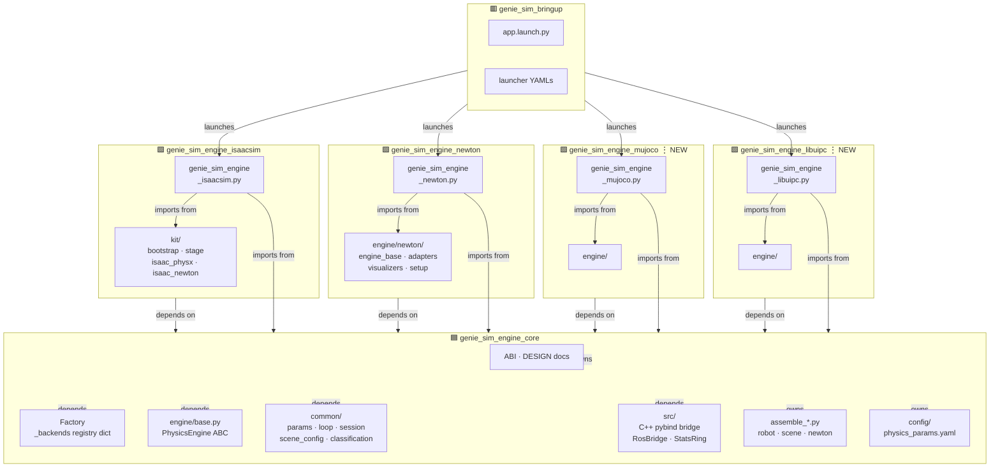
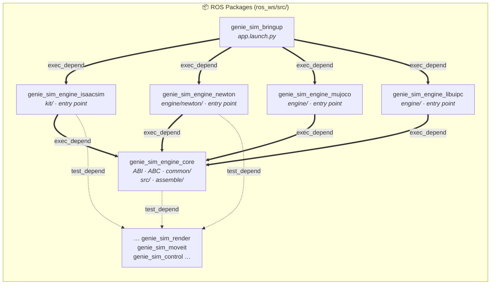
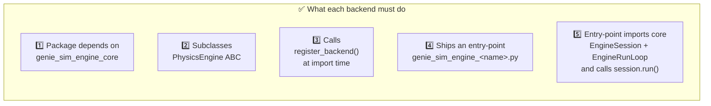
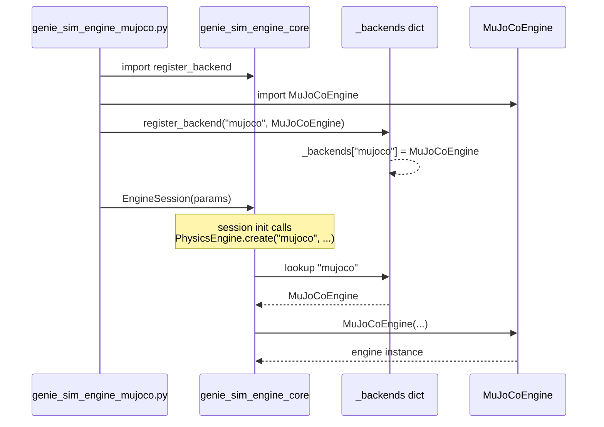
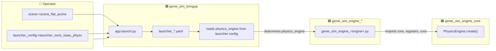
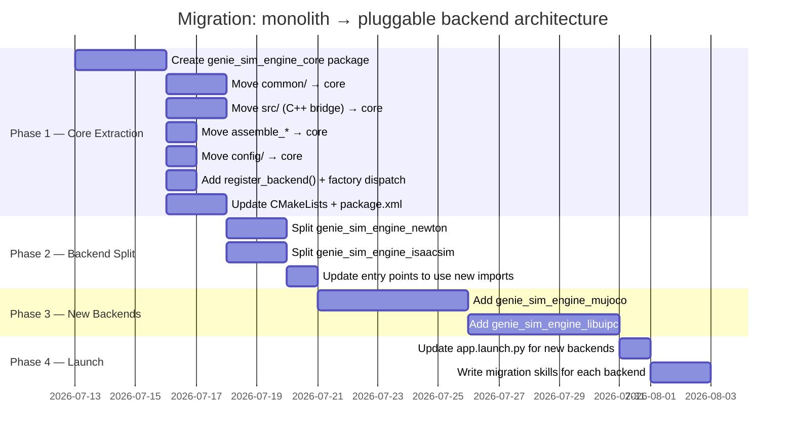
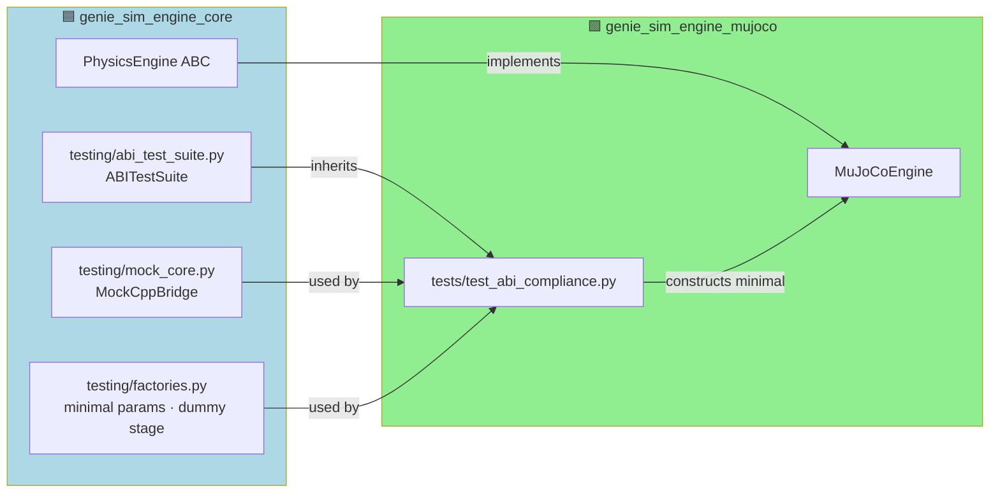
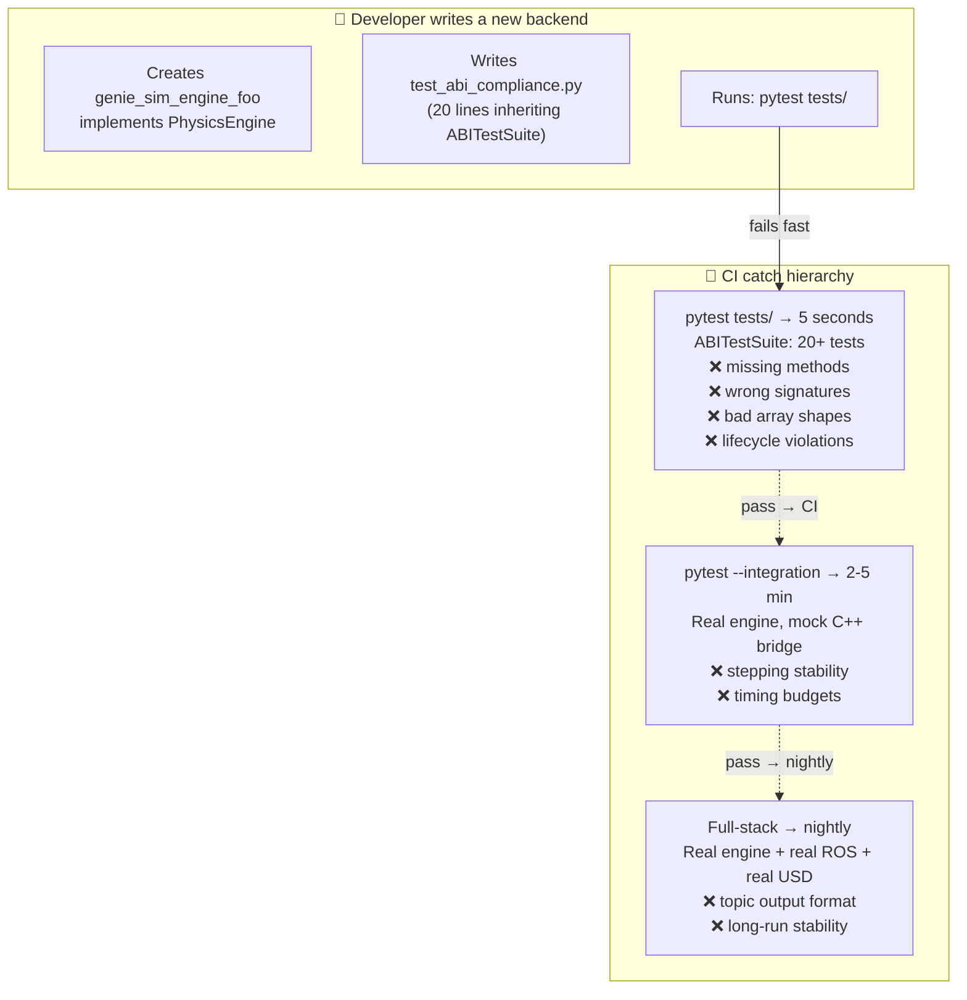

# 🏗️ geniesim_engine — Unified Backend Architecture

> **Status**: Design Document  
> **Scope**: Package decomposition of the monolithic `genie_sim_engine` into a
> pluggable backend architecture centred on `genie_sim_engine_core`.  
> **Drivers**: Adding `mujoco`, `libuipc`, and future backends without
> touching core code.
> **Replaces**: The 3-way hardcoded dispatch in `PhysicsEngine.create()` and
> the mixed responsibilities in the current `genie_sim_engine` package.

---

## 📋 Table of Contents

1. [Architecture Overview](#1-architecture-overview)
2. [Package Dependency DAG](#2-package-dependency-dag)
3. [`genie_sim_engine_core` — The Core](#3-genie_sim_engine_core--the-core)
4. [`genie_sim_engine_*` Contract](#4-genie_sim_engine_-contract)
5. [Backend Registration Mechanism](#5-backend-registration-mechanism)
6. [Factory Dispatch](#6-factory-dispatch)
7. [Launch Integration](#7-launch-integration)
8. [Migration Path](#8-migration-path)
9. [ABI Enforcement & Test Suite](#9-abi-enforcement--test-suite)
10. [File Inventory & Moves](#10-file-inventory--moves)

---

## 1. Architecture Overview



---

## 2. Package Dependency DAG



**Rule**: No `genie_sim_engine_*` may depend on another `genie_sim_engine_*`.
All sharing goes through `genie_sim_engine_core`.

---

## 3. 🟦 `genie_sim_engine_core` — The Core

### 3.1 What it ships

| Layer | Contents | Consumers |
|---|---|---|
| 🧬 **Engine ABC** | `engine/base.py`: `PhysicsEngine` ABC + `register_backend()` + `create()` factory | All backends implement the ABC |
| ⚡ **C++ Bridge** | `src/`: `genie_sim_engine_py` pybind module (`RosBridge`, `RealtimeCommandBuffer`, `RenderScheduler`, `StatsRing`) | `EngineRunLoop._publish_tick()` |
| 🔧 **Utilities** | `common/params.py`, `common/loop.py`, `common/session.py`, `common/scene_config.py`, `common/joint_classification.py`, `common/object_classification.py`, `common/mjcf_postprocess.py`, `common/usd_path_helpers.py` | All backends |
| 🏗️ **Asset Pipeline** | `assemble_robot.py`, `assemble_scene.py`, `assemble_newton.py` | Called before engine launch |
| ⚙️ **Config** | `config/physics_params.yaml` | All backends |
| 📐 **Design Docs** | `DESIGN.ABI.md`, `DESIGN.ARCH.md`, `DESIGN.RL.md`, `DESIGN.ALIPC.md` | Developers |

### 3.2 Package Manifest (`package.xml`)

```xml
<package>
  <name>genie_sim_engine_core</name>
  <depend>rclcpp</depend>
  <depend>pybind11_vendor</depend>
  <depend>sensor_msgs</depend>
  <depend>nav_msgs</depend>
  <depend>geometry_msgs</depend>
  <depend>tf2_msgs</depend>
  <depend>image_transport</depend>
  <depend>realtime_tools</depend>
</package>
```

### 3.3 Public API

```python
# engine/base.py — every genie_sim_engine_* imports this

from genie_sim_engine_core.common.params import PhysicsParams, EngineNodeParams
from genie_sim_engine_core.common.session import EngineSession
from genie_sim_engine_core.common.loop import EngineRunLoop

# ABI: PhysicsEngine ABC
class PhysicsEngine(ABC):
    @staticmethod
    def create(physics_engine: str, ...) -> PhysicsEngine: ...

    @abstractmethod
    def startup(self, headless: bool) -> None: ...
    @abstractmethod
    def step(self, dt: float, step_start: float) -> float: ...
    @abstractmethod
    def tick_extras(self) -> None: ...
    @abstractmethod
    def shutdown(self) -> None: ...
    @abstractmethod
    def get_joint_states(self) -> tuple[np.ndarray, np.ndarray]: ...
    @abstractmethod
    def get_body_transforms(self) -> tuple[np.ndarray, list[str]]: ...
    @abstractmethod
    def apply_commands(self, ...) -> None: ...

# Registration
def register_backend(name: str, engine_cls: type[PhysicsEngine]) -> None: ...
def list_backends() -> list[str]: ...
```

---

## 4. 🟩 `genie_sim_engine_*` Contract

### 4.1 Every backend MUST



### 4.2 Backend package skeleton

```
genie_sim_engine_<name>/
├── package.xml              → <depend>genie_sim_engine_core</depend>
├── CMakeLists.txt           → install scripts/
├── scripts/
│   ├── genie_sim_engine_<name>.py   → entry point (~30 lines)
│   ├── engine/                       → backend implementation
│   │   ├── __init__.py
│   │   ├── <name>_engine.py         → MyEngine(PhysicsEngine)
│   │   └── ...                       → helpers, adapters, plugins
│   └── ...                           → optional extras
├── config/                          → optional backend-specific configs
├── README.md
└── AGENTS.md
```

### 4.3 Entry-point template (~30 lines)

```python
"""Entry point for genie_sim_engine_<name>."""

from genie_sim_engine_core.engine.base import register_backend
from genie_sim_engine_core.common.params import EngineNodeParams
from genie_sim_engine_core.common.session import EngineSession
from genie_sim_engine_<name>.engine.<name>_engine import MyEngine

def main():
    params = EngineNodeParams.from_cli_args()
    register_backend("<name>", MyEngine)
    session = EngineSession(params)
    session.run(render_hook=...)

if __name__ == "__main__":
    main()
```

### 4.4 Backend implementation template

```python
from genie_sim_engine_core.engine.base import PhysicsEngine

class MyEngine(PhysicsEngine):

    def startup(self, headless: bool) -> None:
        ...  # open stage, build model

    def step(self, dt: float, step_start: float) -> float:
        ...  # advance physics, return wall-clock ms

    def tick_extras(self) -> None:
        ...  # stats, debug pubs, render events

    def shutdown(self) -> None:
        ...  # release GPU resources

    def get_joint_states(self) -> tuple[np.ndarray, np.ndarray]:
        ...  # return (positions, velocities)

    def get_body_transforms(self) -> tuple[np.ndarray, list[str]]:
        ...  # return (Nx7 poses, frame_paths)

    def apply_commands(self, cmd_positions, cmd_4ws_steer_pos,
                       cmd_4ws_drive_vel, cmd_4ws_stamp) -> None:
        ...  # write commands to control buffer
```

---

## 5. Backend Registration Mechanism

### 5.1 How it works



### 5.2 `engine/base.py` — registration internals

```python
import threading

_backends: dict[str, type["PhysicsEngine"]] = {}
_lock = threading.Lock()


def register_backend(name: str, engine_cls: type["PhysicsEngine"]) -> None:
    """Register a physics backend for factory dispatch.

    Must be called at module import time, before any call to create().
    Thread-safe: intended for use from entry-point scripts.

    Raises ValueError if name is already registered.
    """
    if not isinstance(name, str) or not name:
        raise ValueError(f"Backend name must be a non-empty string, got {name!r}")
    if not (isinstance(engine_cls, type) and issubclass(engine_cls, PhysicsEngine)):
        raise TypeError(f"{engine_cls.__name__} must be a PhysicsEngine subclass")
    with _lock:
        if name in _backends:
            raise ValueError(f"Backend {name!r} already registered by {_backends[name]}")
        _backends[name] = engine_cls


def list_backends() -> list[str]:
    """Return sorted list of registered backend names."""
    with _lock:
        return sorted(_backends.keys())
```

### 5.3 Safety guarantees

| Concern | Mechanism |
|---|---|
| 🏃 **Thread safety** | `threading.Lock` on `_backends` dict |
| 🔁 **Double-registration** | `ValueError` if name already taken |
| 🐍 **Wrong type** | `TypeError` if not a `PhysicsEngine` subclass |
| ⚡ **Late registration** | `create()` raises `ValueError` if name not found |
| 🔍 **Discovery** | `geniesim doctor` calls `list_backends()` to verify installation |

---

## 6. Factory Dispatch

```python
@staticmethod
def create(physics_engine: str, **kwargs) -> PhysicsEngine:
    """Factory: dispatch to the registered backend.

    Raises ValueError if physics_engine is not registered.
    All kwargs passed through to the backend constructor.
    """
    with _lock:
        if physics_engine not in _backends:
            registered = ", ".join(sorted(_backends))
            raise ValueError(
                f"Unknown physics_engine {physics_engine!r}. "
                f"Registered backends: [{registered}]"
            )
        cls = _backends[physics_engine]
    logger.info("Creating engine: %s (%s)", physics_engine, cls.__name__)
    return cls(**kwargs)
```

### 6.1 Backend → class mapping

| `physics_engine` arg | Package | Class | Notes |
|---|---|---|---|
| `isaac_physx` | `genie_sim_engine_isaacsim` | `IsaacPhysXEngine` | Isaac Sim + PhysX 5 |
| `isaac_newton` | `genie_sim_engine_isaacsim` | `IsaacNewtonEngine` | Isaac Sim + Newton wrapper |
| `newton` | `genie_sim_engine_newton` | `NewtonHeadlessEngine` | Kit-free Newton-direct |
| `mujoco` | `genie_sim_engine_mujoco` | `MuJoCoEngine` | — |
| `libuipc` | `genie_sim_engine_libuipc` | `LibUipcEngine` | — |

All resolved at runtime via the registry dict — no hardcoded switch.

---

## 7. Launch Integration

### 7.1 How `genie_sim_bringup` selects a backend



### 7.2 Launcher config pattern

```yaml
# launcher_ovrtx_isaac_physx.yaml
physics_engine: isaac_physx
render: ovrtx
entry_point: genie_sim_engine_isaacsim

# launcher_ovrtx_newton.yaml
physics_engine: newton
render: ovrtx
entry_point: genie_sim_engine_newton
```

The launcher config specifies **which entry-point script** to run. The entry-point itself calls `register_backend()` and `PhysicsEngine.create()`.

---

## 8. Migration Path 🛤️

### 8.1 Phased approach



### 8.2 Import migration table

| Current import | New import | Package |
|---|---|---|
| `from common.params import ...` | `from genie_sim_engine_core.common.params import ...` | core |
| `from common.loop import ...` | `from genie_sim_engine_core.common.loop import ...` | core |
| `from common.session import ...` | `from genie_sim_engine_core.common.session import ...` | core |
| `from engine.base import PhysicsEngine` | `from genie_sim_engine_core.engine.base import PhysicsEngine` | core |
| `from engine._mimic import ...` | `from genie_sim_engine_core.engine._mimic import ...` | core |
| `from kit.isaac_physx import ...` | `from genie_sim_engine_isaacsim.kit.isaac_physx import ...` | isaacsim |
| `from engine.newton.engine import ...` | `from genie_sim_engine_newton.engine.newton.engine import ...` | newton |

### 8.3 Entry-point update (migration example)

**Before** (current `genie_sim_engine_newton.py`):
```python
from common.early_params import ...
from common.loop import EngineRunLoop
from common.session import EngineSession
from engine.newton.engine import NewtonHeadlessEngine
```

**After** (migrated `genie_sim_engine_newton.py`):
```python
from genie_sim_engine_core.engine.base import register_backend
from genie_sim_engine_core.common.session import EngineSession
from genie_sim_engine_core.common.loop import EngineRunLoop
from genie_sim_engine_newton.engine.newton.engine import NewtonHeadlessEngine

register_backend("newton", NewtonHeadlessEngine)
```

---

## 9. ABI Enforcement & Test Suite 🧪

> **Problem**: Python has no compile-time type enforcement. Without a compiler,
> a misbehaving backend reaches a human only at runtime after expensive GPU/ROS
> setup. We need a **shippable, zero-cost test suite** — a `pytest` battery that
> every backend runs in seconds, no GPU, no ROS, no real USD.
>
> **Solution**: `genie_sim_engine_core` ships a test suite + mock C++ bridge.
> Every `genie_sim_engine_*` inherits it and runs it against a **minimally
> constructed engine** (~5 seconds, any CI runner).

### 9.1 Architecture



### 9.2 Core ships (`genie_sim_engine_core/testing/`)

| File | What | Why |
|---|---|---|
| `abi_test_suite.py` | `class ABITestSuite` — parametrized tests for every ABI method | Backends inherit it |
| `mock_core.py` | `MockCppBridge(py::module)` — in-memory replacement for `genie_sim_engine_py` | No ROS, no C++ needed |
| `factories.py` | `minimal_physics_params()`, `dummy_usd_stage()`, `default_engine_node_params()` | No real YAML/USD on disk |

### 9.3 What ABITestSuite validates

```python
class ABITestSuite:
    """Every backend must pass these.  Runs in ~5 seconds."""

    def test_lifecycle_order(self, engine):
        """create → startup → [step → tick_extras]ⁿ → shutdown"""
        engine.startup(headless=True)
        for _ in range(5):
            engine.step(dt=0.01, step_start=0.0)
            engine.tick_extras()
        engine.shutdown()

    def test_lifecycle_miss_step_before_startup(self, engine):
        """step() before startup() must raise or no-op gracefully"""
        with pytest.raises(RuntimeError):
            engine.step(dt=0.01, step_start=0.0)

    def test_joint_states_shape(self, engine):
        """(N,) arrays, N == len(joint_names), dtype=float64"""
        engine.startup(headless=True)
        engine.step(dt=0.01, step_start=0.0)
        q, qd = engine.get_joint_states()
        assert q.shape == (len(engine.joint_names),)
        assert qd.shape == (len(engine.joint_names),)
        assert q.dtype == np.float64

    def test_joint_states_after_single_step(self, engine):
        """values are finite after one step"""
        engine.startup(headless=True)
        engine.step(dt=0.01, step_start=0.0)
        q, qd = engine.get_joint_states()
        assert np.all(np.isfinite(q))
        assert np.all(np.isfinite(qd))

    def test_body_transforms_shape(self, engine):
        """(M, 7) array + M frame_paths"""
        engine.startup(headless=True)
        engine.step(dt=0.01, step_start=0.0)
        poses, paths = engine.get_body_transforms()
        assert poses.shape[0] == len(paths)
        assert poses.shape[1] == 7
        assert np.all(np.isfinite(poses))

    def test_body_transforms_quaternion_normalized(self, engine):
        """returned quaternions are unit-length"""
        engine.startup(headless=True)
        engine.step(dt=0.01, step_start=0.0)
        poses, _ = engine.get_body_transforms()
        q = poses[:, 3:7]
        norms = np.linalg.norm(q, axis=1)
        assert np.allclose(norms, 1.0, atol=1e-5)

    def test_apply_commands_empty_is_noop(self, engine):
        """empty command dict does not raise or corrupt state"""
        engine.startup(headless=True)
        q_before, _ = engine.get_joint_states()
        engine.apply_commands(cmd_positions={}, ...)
        engine.step(dt=0.01, step_start=0.0)
        q_after, _ = engine.get_joint_states()
        assert np.all(np.isfinite(q_after))

    def test_apply_commands_persists(self, engine):
        """commanded value is reflected in control buffer"""
        engine.startup(headless=True)
        engine.apply_commands(cmd_positions={"joint1": 0.5}, ...)
        assert self._read_control_buffer(engine, "joint1") == 0.5

    def test_shutdown_idempotent(self, engine):
        """double shutdown must not raise"""
        engine.startup(headless=True)
        engine.shutdown()
        engine.shutdown()

    def test_shutdown_releases_resources(self, engine):
        """after shutdown, stage / model are None"""
        engine.startup(headless=True)
        engine.shutdown()
        assert engine.stage is None

    def test_tick_extras_after_every_step(self, engine):
        """tick_extras called, does not raise"""
        engine.startup(headless=True)
        engine.step(dt=0.01, step_start=0.0)
        engine.tick_extras()

    def test_factory_rejects_unknown(self):
        """PhysicsEngine.create('garbage') → ValueError"""
        with pytest.raises(ValueError, match="garbage"):
            PhysicsEngine.create("garbage")

    def test_factory_rejects_unregistered(self):
        """engine not registered yet → ValueError"""
        with pytest.raises(ValueError, match="not_registered"):
            PhysicsEngine.create("not_registered")

    def test_factory_dispatch(self):
        """registered name returns correct class"""
        register_backend("test_dummy", DummyEngine)
        eng = PhysicsEngine.create("test_dummy")
        assert isinstance(eng, DummyEngine)

    def test_register_duplicate_name(self):
        """double-register → ValueError"""
        register_backend("dup", DummyEngine)
        with pytest.raises(ValueError, match="already registered"):
            register_backend("dup", AnotherEngine)

    def test_register_non_physicsengine(self):
        """register a non-subclass → TypeError"""
        class NotAnEngine: pass
        with pytest.raises(TypeError):
            register_backend("bad", NotAnEngine)
```

### 9.4 Each backend writes (~20 lines)

```python
# genie_sim_engine_mujoco/tests/test_abi_compliance.py

from genie_sim_engine_core.testing.abi_test_suite import ABITestSuite
from genie_sim_engine_core.testing.factories import minimal_physics_params
from genie_sim_engine_core.testing.mock_core import MockCppBridge
from genie_sim_engine_mujoco.engine import MuJoCoEngine


class TestMuJoCoABI(ABITestSuite):
    """All ABI tests run against a minimally-constructed MuJoCoEngine."""

    @pytest.fixture
    def engine(self):
        return MuJoCoEngine(
            params=minimal_physics_params(),
            robot_prefix="test",
            scene_usda=_create_dummy_usd(),      # minimal empty stage
            robot_usda=_create_dummy_usd(),
            render_layer_usda=_create_dummy_usd(),
        )

    @pytest.fixture
    def core(self):
        return MockCppBridge()                    # no ROS, no C++
```

Every test from `ABITestSuite` runs.  If `MuJoCoEngine` forgets to implement
`get_body_transforms()`, the test fails **at the backend's CI step**, not during
a full-stack integration run.

### 9.5 Enforcement without a compiler



| Enforcement level | Cost | Blocks |
|---|---|---|
| 🟢 `ABITestSuite` (inherited) | ~5 sec | ABI compliance, shape/lifecycle/invariants |
| 🟡 Integration tests | ~2-5 min | Step stability, timing |
| 🔴 Full-stack | ~15-30 min | ROS topic format, long-run, regression |

The **shippable test suite is the compiler** — it catches ABI violations at the
backend package level before any expensive integration test or full launch.

### 9.6 What is NOT tested by ABITestSuite

These stay in integration / full-stack because they need real infrastructure:

| Test | Why not here | Where |
|---|---|---|
| CUDA graph capture + replay | Needs real GPU | backend integration |
| ROS topic message format | Needs `core.publish_*` | backend integration |
| USD readback accuracy | Needs real USD stage on disk | full-stack |
| Real-time wall-clock timing | Needs accurate clocks | backend integration |
| Multi-backend determinism | Needs same scene in two engines | nightly comparison |

---

## 10. File Inventory & Moves 📦

### 10.1 Files moving to `genie_sim_engine_core`

| Source (current `genie_sim_engine/`) | Destination (`genie_sim_engine_core/`) |
|---|---|
| `scripts/common/*.py` (9 files) | `scripts/common/` |
| `scripts/engine/base.py` | `scripts/engine/base.py` |
| `scripts/engine/__init__.py` | `scripts/engine/__init__.py` |
| `scripts/engine/_mimic.py` | `scripts/engine/_mimic.py` |
| `scripts/assemble_robot.py` | `scripts/assemble_robot.py` |
| `scripts/assemble_scene.py` | `scripts/assemble_scene.py` |
| `scripts/assemble_newton.py` | `scripts/assemble_newton.py` |
| `src/*` (9 C++ files) | `src/` |
| `config/physics_params.yaml` | `config/physics_params.yaml` |
| `CMakeLists.txt` | `CMakeLists.txt` |
| `package.xml` | `package.xml` |
| `DESIGN.ABI.md` | `DESIGN.ABI.md` |
| `DESIGN.ARCH.md` | `DESIGN.ARCH.md` |
| `DESIGN.RL.md` | `DESIGN.RL.md` |
| `DESIGN.ALIPC.md` | `DESIGN.ALIPC.md` |

### 10.2 Files staying / moving to `genie_sim_engine_newton`

| Source (current `genie_sim_engine/`) | Destination |
|---|---|
| `scripts/engine/newton/*` (24 files) | `genie_sim_engine_newton/scripts/engine/newton/` |
| `scripts/genie_sim_engine_newton.py` | `genie_sim_engine_newton/scripts/genie_sim_engine_newton.py` |

### 10.3 Files staying / moving to `genie_sim_engine_isaacsim`

| Source (current `genie_sim_engine/`) | Destination |
|---|---|
| `scripts/kit/*` (5 files) | `genie_sim_engine_isaacsim/scripts/kit/` |
| `scripts/genie_sim_engine_isaacsim.py` | `genie_sim_engine_isaacsim/scripts/genie_sim_engine_isaacsim.py` |

### 10.4 Files that stay in current `genie_sim_engine` (deleted after migration)

| File | Fate |
|---|---|
| `AGENTS.md` | Split into per-package AGENTS.md |
| `README.md` | Split into per-package README.md |
| `scripts/tools/*` | Stay in `genie_sim_engine` workspace (shared debug tools) |
| `scripts/runtime/*` | Move to `genie_sim_engine_core` (if Kit-free) or `genie_sim_engine_isaacsim` (if Kit-requiring) |
| `docs/*.md` (7 files) | Keep in `genie_sim_engine_core` |

---

## Revision History

| Date | Change |
|---|---|
| 2026-07-12 | Initial version. Package decomposition, registration mechanism, factory dispatch, migration path. |
| 2026-07-12 | Added §9 ABI Enforcement & Test Suite — shippable `ABITestSuite` + `MockCppBridge`, every backend inherits, runs in ~5 sec without GPU/ROS/USD. Renamed from DESIGN.ARCH.md. |

---

*Next step: implement Phase 1 — Core Extraction (create `genie_sim_engine_core` package, move files, update imports).*
