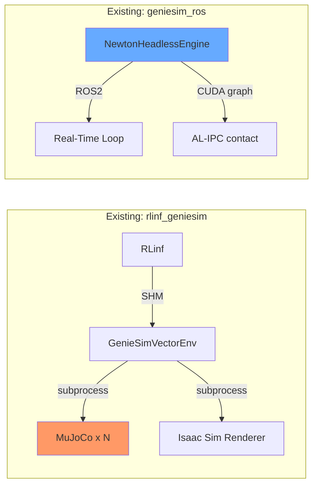
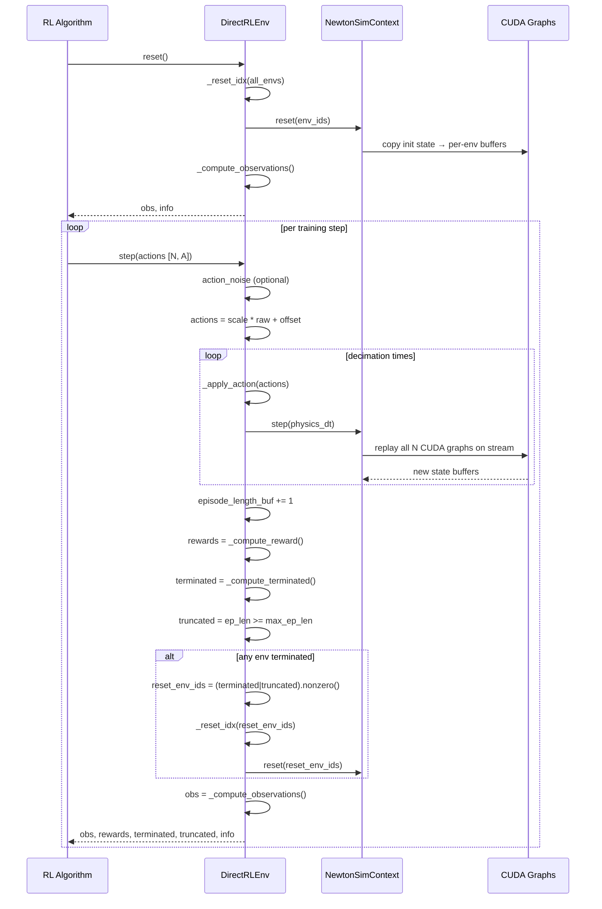
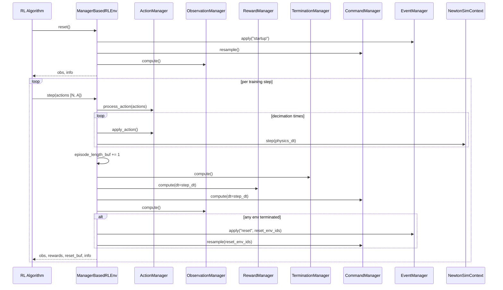
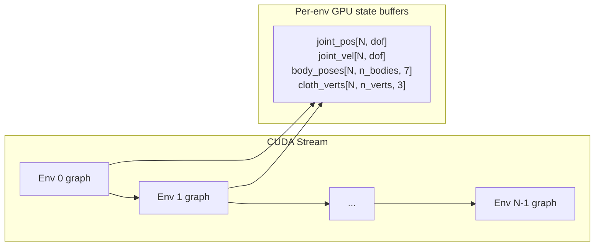
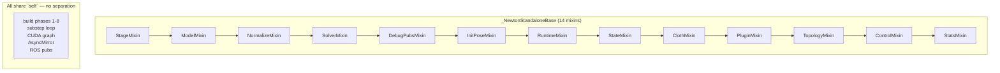
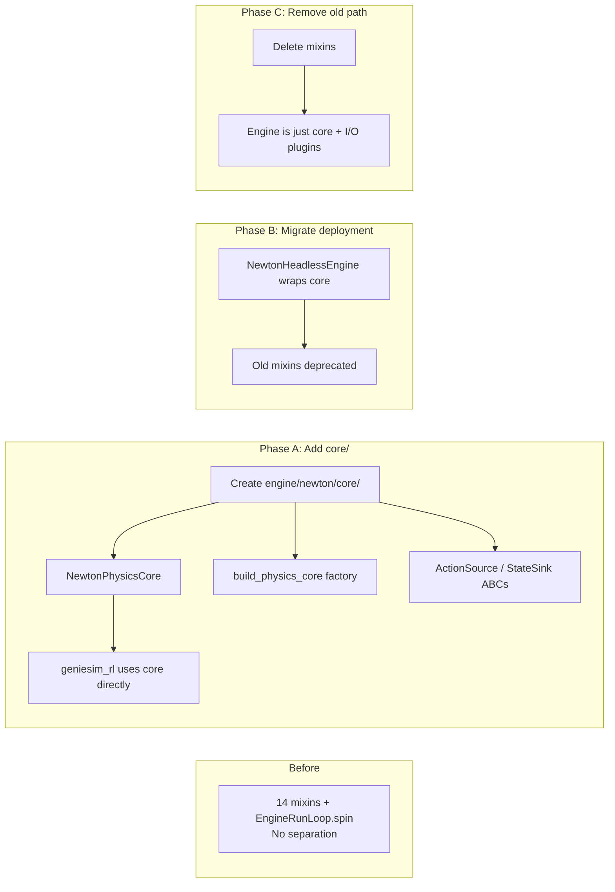

# 🧪 geniesim_rl — RL Training Architecture for Newton-Direct

> **Status**: Design Proposal — revisit before implementation  
> **Based on**: IsaacLab (NVIDIA), Genesis World, Isaac Gym  
> **Scope**: New `geniesim_rl` peer distribution providing a Gymnasium-compatible
> vectorized RL training backend powered by Newton-direct + AL-IPC contact

---

## 📖 Table of Contents

1. [The Problem 🎯](#1-the-problem-)
2. [Why Not Extend rlinf_geniesim? 🚫](#2-why-not-extend-rlinf_geniesim-)
3. [Design Summary 📐](#3-design-summary-)
4. [Architecture 🏗️](#4-architecture)
5. [Module Layout 📁](#5-module-layout-)
6. [Config System ⚙️](#6-config-system-)
7. [Manager Interfaces 🔌](#7-manager-interfaces-)
8. [DirectRLEnv Flow 🔄](#8-directrlenv-flow-)
9. [ManagerBasedRLEnv Flow 🔄](#9-managerbasedrlenv-flow-)
10. [NewtonSimContext — CUDA Graph Management ⚡](#10-newtonsimcontext--cuda-graph-management-)
11. [Per-Env Reset 🔄](#11-per-env-reset-)
12. [Observation & Action Pipeline 📊](#12-observation--action-pipeline-)
13. [RL Library Wrappers 🔗](#13-rl-library-wrappers-)
14. [Domain Randomization 🎲](#14-domain-randomization-)
14. [Boundary with geniesim_ros 🧱](#14-boundary-with-geniesim_ros-)
15. [Engine Restructuring for RL Reuse 🔧](#15-engine-restructuring-for-rl-reuse-)
16. [Lessons from IsaacLab 📚](#16-lessons-from-isaaclab-)
17. [Roadmap 🛣️](#17-roadmap-)

---

## 1. The Problem 🎯

### Current state: two disconnected simulation stacks



- **rlinf_geniesim** uses MuJoCo (no cloth, penalty contact only) — proven RL pipeline with subprocess + SHM parallelism
- **geniesim_ros** has Newton-direct with GPU CUDA graphs + AL-IPC (cloth-capable, robust contact) — but zero RL integration
- No way to train RL policies on Newton-direct's cloth physics

### What we need

```mermaid
graph RL
    SB3[SB3 / RSL-RL / SKRL] -->|Gymnasium API| GEN[geniesim_rl]
    GEN -->|torch tensors [N, ...]| NRL[NewtonRLEnv]
    NRL -->|step-on-demand| NSC[NewtonSimContext]
    NSC -->|CUDA graph replay x N| NE2[NewtonStandaloneEngine+AL-IPC]
```

A new `geniesim_rl` peer distribution that wraps Newton-direct in a Gymnasium-compatible vectorized environment — single process, GPU-parallel, cloth-capable.

---

## 2. Why Not Extend rlinf_geniesim? 🚫

| Dimension | rlinf_geniesim | geniesim_rl (new) |
|---|---|---|
| Physics backend | MuJoCo (CPU/GPU) | Newton-direct (GPU CUDA graph) |
| Cloth | ❌ | ✅ via AL-IPC |
| Parallelism | Multi-process + SHM | Single-process, N CUDA graphs on GPU |
| Env API | Custom (SHM phase flags) | Gymnasium `gym.Env` |
| Config | argparse + JSON | `@configclass` hierarchy |
| Scene setup | MJCF XML | USD (reuses geniesim_ros pipeline) |
| Rendering | Isaac Sim subprocess | Future: headless or OVRTX |

**Decision**: clean-slate `geniesim_rl` peer, leave `rlinf_geniesim` untouched.

---

## 3. Design Summary 📐

```
┌──────────────────────────────────────────────────────────────────┐
│                   geniesim_rl (new peer)                          │
├──────────────────────────────────────────────────────────────────┤
│  gym.Env (is_vector_env=True)                                     │
│    ┌──────────────────┐   ┌──────────────────────────┐           │
│    │   DirectRLEnv    │   │   ManagerBasedRLEnv      │           │
│    │  (single class)  │   │  (config + managers)     │           │
│    └────────┬─────────┘   └────────────┬─────────────┘           │
│             │                          │                          │
│             └──────────┬───────────────┘                          │
│                        ▼                                          │
│             ┌──────────────────────┐                              │
│             │   NewtonSimContext    │  ← N CUDA graphs, state     │
│             │   (scene/context.py)  │    buffers, per-env reset   │
│             └──────────┬───────────┘                              │
├────────────────────────┼──────────────────────────────────────────┤
│            geniesim_ros (reused build pipeline)                    │
│                        ▼                                          │
│             ┌──────────────────────┐                              │
│             │NewtonStandaloneEngine│  ← mixin composition          │
│             └──────────┬───────────┘                              │
│                        ▼                                          │
│             ┌──────────────────────┐                              │
│             │  SolverAdapter       │  ← penalty | AL-IPC          │
│             └──────────────────────┘                              │
└──────────────────────────────────────────────────────────────────┘
```

**Key insight**: Reuse the engine's **build phase** (stage setup, model loading, solver init, CUDA graph capture) but replace the real-time ROS 2 loop with a **step-on-demand** API.

---

## 4. Module Layout 📁

```
source/geniesim_rl/
├── pyproject.toml            # deps: geniesim_ros, gymnasium>=0.29, torch
├── AGENTS.md
├── README.md
│
└── src/geniesim_rl/
    ├── __init__.py
    │
    ├── envs/
    │   ├── __init__.py
    │   ├── direct_rl_env.py          # DirectRLEnv(gym.Env)
    │   └── manager_based_rl_env.py   # ManagerBasedRLEnv(gym.Env)
    │
    ├── managers/
    │   ├── __init__.py
    │   ├── action_manager.py         # ActionTerm composition
    │   ├── observation_manager.py    # ObservationTerm → tensor
    │   ├── reward_manager.py         # weighted sum of RewardTerms
    │   ├── termination_manager.py    # terminated + time_out flags
    │   ├── command_manager.py        # resample task commands
    │   ├── event_manager.py          # domain randomization
    │   └── curriculum_manager.py     # environment difficulty scaling
    │
    ├── mdp/
    │   ├── __init__.py
    │   ├── actions.py                # JointPosition, EEDelta, Gripper
    │   ├── observations.py           # JointState, BodyPose, ClothVerts
    │   ├── rewards.py                # default reward functions
    │   └── terminations.py           # default termination conditions
    │
    ├── scene/
    │   ├── __init__.py
    │   ├── newton_scene.py           # NewtonInteractiveScene
    │   └── newton_context.py         # NewtonSimContext — N graphs, GPU state
    │
    ├── wrappers/
    │   ├── __init__.py
    │   ├── sb3_wrapper.py            # Stable-Baselines3 VecEnv
    │   ├── rsl_rl_wrapper.py         # RSL-RL wrapper
    │   └── skrl_wrapper.py           # SKRL wrapper
    │
    └── config/
        ├── __init__.py
        ├── configclass.py            # @configclass decorator
        └── base_env_cfg.py           # env + scene config hierarchy
```

---

## 5. Config System ⚙️

### @configclass pattern

```python
# config/configclass.py
def configclass(cls):
    """Frozen dataclass with post-init validation, no __init__ boilerplate."""
    cls = dataclass(cls, frozen=True)
    if hasattr(cls, "__post_init__"):
        orig = cls.__post_init__
        def wrapper(self):
            self.__class__ = cls  # keep frozen dataclass identity
            orig(self)
        cls.__post_init__ = wrapper
    return cls
```

### Config hierarchy

```mermaid
graph TD
    subgraph "DirectRLEnvCfg"
        D[DirectRLEnvCfg] --> S[SceneCfg]
        D --> Sim[SimCfg]
        D --> A[ActionSpaceCfg]
        D --> O[ObsSpaceCfg]
        D --> Ep[episode_length_s]
        D --> Dec[decimation]
    end

    subgraph "ManagerBasedRLEnvCfg"
        M[ManagerBasedRLEnvCfg] --> S
        M --> Sim
        M --> Am[ActionManagerCfg]
        M --> Om[ObservationManagerCfg]
        M --> Rm[RewardManagerCfg]
        M --> Tm[TerminationManagerCfg]
        M --> Cm[CommandManagerCfg]
        M --> Em[EventManagerCfg]
        M --> Cur[CurriculumManagerCfg]
    end

    subgraph "SceneCfg"
        S --> Num[num_envs: 64]
        S --> Spacing[env_spacing: 2.0]
        S --> Robot[ArticulationCfg]
        S --> Cloth[ClothCfg | None]
        S --> Bodies[RigidBodyCfg...]
    end
```

```python
# config/base_env_cfg.py
@configclass
class SceneCfg:
    num_envs: int = 64
    env_spacing: float = 2.0
    robot: ArticulationCfg = ArticulationCfg(...)

@configclass
class SimCfg:
    dt: float = 0.01          # physics timestep
    substeps: int = 10        # solver substeps per physics step
    solver: str = "alipc"     # "penalty" | "alipc"

@configclass
class DirectRLEnvCfg:
    scene: SceneCfg = SceneCfg()
    sim: SimCfg = SimCfg()
    decimation: int = 10      # physics steps per env step
    episode_length_s: float = 10.0
    action_space: ActionSpaceCfg = ...
    observation_space: ObsSpaceCfg = ...

@configclass
class ManagerBasedRLEnvCfg:
    scene: SceneCfg = SceneCfg()
    sim: SimCfg = SimCfg()
    decimation: int = 10
    episode_length_s: float = 10.0
    action_manager: ActionManagerCfg = ...
    observation_manager: ObservationManagerCfg = ...
    reward_manager: RewardManagerCfg = ...
    termination_manager: TerminationManagerCfg = ...
    command_manager: CommandManagerCfg = ...
    event_manager: EventManagerCfg = ...
    curriculum_manager: CurriculumManagerCfg = ...
```

---

## 6. Manager Interfaces 🔌

| Manager | Input | Output | Called at |
|---|---|---|---|
| **ActionManager** | raw `actions [N, A]` tensor | writes articulation targets | every env step |
| **ObservationManager** | scene state tensors | `obs_dict {name: [N, ...]}` | every env step |
| **RewardManager** | scene + action tensors | `rewards [N]` | every env step |
| **TerminationManager** | scene tensors | `reset_buf [N]`, `terminated [N]`, `time_outs [N]` | every env step |
| **CommandManager** | task config | `commands [N, cmd_dim]` | resample interval |
| **EventManager** | scene tensors (mutate) | — | startup / reset / interval |
| **CurriculumManager** | training metrics | updates env config | common step |

### Manager composition (ManagerBasedRLEnv)

```python
class ManagerBasedRLEnv(gym.Env):
    is_vector_env: ClassVar[bool] = True

    def __init__(self, cfg: ManagerBasedRLEnvCfg):
        self.cfg = cfg
        self.newton_context = NewtonSimContext(cfg)
        self.scene = NewtonInteractiveScene(cfg, self.newton_context)
        self.action_manager = ActionManager(cfg.action_manager, self)
        self.observation_manager = ObservationManager(cfg.observation_manager, self)
        self.reward_manager = RewardManager(cfg.reward_manager, self)
        self.termination_manager = TerminationManager(cfg.termination_manager, self)
        self.command_manager = CommandManager(cfg.command_manager, self)
        self.event_manager = EventManager(cfg.event_manager, self)
        self.curriculum_manager = CurriculumManager(cfg.curriculum_manager, self)
        self.episode_length_buf = torch.zeros(cfg.scene.num_envs, dtype=torch.long)
        self._configure_gym_spaces()
```

### Manager term registration

```python
# Each manager collects terms from config at init
# Terms are (function, weight, params) tuples

@configclass
class ActionManagerCfg:
    terms: list[ActionTermCfg] = field(default_factory=lambda: [
        ActionTermCfg(func="joint_position", params={"scale": 1.0}),
    ])

class ActionManager:
    def __init__(self, cfg, env):
        self._terms = [create_term(t, env) for t in cfg.terms]

    def process_action(self, actions: torch.Tensor):
        offset = 0
        for term in self._terms:
            dim = term.action_dim
            term.process(actions[..., offset:offset+dim])
            offset += dim

    def apply_action(self):
        for term in self._terms:
            term.apply()
```

---

## 7. DirectRLEnv Flow 🔄



```python
class DirectRLEnv(gym.Env):
    is_vector_env = True

    def step(self, actions: torch.Tensor) -> VecEnvStepReturn:
        # --- pre-process actions ---
        actions = actions.to(self.device)
        self._actions = actions

        # --- physics stepping ---
        for _ in range(self.cfg.decimation):
            self._apply_action(actions)
            self.newton_context.step(self.physics_dt)

        # --- MDP signals ---
        self.episode_length_buf += 1
        rewards = self._compute_reward(actions)
        terminated = self._compute_terminated()
        truncated = self.episode_length_buf >= self.max_episode_length
        reset_buf = terminated | truncated

        # --- reset terminated envs ---
        reset_env_ids = reset_buf.nonzero(as_tuple=False).squeeze(-1)
        if len(reset_env_ids) > 0:
            self._reset_idx(reset_env_ids)

        # --- observations ---
        obs = self._compute_observations()

        return obs, rewards, terminated, truncated, {"episode": ...}
```

---

## 8. ManagerBasedRLEnv Flow 🔄



```python
class ManagerBasedRLEnv(ManagerBasedEnv):
    is_vector_env = True

    def step(self, actions: torch.Tensor) -> VecEnvStepReturn:
        self.action_manager.process_action(actions.to(self.device))

        for _ in range(self.cfg.decimation):
            self.action_manager.apply_action()
            self.newton_context.step(self.physics_dt)

        self.episode_length_buf += 1
        self.common_step_counter += 1

        self.reset_buf = self.termination_manager.compute()
        self.reward_buf = self.reward_manager.compute(dt=self.step_dt)

        reset_env_ids = self.reset_buf.nonzero(as_tuple=False).squeeze(-1)
        if len(reset_env_ids) > 0:
            self.scene.reset(reset_env_ids)
            self.event_manager.apply(mode="reset", env_ids=reset_env_ids)
            self.command_manager.resample(update_ids=reset_env_ids)

        self.obs_buf = self.observation_manager.compute()

        return self.obs_buf, self.reward_buf, self.reset_buf, self.extras
```

---

## 9. NewtonSimContext — CUDA Graph Management ⚡

### Strategy: N CUDA graphs, one CUDA stream

Each environment gets its own captured CUDA graph at init. On `step()`, all N graphs replay sequentially on a single stream:



### Why sequential replay, not batched tensors

| Approach | Complexity | GPU Util | Flexibility | Chosen? |
|---|---|---|---|---|
| N CUDA graphs, 1 stream | Low | Good (pipeline parallel) | Per-env reset trivial | ✅ |
| Batched tensors `[N, ...]` | High | Best | Re-capture if N changes | Maybe later |
| Multi-process (rlinf style) | Medium | Poor (per-process CUDA ctx) | Crash isolation | ❌ |

### State buffers

```python
class NewtonSimContext:
    """GPU state for N parallel environments."""

    def __init__(self, cfg: SceneCfg, engine: NewtonStandaloneEngine):
        self.num_envs = cfg.num_envs
        self.device = torch.device("cuda:0")

        # Allocate per-env state buffers
        self.joint_pos   = torch.zeros(cfg.num_envs, n_dofs, device=self.device)
        self.joint_vel   = torch.zeros(cfg.num_envs, n_dofs, device=self.device)
        self.body_poses  = torch.zeros(cfg.num_envs, n_bodies, 7, device=self.device)
        self.cloth_verts = torch.zeros(cfg.num_envs, n_verts, 3, device=self.device)

        # Capture one CUDA graph per env
        self._graphs = []
        for i in range(cfg.num_envs):
            graph = engine.capture_cuda_graph(
                state_buffers={k: v[i] for k, v in self._buffers.items()}
            )
            self._graphs.append(graph)

        self._stream = torch.cuda.Stream()

    def step(self, dt: float) -> None:
        """Replay all N CUDA graphs for one substep."""
        with torch.cuda.stream(self._stream):
            for g in self._graphs:
                g.replay()
        # Synchronization handled by next cuda operation's stream dependency

    def reset(self, env_ids: torch.Tensor) -> None:
        """Reset selected envs to initial state template."""
        for k, buf in self._buffers.items():
            buf[env_ids] = self._initial_template[k]
```

### CUDA graph capture

```python
# Simplified — captures one substep for one env
engine = NewtonStandaloneEngine(...)
engine.build_stage()
engine.build_solver(with_alipc=True)

state = engine.get_state_tensors()  # {name: tensor}

# Warm up
engine.step()

# Capture graph
graph = torch.cuda.CUDAGraph()
with torch.cuda.graph(graph):
    engine.step()  # records all kernel launches

# Now replayable with updated state buffers
```

---

## 10. Per-Env Reset 🔄

### Challenge

Some envs terminate mid-batch while others continue. Reset must be **per-env**, not global.

### Solution: template copy + event-based randomization

```
reset(env_ids: Tensor):
  │
  ├─ for each state buffer (joint_pos, joint_vel, body_poses, ...):
  │     buffer[env_ids] = initial_template[env_ids]
  │
  ├─ event_manager.apply("reset", env_ids)  # domain randomization
  │
  └─ episode_length_buf[env_ids] = 0
```

- **No CUDA graph re-capture needed** — graphs operate on fixed buffer pointers
- **Initial template** is a `[N, ...]` staging tensor with per-env initial poses (optionally randomized at startup)
- **Event randomization** adds per-reset noise (joint offsets, body positions, friction)

### In DirectRLEnv

```python
def _reset_idx(self, env_ids: torch.Tensor):
    self.newton_context.reset(env_ids)
    self.episode_length_buf[env_ids] = 0

    if self.cfg.events:
        self.event_manager.apply(mode="reset", env_ids=env_ids)

    if self.cfg.rerender_on_reset:
        self._render(env_ids)
```

### Initial state template seeding

```python
@configclass
class InitialStateCfg:
    """Per-env initial joint positions for reset."""
    # Shape [N, n_dofs] or broadcastable
    joint_pos: tuple | None = None
    joint_vel: tuple | None = None

@configclass
class SceneCfg:
    init_state: InitialStateCfg = InitialStateCfg()
```

---

## 11. Observation & Action Pipeline 📊

### Manager workflow

```mermaid
graph LR
    subgraph "Observation Pipeline"
        JS[JointState<br/>n_dofs*2] --> CAT[Concat]
        BP[BodyPose<br/>n_bodies*7] --> CAT
        CV[ClothVerts<br/>n_verts*3] --> CAT
        TS[TouchSensors] --> CAT
        CAT --> OBS[obs_buf [N, D]]
    end

    subgraph "Action Pipeline"
        ACT[actions [N, A]] --> JPA[JointPosition]
        ACT --> EDA[EEDelta]
        ACT --> GA[Gripper]
        JPA --> WRITE[write to articulation]
        EDA --> IK[IK solver] --> WRITE
        GA --> WRITE
    end
```

### Observation terms

```python
# mdp/observations.py

class JointStateObs:
    def __call__(self, env: ManagerBasedRLEnv) -> torch.Tensor:
        return torch.cat([env.newton_context.joint_pos,
                          env.newton_context.joint_vel], dim=-1)

class BodyPoseObs:
    def __call__(self, env: ManagerBasedRLEnv) -> torch.Tensor:
        return env.newton_context.body_poses.reshape(env.num_envs, -1)

class ClothVertexObs:
    def __call__(self, env: ManagerBasedRLEnv) -> torch.Tensor:
        return env.newton_context.cloth_verts.reshape(env.num_envs, -1)
```

### Action terms

```python
# mdp/actions.py

class JointPositionAction:
    action_dim: int = n_dofs

    def process(self, actions: torch.Tensor):
        self._target = actions  # store for apply

    def apply(self, env: ManagerBasedRLEnv):
        env.scene.articulation.set_joint_position_target(self._target)
```

### Gymnasium space inference

```python
class ObservationManager:
    def _infer_space(self, env: ManagerBasedRLEnv):
        spaces = {}
        for name, term in self._terms.items():
            sample = term(env)  # (N, D) for vector, (N, H, W, C) for image
            if sample.ndim == 2:
                spaces[name] = gym.spaces.Box(-inf, inf, shape=sample.shape[1:])
            elif sample.ndim == 4:
                spaces[name] = gym.spaces.Box(0, 255, shape=sample.shape[1:], dtype=np.uint8)
        return gym.spaces.Dict(spaces)
```

---

## 12. RL Library Wrappers 🔗

Core `DirectRLEnv` / `ManagerBasedRLEnv` emit batched `torch.Tensor`. RL libraries expect their own formats — thin wrappers bridge the gap:

```mermaid
graph TD
    Env[NewtonRLEnv<br/>torch tensors [N, ...]] --> SB3[Sb3VecEnvWrapper<br/>→ list of numpy dicts]
    Env --> RSL[RSL-RL wrapper<br/>→ clipped obs/actions]
    Env --> SK[SKRL wrapper<br/>→ SKRL env spec]

    SB3 --> SB3T[Stable-Baselines3 training]
    RSL --> RSLT[RSL-RL training]
    SK --> SKT[SKRL training]
```

### Example: SB3 wrapper

```python
# wrappers/sb3_wrapper.py
class Sb3VecEnvWrapper(gym.Env):
    """Wraps NewtonRLEnv into Stable-Baselines3 VecEnv format."""

    def __init__(self, env: ManagerBasedRLEnv):
        self.env = env
        self.num_envs = env.num_envs
        self.action_space = env.action_space

    def step(self, actions: np.ndarray) -> tuple:
        actions_t = torch.from_numpy(actions).to(self.env.device)
        obs, rew, term, trunc, info = self.env.step(actions_t)
        return (
            {k: v.cpu().numpy() for k, v in obs.items()},
            rew.cpu().numpy(),
            term.cpu().numpy(),
            trunc.cpu().numpy(),
            info,
        )
```

---

## 13. Domain Randomization 🎲

### EventManager modes

| Mode | When | Purpose |
|---|---|---|
| `startup` | Once at env creation | Randomize mass, friction, geometry (expensive) |
| `reset` | Per-env on episode reset | Randomize joint offsets, body poses, object positions |
| `interval` | Every N steps | Vary lighting, floor friction mid-episode |

```python
# Example event term
class RandomizeJointOffset:
    def __init__(self, cfg, env):
        self.noise_scale = cfg.params.get("noise_scale", 0.05)
        self.env = env

    def __call__(self, env_ids: torch.Tensor):
        noise = torch.randn(len(env_ids), self.env.n_dofs,
                           device=self.env.device) * self.noise_scale
        self.env.newton_context.joint_pos[env_ids] += noise
```

### Config

```python
@configclass
class EventManagerCfg:
    startup: list[EventTermCfg] = []   # expensive, one-time
    reset: list[EventTermCfg] = [      # per-episode
        EventTermCfg(
            func="randomize_joint_offset",
            params={"noise_scale": 0.05},
        ),
        EventTermCfg(
            func="randomize_base_pose",
            params={"xy_range": 0.1, "yaw_range": 0.2},
        ),
    ]
    interval: list[EventTermCfg] = []
```

---

## 14. Boundary with geniesim_ros 🧱

### What geniesim_rl imports from geniesim_ros

| Component | From | Purpose |
|---|---|---|
| `NewtonStandaloneEngine` | `genie_sim_engine.scripts.engine.newton.engine` | Build pipeline, solver init |
| `SolverAdapter` | `genie_sim_engine.scripts.engine.newton.adapters` | Penalty / AL-IPC contact |
| `_NewtonStandaloneBase` | `genie_sim_engine.scripts.engine.newton.engine_base` | Mixin composition (build phase only) |
| Collision geometry | `genie_sim_engine.scripts.engine.newton.setup.stage` | USD scene assembly |

### What geniesim_rl does NOT use from geniesim_ros

| Component | Reason |
|---|---|
| `EngineRunLoop.spin()` | Real-time wall-clock loop — replaced with step-on-demand |
| ROS 2 publishers/joint_states/tf | No ROS in RL training |
| RViz visualizers | Silent headless operation |
| `genie_sim_engine_isaacsim.py` / `newton.py` | These are CLI entry points with ROS |

### Dependency flow

```python
# pyproject.toml
[project]
name = "geniesim_rl"
dependencies = [
    "geniesim_ros",       # ← engine build pipeline + AL-IPC
    "gymnasium>=0.29",
    "torch>=2.0",
]

[project.optional-dependencies]
sb3 = ["stable-baselines3"]
rsl_rl = ["rsl-rl"]
skrl = ["skrl"]
```

---

## 15. Engine Restructuring for RL Reuse 🔧

### The coupling problem

The current `genie_sim_engine` is built as a single monolithic mixin chain:



Every attribute (`_model`, `_state_0`, `_state_1`, `_adapter`, `_cuda_graph`, `_cloth_solver`, …)
is set on `self` — there is no "physics kernel" object separable from the ROS deployment machine.

### Pain points for geniesim_rl

| Current | RL needs |
|---|---|
| `AsyncMirror` → ROS topics (1-tick lag) | Synchronous `Tensor` properties after step |
| ROS 2 subscription → `core.pop_commands()` | `actions [N, A]` tensor write |
| `EngineRunLoop.spin()` — wall-clock loop | `step(dt)` — on-demand, no timing |
| One CUDA graph on `self._state_0/1` | N graphs on N independent state buffers |
| No reset concept | `snapshot_init_state()` / `restore_state(env_ids)` |
| Build spread across 14 mixins in `__init__` | Factory function callable without ROS |

### Solution: extract `NewtonPhysicsCore`

```mermaid
graph TD
    subgraph "New: engine/newton/core/"
        C[NewtonPhysicsCore] --> Mdl[Model]
        C --> S0[state_0]
        C --> S1[state_1]
        C --> Ctrl[control]
        C --> Contact[contacts]
        C --> Adapter[SolverAdapter]
        C --> Cloth[ClothSolver | None]
        C --> Graph[CUDA graph]

        B[build_physics_core] --> Mdl
        B --> S0
        B --> S1
        B --> Ctrl
        B --> Contact
        B --> Adapter
        B --> Cloth
    end

    subgraph "Both paths reuse it"
        DEPLOY[NewtonHeadlessEngine + ROS loop] --> C
        RL[NewtonSimContext x N] --> C
    end

    subgraph "Pluggable I/O"
        AS[ActionSource] -.-> DEPLOY
        TS[TensorAction] -.-> RL
        SS[RosStateSink] -.-> DEPLOY
        NS[NullStateSink] -.-> RL
    end
```

### `NewtonPhysicsCore` — standalone physics kernel

```python
# engine/newton/core/physics_core.py

class NewtonPhysicsCore:
    """
    One physics world.  No ROS, no viz, no real-time loop.
    Can be cloned to N for vectorized RL.
    """

    def __init__(self, model, state_0, state_1, control,
                 contacts, adapter, cloth_solver, physics_hz):
        self.model = model
        self.state_0 = state_0
        self.state_1 = state_1
        self.control = control
        self.contacts = contacts
        self.adapter = adapter
        self.cloth_solver = cloth_solver
        self._physics_hz = physics_hz
        self._cuda_graph = None

    # --- stepping ---

    def substep(self, dt: float) -> None:
        """Single physics substep.  Can be CUDA-graph-captured."""
        self.state_0.clear_forces()
        self.state_1.clear_forces()
        self._dispatch_substep(dt)
        self.state_0.assign(self.state_1)

    def _dispatch_substep(self, dt: float) -> None:
        """Thin router — same dispatch as current _substep_body_* variants."""
        if self.cloth_solver is None:
            self.adapter.substep(self.model, self.state_0, self.state_1,
                                 self.control, dt)
        else:
            self.adapter.substep(self.model, self.state_0, self.state_1,
                                 self.control, dt)
            self.model.collide(self.state_0, self.contacts)
            self.cloth_solver.step(self.state_0, self.state_1,
                                   self.control, self.contacts, dt)

    # --- CUDA graph ---

    def capture_graph(self) -> None:
        if self.cloth_solver is not None and hasattr(self.cloth_solver, "rebuild_bvh"):
            self.cloth_solver.rebuild_bvh(self.state_0)
        with wp.ScopedCapture() as cap:
            self.substep(1.0 / self._physics_hz)
        self._cuda_graph = cap.graph

    def replay_graph(self) -> None:
        wp.capture_launch(self._cuda_graph)

    # --- synchronous state readback ---

    @property
    def joint_positions(self) -> torch.Tensor:
        return self.state_0.joint_q

    @property
    def joint_velocities(self) -> torch.Tensor:
        return self.state_0.joint_qd

    @property
    def body_poses(self) -> torch.Tensor:
        return self.state_0.body_q

    @property
    def cloth_vertices(self) -> torch.Tensor | None:
        if self.cloth_solver is not None:
            return self.state_0.particle_q
        return None

    # --- episode reset ---

    def snapshot_init_state(self) -> dict[str, np.ndarray]:
        return {
            "joint_q": self.state_0.joint_q.numpy().copy(),
            "joint_qd": self.state_0.joint_qd.numpy().copy(),
            "body_q": self.state_0.body_q.numpy().copy(),
            "body_qd": self.state_0.body_qd.numpy().copy(),
        }

    def restore_state(self, snapshot: dict[str, np.ndarray]) -> None:
        for k, v in snapshot.items():
            buf = getattr(self.state_0, k)
            buf[:] = torch.from_numpy(v)
        self.state_1.assign(self.state_0)

    def clone(self) -> NewtonPhysicsCore:
        """Independent copy with deep-copied state buffers."""
        return NewtonPhysicsCore(
            model=self.model,
            state_0=self.model.state(),
            state_1=self.model.state(),
            control=self.model.control(),
            contacts=self.model.contacts(),
            adapter=self.adapter,
            cloth_solver=self.cloth_solver,
            physics_hz=self._physics_hz,
        )
```

### `build_physics_core()` — standalone factory

```python
# engine/newton/core/builder.py

def build_physics_core(
    scene_usda: str,
    robot_usda: str | None,
    physics_hz: int = 100,
    sim_substeps: int = 10,
    solver: str = "featherstone",
    cloth: str | None = None,
    contact_ke: float = 5e4,
    **kwargs,
) -> NewtonPhysicsCore:
    """
    Standalone factory.  Reuses the same phase logic as the mixin
    build pipeline, but returns a lightweight core instead of a full engine.
    """
    # Phase 1: open USD stage
    stage = _open_stage(scene_usda, robot_usda)
    # Phase 2-3: build Newton model
    model = _build_model(stage, robot_usda)
    # Phase 4: normalize (mass clamp, contact unification)
    _normalize_model(model)
    # Phase 5: allocate state + build solver
    adapter = make_adapter(solver, ...)
    state_0 = model.state()
    state_1 = model.state()
    control = model.control()
    contacts = model.contacts()
    adapter.prepare_model(model, contact_ke, ...)
    adapter.build_solver(model, sim_substeps, ...)
    # Phase 6: cloth solver (optional)
    cloth_solver = _maybe_build_cloth_solver(model, cloth)
    # Assemble and capture
    core = NewtonPhysicsCore(model, state_0, state_1, control,
                             contacts, adapter, cloth_solver, physics_hz)
    core.capture_graph()
    return core


def _open_stage(scene_usda: str, robot_usda: str | None):
    from pxr import Usd
    stage = Usd.Stage.Open(scene_usda)
    if robot_usda and Path(robot_usda).exists():
        prim = stage.DefinePrim("/robot", "Xform")
        prim.GetReferences().AddReference(robot_usda)
    return stage
```

### Pluggable I/O

```python
# engine/newton/core/io.py

class ActionSource(ABC):
    """Where actions come from."""

    @abstractmethod
    def write_actions(self, control) -> None: ...

class StateSink(ABC):
    """Where state goes after stepping."""

    @abstractmethod
    def read_state(self, core: NewtonPhysicsCore) -> dict: ...


class RosActionSource(ActionSource):
    """Reads joint commands from a ROS 2 subscription."""
    def __init__(self, node, topic: str):
        self._latest = None
        self._sub = node.create_subscription(JointCommand, topic, self._cb, 10)

    def _cb(self, msg):
        self._latest = msg

    def write_actions(self, control) -> None:
        if self._latest is not None:
            control.joint_q[:] = torch.from_numpy(self._latest.position)


class TensorActionSource(ActionSource):
    """Reads actions directly from a torch tensor (RL path)."""
    def __init__(self, actions: torch.Tensor):
        self._actions = actions

    def write_actions(self, control) -> None:
        control.joint_q[:] = self._actions


class RosStateSink(StateSink):
    """Publishes state to ROS 2 topics with AsyncMirror."""
    ...

class NullStateSink(StateSink):
    """No-op — RL reads tensor properties directly."""
    def read_state(self, core):
        return {}
```

### How `NewtonHeadlessEngine` uses the core

```python
class NewtonHeadlessEngine(_NewtonStandaloneBase):
    """Deployment path: ROS 2 + visualization + real-time loop.
    Keeps the mixin chain for backward compatibility,
    but delegates core physics to NewtonPhysicsCore.
    """

    def __init__(self, ...):
        self._core = build_physics_core(...)
        self._action_source = RosActionSource(self._ros_node, "/joint_command")
        self._state_sink = RosStateSink(self._ros_node)

    def step(self, dt: float, step_start: float) -> float:
        self._action_source.write_actions(self._core.control)
        self._core.replay_graph()
        if self._core.cloth_solver is not None:
            self._core.cloth_solver.rebuild_bvh(self._core.state_0)
        self._state_sink.read_state(self._core)
        return dt
```

### How geniesim_rl uses the core directly

```python
class NewtonSimContext:
    """N environments, each with its own CUDA graph on shared stream."""

    def __init__(self, cfg: SceneCfg):
        template = build_physics_core(
            scene_usda=cfg.scene_usda,
            robot_usda=cfg.robot_usda,
            solver=cfg.solver,
            cloth=cfg.cloth,
        )
        self._envs = [template.clone() for _ in range(cfg.num_envs)]
        for env in self._envs:
            env.capture_graph()
        self._stream = torch.cuda.Stream()

    def step(self, dt: float):
        with torch.cuda.stream(self._stream):
            for env in self._envs:
                if env.cloth_solver is not None:
                    env.cloth_solver.rebuild_bvh(env.state_0)
                env.replay_graph()

    def reset(self, env_ids: torch.Tensor):
        for idx in env_ids:
            self._envs[idx].restore_state(self._init_snapshot)
```

### Migration path



### Summary of proposed files

```
engine/newton/core/              ← NEW
├── __init__.py
├── physics_core.py              ← NewtonPhysicsCore (step, state, reset, clone)
├── builder.py                   ← build_physics_core() factory
└── io.py                        ← ActionSource, StateSink ABCs + impls

engine/newton/engine.py          ← KEEP (thin facade using core)
engine/newton/engine_base.py     ← DEPRECATE (mixins)
engine/newton/setup/             ← KEEP (backward compat during migration)
engine/newton/adapters/          ← KEEP (SolverAdapter unchanged)
```

---

## 16. Lessons from IsaacLab 📚

| Pattern | Source | Adaptation |
|---|---|---|
| **Two workflows** (Direct + Manager) | IsaacLab | Same — Direct for prototyping, Manager for production |
| **Vectorized != VectorEnv** | IsaacLab | `gym.Env` with `is_vector_env=True`, not `gym.vector.VectorEnv` |
| **@configclass** | IsaacLab | Frozen dataclass hierarchy, no `__init__` in configs |
| **Decimation** | IsaacLab | `cfg.decimation` substeps per env step |
| **EventManager** modes | IsaacLab | startup / reset / interval for DR |
| **Manager composition** | IsaacLab | ActionManager, ObservationManager, RewardManager, etc. |
| **RL library wrappers** | IsaacLab | Thin wrapper per RL framework (SB3, RSL-RL, SKRL) |
| **CUDA graph replay** | Newton-direct | N graphs on one stream — unique to our stack |
| **Per-graph, not batched** | Newton constraint | Genesis uses vectorized compiler; we use sequential graph replay |
| **AL-IPC adapter** | This repo | New contact model, not available in IsaacLab |

---

## 17. Roadmap 🛣️

### Phase 0: Engine Restructuring 🔧

| Step | What | Depends on |
|---|---|---|
| 0.1 | Create `engine/newton/core/physics_core.py` — `NewtonPhysicsCore` | — |
| 0.2 | Create `engine/newton/core/builder.py` — `build_physics_core()` | 0.1 |
| 0.3 | Create `engine/newton/core/io.py` — `ActionSource` / `StateSink` | — |
| 0.4 | Migrate `NewtonHeadlessEngine` to wrap core | 0.2 |
| 0.5 | Verify deployment path still works (regression test) | 0.4 |

### Phase 1: Foundation 🏗️

| Step | What | Depends on |
|---|---|---|
| 1.1 | Create `source/geniesim_rl` with `pyproject.toml` | — |
| 1.2 | Implement `@configclass` decorator | — |
| 1.3 | Implement `NewtonSimContext` — N CUDA graph capture + replay | Phase 0, AL-IPC adapter |
| 1.4 | Implement `NewtonInteractiveScene` — robot/cloth/bodies | — |
| 1.5 | Implement `DirectRLEnv` — step/reset/obs pipeline | NewtonSimContext |

### Phase 2: Manager Workflow 🧩

| Step | What | Depends on |
|---|---|---|
| 2.1 | ActionManager + JointPosition action term | Phase 1 |
| 2.2 | ObservationManager + JointState observation term | Phase 1 |
| 2.3 | RewardManager + termination_manager | Phase 1 |
| 2.4 | CommandManager + EventManager | Phase 1 |
| 2.5 | ManagerBasedRLEnv composition | 2.1–2.4 |

### Phase 3: Training Integration 🎯

| Step | What | Depends on |
|---|---|---|
| 3.1 | SB3 VecEnv wrapper | Phase 2 |
| 3.2 | RSL-RL wrapper | Phase 2 |
| 3.3 | Reference task: rigid manipulation (cartpole) | Phase 2 |
| 3.4 | Reference task: cloth folding (AL-IPC) | Phase 1 + AL-IPC |

### Phase 4: Scale 🚀

| Step | What | Depends on |
|---|---|---|
| 4.1 | Performance benchmark: Hz vs N envs | Phase 1 |
| 4.2 | Batched tensor optimization (if needed) | Phase 4.1 data |
| 4.3 | Multi-GPU support (future) | Phase 2 |

---

## Appendices

### A: State Buffer Layout

| Buffer | Shape | dtype | Description |
|---|---|---|---|
| `joint_pos` | `[N, n_dofs]` | float32 | Joint positions (rad) |
| `joint_vel` | `[N, n_dofs]` | float32 | Joint velocities (rad/s) |
| `body_poses` | `[N, n_bodies, 7]` | float32 | Body poses (xyz + wxyz quat) |
| `body_vels` | `[N, n_bodies, 6]` | float32 | Body velocities (linear + angular) |
| `cloth_verts` | `[N, n_verts, 3]` | float32 | Cloth vertex positions |
| `cloth_vels` | `[N, n_verts, 3]` | float32 | Cloth vertex velocities |
| `contact_forces` | `[N, n_contacts]` | float32 | Contact force magnitudes |

### B: Key Config Defaults

| Parameter | Default | Description |
|---|---|---|
| `physics_dt` | 0.01s (100Hz) | Physics timestep |
| `decimation` | 10 | Physics steps per env step |
| `step_dt` | 0.1s (10Hz) | Effective control timestep |
| `episode_length_s` | 10.0s | Max episode duration |
| `num_envs` | 64 | Parallel environments |
| `solver` | `"alipc"` | Contact solver type |

### C: Glossary

| Term | Meaning |
|---|---|
| **Decimation** | Number of physics substeps per environment step |
| **Manager** | Component responsible for one MDP concern (action, observation, reward, etc.) |
| **Term** | A single function inside a manager (e.g., `JointPosition` is an ActionTerm) |
| **@configclass** | Frozen dataclass used for hierarchical environment configuration |
| **NewtonSimContext** | GPU state + CUDA graph manager for N parallel environments |
| **CUDA graph replay** | Re-executing a pre-captured sequence of GPU kernel launches |
