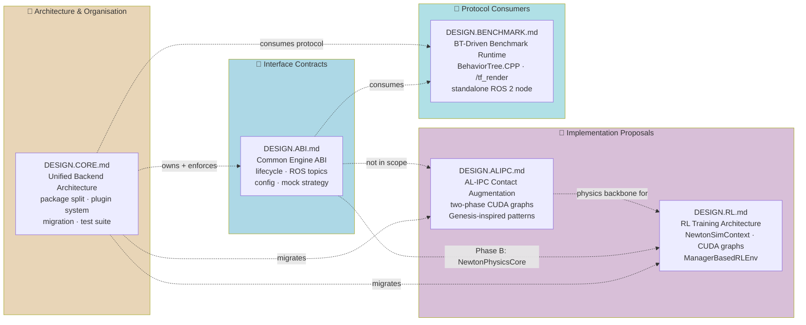
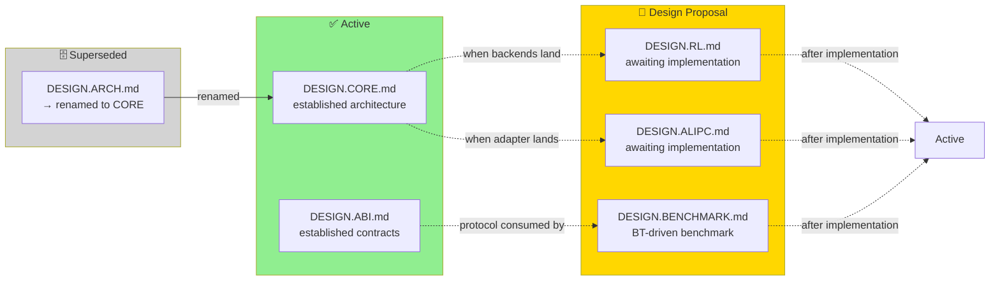

# 🏗️ geniesim_engine — Design Document Index

> **Central entry point** for all design docs in the `genie_sim_engine` ecosystem.
> Read this first, then follow the link that matches your role.

---

## 📚 Document Dependency Graph



---

## 🧭 Reading Guide

| You are... | Read this first | Then | When to read |
|---|---|---|---|
| ✍️ **New backend developer** (adding mujoco, libuipc, etc.) | [`DESIGN.CORE.md`](./DESIGN.CORE.md) — package layout, registration, factory, entry-point template | [`DESIGN.ABI.md`](./DESIGN.ABI.md) — `PhysicsEngine` ABC contracts, state/command/ROS invariants | Before writing the first line of engine code |
| 🧪 **Test / CI engineer** | [`DESIGN.CORE.md §9`](./DESIGN.CORE.md#9-abi-enforcement--test-suite) — `ABITestSuite`, `MockCppBridge`, enforcement hierarchy | [`DESIGN.ABI.md §12`](./DESIGN.ABI.md#13-unit-test-mock-strategy) — mock boundaries, `MockPhysicsEngine` skeleton | Before writing test fixtures |
| 🤖 **RL researcher** | [`DESIGN.RL.md`](./DESIGN.RL.md) — RL training architecture, vectorized envs, CUDA graph management | [`DESIGN.ABI.md §14`](./DESIGN.ABI.md#14-rl-reuse-path) — what RL consumes/reuses from the engine | Before implementing the training loop |
| 🔬 **Physics / solver engineer** (contact, cloth) | [`DESIGN.ALIPC.md`](./DESIGN.ALIPC.md) — AL-IPC inner loop, two-phase CUDA graphs, performance budget | [`DESIGN.CORE.md §4`](./DESIGN.CORE.md#4--genie_sim_engine_-contract) — how to wrap as a `PhysicsEngine` plugin | Before implementing a new solver adapter |
| 🔧 **Package maintainer** (splitting the monolith) | [`DESIGN.CORE.md §8`](./DESIGN.CORE.md#8-migration-path) — phased migration plan, import table, file moves | [`DESIGN.CORE.md §10`](./DESIGN.CORE.md#10-file-inventory--moves) — every file's destination | Before starting Phase 1 of the split |
| 🧪 **Benchmark developer** (adding task, building BT) | [`DESIGN.BENCHMARK.md`](./DESIGN.BENCHMARK.md) — BT runtime, task YAML schema, node library, scoring model | [`DESIGN.ABI.md §5-7`](./DESIGN.ABI.md) — `/tf_render` protocol, ROS topics, state readback | Before writing a new task YAML or BT node |
| 👤 **Newcomer / overview** | This file (`DESIGN.md`) — document landscape, reading guide | — | First thing |

---

## 📋 Quick Reference

| Doc | Lines | Status | Audience | Key sections |
|---|---|---|---|---|---|
| [`DESIGN.CORE.md`](./DESIGN.CORE.md) | ~800 | ✅ Active | Backend devs, maintainers, test engineers | §1 Architecture · §4 Backend contract · §5 Registration · §9 ABI test suite · §10 File moves |
| [`DESIGN.ABI.md`](./DESIGN.ABI.md) | ~820 | ✅ Active | Engine implementers, RL devs, test engineers | §1 Module diagram · §4 Lifecycle · §5 State readback · §7-8 ROS/C++ bridge · §12 Mock strategy · §14 RL path |
| [`DESIGN.BENCHMARK.md`](./DESIGN.BENCHMARK.md) | ~925 | 📝 Draft | BT/task authors, evaluation engineers | §1 Architecture · §3 BT runtime · §4 Config & schema · §5 Protocol · §6 BT nodes · §7 OVRtx pipeline · §8 Scoring · §11 Engine requirements |
| [`DESIGN.RL.md`](./DESIGN.RL.md) | ~1310 | 📝 Draft | RL researchers | §7 DirectRLEnv · §8 ManagerBasedRLEnv · §9 NewtonSimContext CUDA graphs · §15 Engine restructuring · §16 IsaacLab lessons |
| [`DESIGN.ALIPC.md`](./DESIGN.ALIPC.md) | ~1405 | 📝 Draft | Physics/solver engineers | §4 Architecture · §5 Two-phase CUDA graph · §6 AL-IPC inner loop · §8 CUDA graph tradeoffs · §14 Genesis patterns |

---

## 🔗 Cross-Reference Quickmap

### DESIGN.CORE.md references

| Where | What | Related doc |
|---|---|---|
| §3.1 | Design docs owned by core | ABI, RL, ALIPC |
| §9 | ABI enforcement via `ABITestSuite` | ABI §12 |

### DESIGN.ABI.md references

| Where | What | Related doc |
|---|---|---|
| §2.3 | "Not in scope — covered by" | RL, ALIPC |
| §14.3 | Phase B: NewtonPhysicsCore extraction | RL §15 |

### DESIGN.BENCHMARK.md references

| Where | What | Related doc |
|---|---|---|
| §1 | Protocol consumers — engine-agnostic benchmark | ABI §5-6 (state readback), CORE §4 (backend contract) |
| §5 | Data exchange protocol (`/tf_render`, `/scene_state`) | ABI §7 (ROS topics), ABI §5 (tf_render spec) |
| §7 | OVRtx integration for perceptual evaluation | genie_sim_render AGENTS.md |
| §11 | Engine feature requirements (reset, scene descriptor, contact/cloth state) | ABI §4 (lifecycle), CORE §4 (backend contract) |

### DESIGN.RL.md references

| Where | What | Related doc |
|---|---|---|
| §1, §4, etc. | Depends on AL-IPC contact | ALIPC |
| §15 | Engine restructuring follows ABI contract | ABI §14 |

### DESIGN.ALIPC.md references

| Where | What | Related doc |
|---|---|---|
| §7 | Integration map: AL-IPC adapter slots into Newton pipeline | RL (consumes) |
| — | No explicit filename references to other DESIGN docs | — |

---

## 🔄 Update Rules

| When this changes... | Update these docs |
|---|---|
| ✨ New backend added (`genie_sim_engine_foo`) | CORE §4 (contract), §10 (file inventory) |
| 🔧 `PhysicsEngine` ABC method signature changes | ABI (that section) + CORE §9 (ABITestSuite) + all backend implementations |
| 🚀 ROS topic name / message type changes | ABI §7-8 + BENCHMARK §5 (protocol consumer) |
| 🧪 New benchmark task added | BENCHMARK §4 (task YAML) + §6 (BT nodes, if needed) |
| 🧪 New BT node type | BENCHMARK §6 |
| 🧪 `/scene_state` protocol change | BENCHMARK §5 + all engine backends |
| 🧪 New test category added | CORE §9 (ABITestSuite) + ABI §12 (mock strategy) |
| 🤖 RL env implementation begins | RL (entire doc) + ABI §14 (RL path) |
| 🔬 AL-IPC adapter implementation begins | ALIPC (entire doc) |

---

## 📄 Document Lifecycle



---

## 🗂️ File locations

All design docs live at the workspace root alongside the source tree they describe:

```
source/geniesim_ros/src/ros_ws/src/genie_sim_engine/
├── DESIGN.md              ← YOU ARE HERE
├── DESIGN.CORE.md         ← Unified backend architecture
├── DESIGN.ABI.md          ← Common engine ABI
├── DESIGN.BENCHMARK.md    ← BT-driven benchmark runtime  ⭐ NEW
├── DESIGN.RL.md           ← RL training architecture
└── DESIGN.ALIPC.md        ← AL-IPC contact augmentation
```

After the core extraction (Phase 1), `DESIGN.CORE.md`, `DESIGN.ABI.md`, and
this file (`DESIGN.md`) move to `genie_sim_engine_core/`. The implementation
proposals (`RL.md`, `ALIPC.md`) stay alongside their respective backends or
move to the core depending on scope. See
[`DESIGN.CORE.md §10`](./DESIGN.CORE.md#10-file-inventory--moves) for the
exact migration table.

---

## Revision History

| Date | Change |
|---|---|
| 2026-07-12 | Initial version. Document index with dependency graph, reading guide, quick-reference table, cross-reference map, and update rules. |
